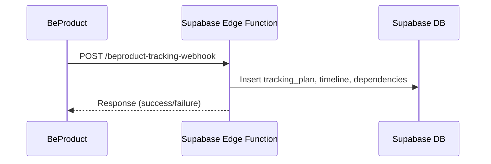
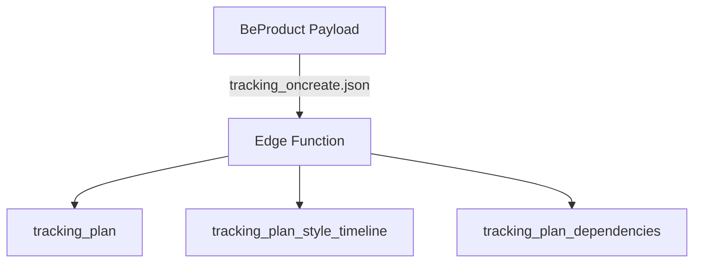
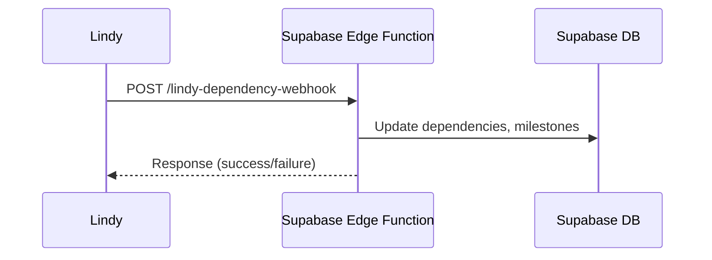
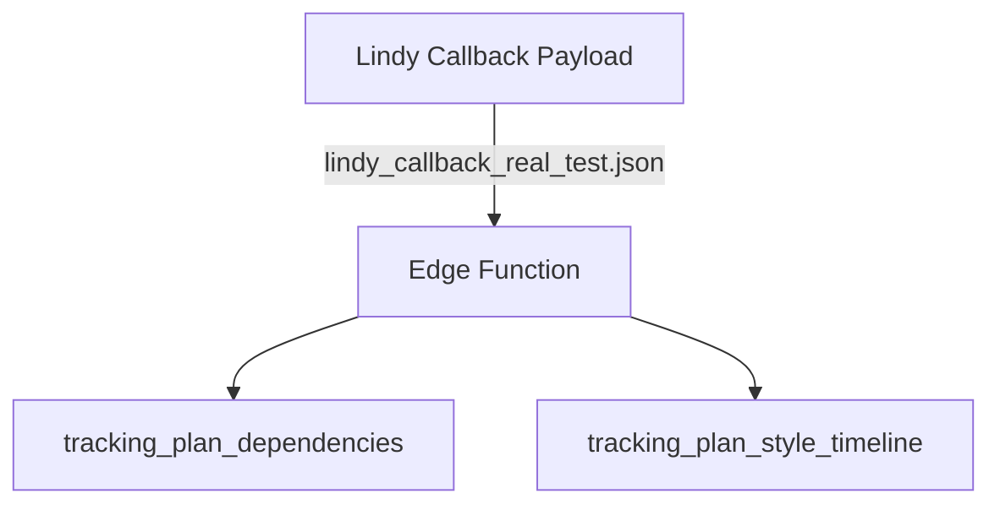

# Supabase Edge Functions Catalog

## 1. `beproduct-tracking-webhook`
**Purpose:** Handles garment tracking plan creation, milestone assignment, and timeline updates.
**Entry Point:** `/functions/v1/beproduct-tracking-webhook`
**Key Payloads:** `tracking_oncreate.json`
**Schema Fields:** `tracking_plan`, `tracking_plan_style_timeline`, `tracking_plan_dependencies`
**Integration:** Receives webhook from BeProduct, maps to Supabase schema, triggers timeline/milestone logic.

### Sequence Diagram

### Data Mapping

---

## 2. `lindy-dependency-webhook`
**Purpose:** Handles async dependency resolution and milestone updates from Lindy.
**Entry Point:** `/functions/v1/lindy-dependency-webhook`
**Key Payloads:** `lindy_callback_real_test.json`
**Schema Fields:** `tracking_plan_dependencies`, `tracking_plan_style_timeline`
**Integration:** Receives callback from Lindy, updates dependency/milestone status in Supabase.

### Sequence Diagram

### Data Mapping

---

## 3. `beproduct-material-webhook`
**Purpose:** Handles BeProduct material sync events.
**Entry Point:** `/functions/v1/beproduct-material-webhook`
**Key Payloads:** Material sync payloads
**Schema Fields:** Material tables
**Integration:** Receives webhook from BeProduct, syncs material data to Supabase.

---

## Webhook Payload Reference

| Function                     | Example Payload File                | Key Fields/Mapping |
|------------------------------|-------------------------------------|--------------------|
| beproduct-tracking-webhook   | tracking_oncreate.json              | plan_id, milestones, dependencies |
| lindy-dependency-webhook     | lindy_callback_real_test.json       | dependency_id, milestone_status  |
| beproduct-material-webhook   | material sync payloads              | material_id, attributes         |

---

## Integration Notes
- All edge functions are Deno-based, deployed via Supabase Edge Functions.
- Payloads must match schema requirements for timeline, milestone, and dependency fields.
- Error handling: Functions return HTTP 200/400/500 with error details in response body.
- See `/docs/api/webhooks.md` for full payload and mapping details.
- All edge function code is in `supabase/functions/`.
