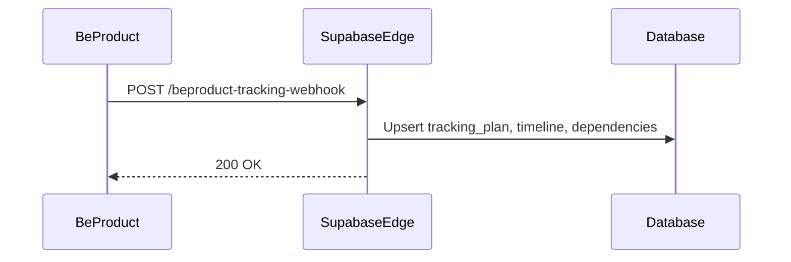
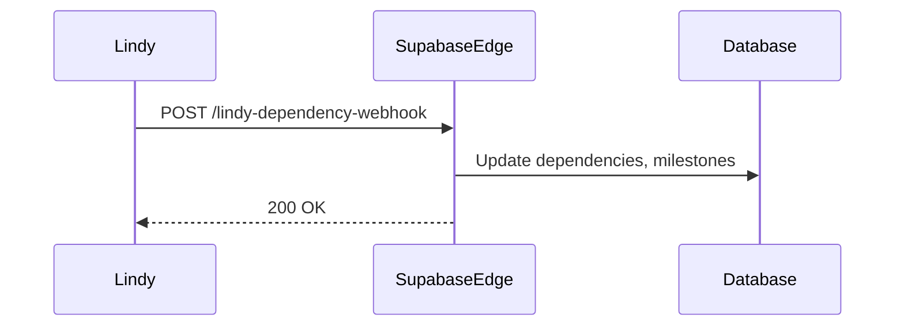
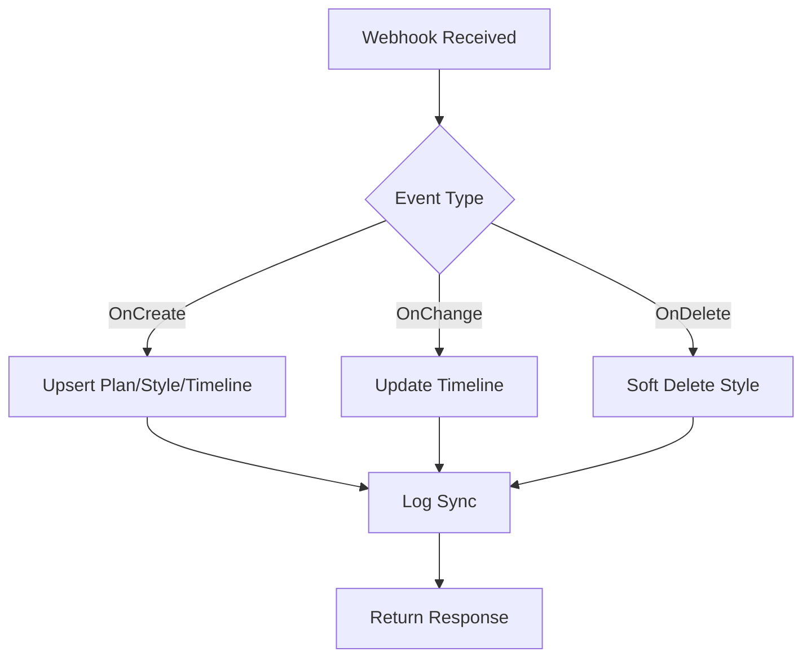
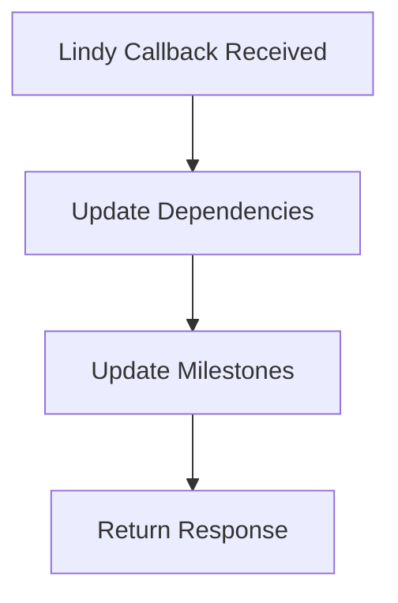

# Webhooks Documentation

This document catalogs all webhook payloads, mapping, and integration details for the Supabase garment tracking project.

## Webhook Events
- **OnCreate:** New style/colorway added to tracking plan (see `tracking_oncreate.json`)
- **OnChange:** Timeline milestone updated (see `tracking_onchange.json`)
- **OnDelete:** Style/colorway removed from tracking plan (see `tracking_ondelete.json`)
- **Lindy Callback:** Dependency/milestone update from Lindy (see `lindy_callback_real_test.json`)

## Payload Reference
Example payloads are in `supabase-beproduct-migration/99-webhook-payloads/`:

| Event Type         | Example File                   | Key Fields                  |
|--------------------|-------------------------------|-----------------------------|
| OnCreate           | tracking_oncreate.json         | plan_id, milestones, dependencies |
| OnChange           | tracking_onchange.json         | milestone_id, status        |
| OnDelete           | tracking_ondelete.json         | style_id, deleted_at        |
| Lindy Callback     | lindy_callback_real_test.json  | dependency_id, milestone_status |

## Sequence Diagrams

### BeProduct Tracking Webhook

### Lindy Dependency Webhook

## Flowcharts

### Tracking Webhook Flow

### Lindy Callback Flow

## Field Mapping

| Source Field           | Supabase Table/Field                | Notes |
|------------------------|-------------------------------------|-------|
| plan_id                | tracking_plan.id                    | Primary key |
| milestones             | tracking_plan_style_timeline        | Array of milestone objects |
| dependencies           | tracking_plan_dependencies          | Array of dependency objects |
| milestone_id           | tracking_plan_style_timeline.id     | Used for updates |
| dependency_id          | tracking_plan_dependencies.id       | Used for updates |
| status/milestone_status| tracking_plan_style_timeline.status | Enum: pending, complete, blocked |

## Integration Notes
- All webhook payloads must match schema requirements for timeline, milestone, and dependency fields.
- Error handling: Functions return HTTP 200/400/500 with error details in response body.
- See `/docs/api/edge-functions.md` for edge function catalog and integration details.
- All edge function code is in `supabase/functions/`.
