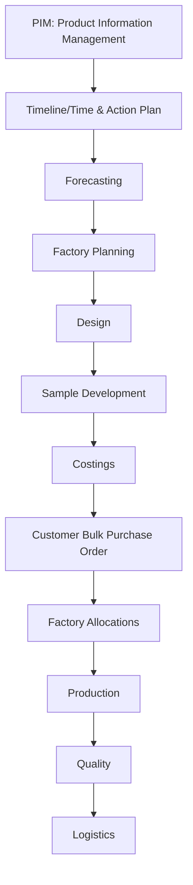

# Workflow Overview

This document provides a high-level overview of the end-to-end fashion season workflow, schema, and integration points between Supabase and BeProduct.

## Workflow Stages

Each stage is implemented in its own folder with:
- Documentation (including mermaid diagrams and backlinks)
- All SQL migrations and Edge Function code/scripts are now centralized in the canonical `supabase/` folders. See [Migration and Function Index](../migration/MIGRATION_FUNCTION_INDEX.md) for the single source of truth.

## Navigation
- Use the Milestones section above to jump to detailed documentation for each phase.
- Each milestone doc contains links back to this overview and to related SOPs, technical references, and diagrams.

---

*This document will be updated as the workflow and schema evolve.*
