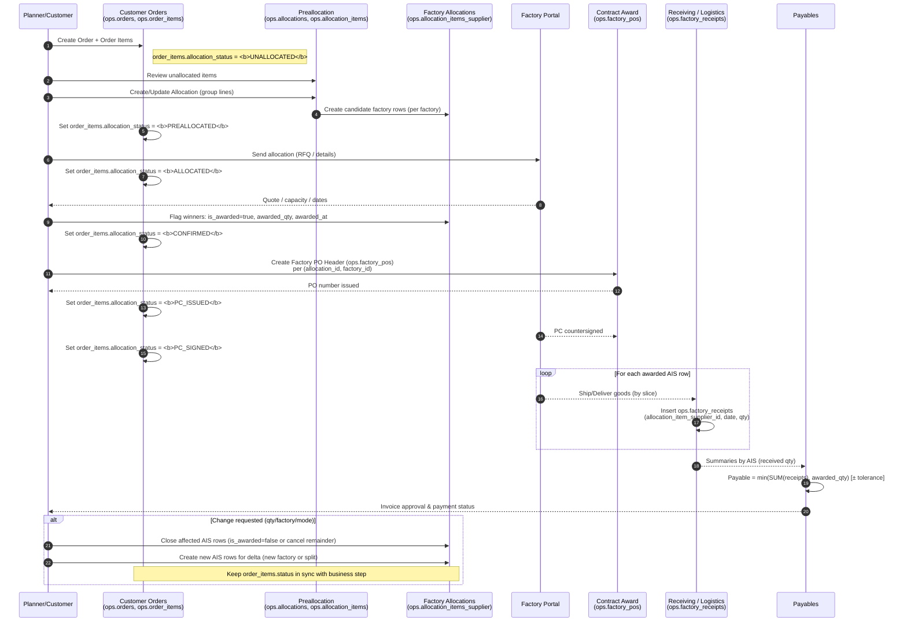
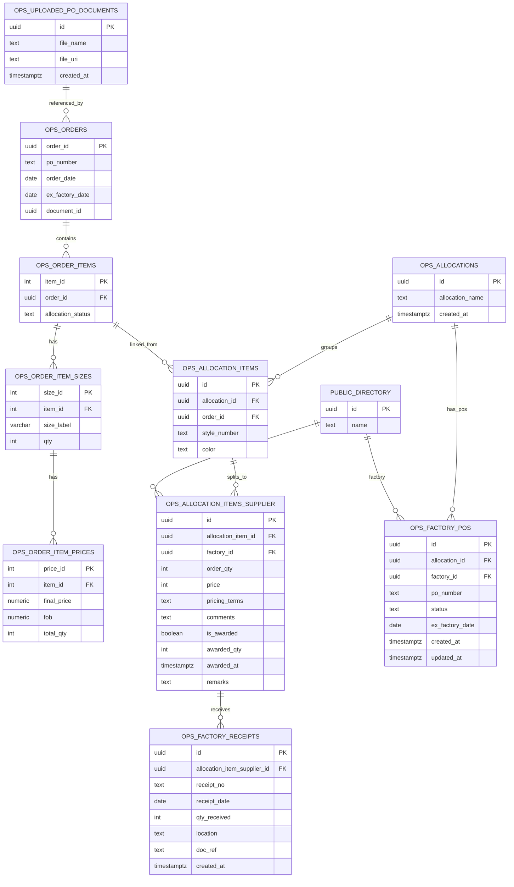

# AAG Phase 1 Dev Deployment — Meeting Summary

**Date:** 2025-11-05  
**Duration:** ~3 hours  
**Attendees:** Chris Kalathas, Hamza Khalid, Afaq Arif, Muhammad Rehan, Sameer (resourcing)

## Context
The team aligned on the Phase 1 development deployment for the Supabase-backed production planning platform. Topics covered: allocation UI consistency, allocation data model updates, canonical timeline design, and coordination needs under current resourcing constraints. Hamza and Afaq shared shorthand follow-up notes that are integrated below.

## Discussion Highlights by Domain

### Allocation UI & Table Experience
- Existing allocation screen diverges from reference designs (Divish/Afaq UI). Missing reuse of established components makes it feel disconnected from the production planning page.  
- Non-customer-friendly columns (e.g., `color_reference`, total order quantity) surfaced despite previous guidance. Pricing field does not pull from factory quote.  
- Misalignment attributed to implicit instructions; team agreed to document UI → data mappings explicitly (Miro/markdown).  
- Plan: engage designer separately, remove irrelevant columns, ensure marketing names display, and align styling with materials/production planning UI.

### Allocation Schema & Business Logic
- Decided to link `order_items` rows to allocations via `allocation_item_id` and track state with an enum `allocation_status` (default `unallocated`).
- Need to display allocation status in the `/allocations` UI for every order line.  
- Quantity should live on the allocation item / colorway row to reflect the actual committed amount.  
- Allocation items must support multiple downstream allocations; store allocation IDs as a list/array to manage split awards and reallocation flows.  
- Pricing must flow from `allocation_items_supplier` to keep the customer view consistent with negotiated factory quotes.  
- Hamza to load all supplied tech packs (Grayson Men’s) and verify orders map 1:1 to style/colorway records for accurate allocation references.

### Canonical Timeline & Node-Based Planning
- Chris proposed consolidating style, material, and sample activities under a single canonical timeline node.  
- Order allocation splits remain anchored to the same node via self-referencing split tables so that downstream shipments can diverge without duplicating the base timeline.  
- Sampling/production events hang off the same node, providing a cohesive tree view of progress.  
- Chris will package documentation and schema diagrams; Hamza & Afaq will review to determine whether a self-referencing structure or dedicated split table best preserves readability.

### Coordination, Resourcing & Documentation
- Sameer pushing to secure a dedicated DBA; in the interim, senior contributors will assist with reviews.  
- All database changes must be messaged to Chris immediately after implementation for next-day validation and Monday.com tracking.  
- Hamza and Afaq to continue sharing consolidated notes; Chris to provide contract-handling mockups and additional timeline documentation.  
- Separate session with the designer to unblock UI alignment.

## Action Item Tracker

| # | Action | Owner(s) | Source |
|---|--------|----------|--------|
| 1 | Load all shared tech packs into the Grayson Men’s folder and ensure each customer order maps to the correct style/colorway records. | Hamza | Hamza/Afaq shorthand |
| 2 | Persist `allocation_item_id` on each `order_items` row. | Hamza, Afaq | Shorthand & schema discussion |
| 3 | Add `allocation_status` enum (default `unallocated`) to `order_items` and surface status per row on `/allocations`. | Hamza, Afaq | Shorthand & schema discussion |
| 4 | Store committed quantity at the allocation item / colorway level. | Hamza, Afaq | Shorthand |
| 5 | Allow `allocation_items.allocation_ids` to store a list/array of related allocation references for split awards. | Hamza, Afaq | Shorthand |
| 6 | Ensure pricing/terms on the allocation table come from `allocation_items_supplier`. | Hamza, Afaq | Shorthand |
| 7 | Fix allocation table UI: remove `total_order_quantity`, replace color reference with marketing name, align pricing, match Divish’s production planning layout. | Afaq (UI), Hamza (data) | Shorthand & UI discussion |
| 8 | Schedule follow-up with designer to realign on allocation screen UX; avoid adding designer to technical deep dives. | Chris | Transcript |
| 9 | Share timeline node documentation and contract-handling mockups for review. | Chris | Transcript |
|10 | Review shared docs, prototype split-handling approach, and sync back with Chris. | Hamza, Afaq | Transcript |
|11 | Notify Chris after every database schema change for next-day validation. | Hamza, Afaq | Transcript |
|12 | Capture explicit UI/data mapping instructions (Miro/markdown) to avoid ambiguity. | Chris, Hamza, Afaq | UI discussion |
|13 | Continue DBA recruitment; provide interim review support. | Sameer | Transcript |


---

## 1. Updated documentation and notes


```css
Each order item (style + color) progresses through a controlled status lifecycle, while related tables store supporting data (allocations, factory assignments, contracts, receipts).
Customer Order → Order Items → Allocation → Factory Assignment → PO Issued → Factory Receipts → Payables
```

### 2. Actors and Tables

| Role / System                      | Core Tables                               | Responsibility                                                                    |
| ---------------------------------- | ----------------------------------------- | --------------------------------------------------------------------------------- |
| **Planner / Customer**         | `ops.orders`, `ops.order_items`           | Enters customer orders. Maintains allocation status for each order line - default = UNALLOCATED.          |
| **Allocations**              | `ops.allocations`, `ops.allocation_items` | Groups and assigns order lines to factories.                                      |
| **Factory Assignment (Suppliers)** | `ops.allocation_items_supplier`           | Stores which factories are bidding or awarded, their quantities, contract terms, award dates. |
| **Procurement / Contracts**        | `ops.factory_pos`                         | Tracks issued Production Contracts (PO headers).                                  |
| **Factory / Supplier Portal**      | —                                         | Confirms allocations, capacity, pricing. Countersigns POs.                        |
| **Logistics / Receiving**          | `ops.factory_receipts`                    | Records actual goods received from factories.                                     |
| **Finance / Payables**             | —                                         | Calculates payable quantity based on receipts and awarded qty.                    |


## 🔄 3. Lifecycle Stages (Business Workflow)

### Stage 1 — **Order Entry**

* A new customer order and its items are created (`ops.orders`, `ops.order_items`).
* Each `order_item` starts with `allocation_status = 'UNALLOCATED'`.

### Stage 2 — **Preallocation**

* Planners review unallocated order items.
* They create a **new allocation record** in `ops.allocations` and insert related `ops.allocation_items` that reference specific `order_items`.
* Candidate factories are listed in `ops.allocation_items_supplier` (AIS) with proposed quantities and terms.
* The order item’s `allocation_status` changes to `'PREALLOCATED'`.

### Stage 3 — **Allocation Sent to Factories**

* Allocation details are sent to factories for quote or confirmation.
* Status updates to `'ALLOCATED'`.

### Stage 4 — **Factory Confirmation**

* Factories confirm capacity, price, and ex-factory dates via factory portal
* Planner marks winning factory rows in AIS:
  `is_awarded = TRUE`, `awarded_qty`, and `awarded_at = NOW()`. ** could be database trigger based on selected factory awarded garments **
* The order item’s status moves to `'CONFIRMED'`.

### Stage 5 — **PC Issued (Production Contract)**

* Allocations team creates a `factory_pos` header per factory/allocation combination.
* Each header represents one issued Production Contract (PO).
* `po_number`, `status='ISSUED'`, and `ex_factory_date` are set.
* The order item’s status changes to `'PC_ISSUED'`.

### Stage 6 — **PC Countersigned**

* Factory returns signed contract → procurement updates `factory_pos.status='PC_SIGNED'`.
* The order item’s status becomes `'PC_SIGNED'`.

### Stage 7 — **Production and Receipts**

* The factory produces goods - maintains production status via Portal - `ops.allocation_items_supplier` table is record source
* Upon completion of production, reported quantities are captured in `factory_receipts` linked to the awarded AIS row.
* These receipts track `receipt_date`, `qty_received`, `batch_id` and references to documents.

### Stage 8 — **Payables & Closure**

* Finance reconciles each supplier row:

  * `payable_qty = min(sum(receipts), awarded_qty)`
* Once fully received and paid, the `factory_pos.status` → `'CLOSED'`.

---

## ⚙️ 4. Relationship Summary (Data Flow)

| Step           | Action                 | Source Table                              | Target Table / Effect                          |
| -------------- | ---------------------- | ----------------------------------------- | ---------------------------------------------- |
| Order creation | New order + items      | `ops.orders`, `ops.order_items`           | Default status `'UNALLOCATED'`.                |
| Preallocation  | Build allocation group | `ops.allocations`, `ops.allocation_items` | Link order lines to allocations.               |
| Supplier setup | Candidate factories    | `ops.allocation_items_supplier`           | One per potential factory.                     |
| Award decision | Mark winning factories | `ops.allocation_items_supplier`           | `is_awarded = true`, set qty/date.             |
| PC creation    | Generate PO headers    | `ops.factory_pos`                         | One per `(allocation, factory)`.               |
| Receipts       | Record shipments       | `ops.factory_receipts`                    | One per awarded supplier slice.                |
| Payment        | Reconcile              | (Receipts + AIS)                          | Payables compute `min(receipts, awarded_qty)`. |

---

## 🧠 5. Status Flow Summary (single truth)

| Status           | Who sets it           | Meaning                              |
| ---------------- | --------------------- | ------------------------------------ |
| **UNALLOCATED**  | System / default      | No factory assigned yet.             |
| **PREALLOCATED** | Planner               | Candidate factories proposed.        |
| **ALLOCATED**    | Planner               | RFQ sent to factories.               |
| **CONFIRMED**    | Factory / Planner     | Factory confirmed price/capacity.    |
| **PC_ISSUED**    | Planner           | Production contract issued.          |
| **PC_SIGNED**    | Factory               | Countersigned; production confirmed. |
| **CANCELLED**    | Planner   | Order withdrawn or replaced.         |

---

## 🗺️ 6. Visual — Sequence of Events (Mermaid)



---

### TL;DR — Developer Summary

* **`ops.order_items.allocation_status`** = single source of truth for each line’s lifecycle.
* **`ops.allocations`** = grouping mechanism for batch planning.
* **`ops.allocation_items`** = links each order line into an allocation.
* **`ops.allocation_items_supplier`** = holds per-factory assignment + award data.
* **`ops.factory_pos`** = contract / purchase order header table
* **`ops.factory_receipts`** = actual goods received by awarded factory lines.

---

Next, we can revisit the DDL — but this workflow is your blueprint for what the data model must enable.

---

# ✅ Updated DDL (includes: canonical status on `order_items`, award fields on AIS, new `factory_pos`, `factory_receipts`)


```sql
-- ───────────────────────────────────────────────────────────────
-- 0) Canonical allocation lifecycle lives on ORDER ITEMS
--    (use your existing enum; this shows a compatible definition)
-- ───────────────────────────────────────────────────────────────
DO $$
BEGIN
  -- Create enum if it doesn't exist
  IF NOT EXISTS (
    SELECT 1 FROM pg_type WHERE typname = 'order_allocation_status'
      AND pg_type.typnamespace = 'ops'::regnamespace
  ) THEN
    CREATE TYPE ops.order_allocation_status AS ENUM (
      'UNALLOCATED',
      'PREALLOCATED',
      'ALLOCATED',
      'CONFIRMED',
      'PC_ISSUED',
      'PC_SIGNED',
      'CANCELLED'
    );
  END IF;
END $$;

-- Add column to order_items if missing, default UNALLOCATED
ALTER TABLE ops.order_items
  ADD COLUMN IF NOT EXISTS allocation_status ops.order_allocation_status
    NOT NULL DEFAULT 'UNALLOCATED';

-- ───────────────────────────────────────────────────────────────
-- 1) Supplier “pseudo PO line”: add award facts (NOT a new status machine)
-- ───────────────────────────────────────────────────────────────
ALTER TABLE ops.allocation_items_supplier
  ADD COLUMN IF NOT EXISTS is_awarded boolean DEFAULT false,
  ADD COLUMN IF NOT EXISTS awarded_qty int,
  ADD COLUMN IF NOT EXISTS awarded_at timestamptz,
  ADD COLUMN IF NOT EXISTS remarks text;

ALTER TABLE ops.allocation_items_supplier
  ADD CONSTRAINT chk_ais_awarded_qty_nonneg
    CHECK (awarded_qty IS NULL OR awarded_qty >= 0);

CREATE INDEX IF NOT EXISTS ix_ais_allocation_item_id ON ops.allocation_items_supplier(allocation_item_id);
CREATE INDEX IF NOT EXISTS ix_ais_factory_id         ON ops.allocation_items_supplier(factory_id);
CREATE INDEX IF NOT EXISTS ix_ais_is_awarded         ON ops.allocation_items_supplier(is_awarded);

-- OPTIONAL (handy if you often filter by awarded records per item)
-- CREATE UNIQUE INDEX IF NOT EXISTS ux_one_award_per_item
--   ON ops.allocation_items_supplier(allocation_item_id)
--   WHERE is_awarded = true;  -- enable only if you disallow split-awards

-- ───────────────────────────────────────────────────────────────
-- 2) Factory PO header (grouping by allocation + factory)
-- ───────────────────────────────────────────────────────────────
CREATE TABLE IF NOT EXISTS ops.factory_pos (
  id uuid PRIMARY KEY DEFAULT gen_random_uuid(),
  allocation_id uuid NOT NULL REFERENCES ops.allocations(id),
  factory_id uuid NOT NULL REFERENCES public.directory(id),
  po_number text UNIQUE NOT NULL,
  status text NOT NULL DEFAULT 'DRAFT',  -- DRAFT|ISSUED|CONFIRMED|CLOSED|CANCELLED
  ex_factory_date date,
  po_document_uri text,                  -- link to object storage (PDF / DOCX / etc.) 
  created_at timestamptz NOT NULL DEFAULT now(),
  updated_at timestamptz NOT NULL DEFAULT now()
);

CREATE INDEX IF NOT EXISTS ix_factory_pos_allocation ON ops.factory_pos(allocation_id);
CREATE INDEX IF NOT EXISTS ix_factory_pos_factory    ON ops.factory_pos(factory_id);

-- Optional "updated_at" autostamp
-- CREATE OR REPLACE FUNCTION ops.set_updated_at() RETURNS trigger AS $$
-- BEGIN NEW.updated_at = now(); RETURN NEW; END; $$ LANGUAGE plpgsql;
-- DROP TRIGGER IF EXISTS trg_factory_pos_updated_at ON ops.factory_pos;
-- CREATE TRIGGER trg_factory_pos_updated_at
--   BEFORE UPDATE ON ops.factory_pos
--   FOR EACH ROW EXECUTE FUNCTION ops.set_updated_at();

-- ───────────────────────────────────────────────────────────────
-- 3) Factory Receipts (actuals tied to the awarded supplier row)
-- ───────────────────────────────────────────────────────────────
CREATE TABLE IF NOT EXISTS ops.factory_receipts (
  id uuid PRIMARY KEY DEFAULT gen_random_uuid(),
  allocation_item_supplier_id uuid NOT NULL
    REFERENCES ops.allocation_items_supplier(id) ON DELETE CASCADE,
  receipt_no text,
  receipt_date date NOT NULL,
  qty_received int NOT NULL CHECK (qty_received > 0),
  location text,
  doc_ref text,
  created_at timestamptz NOT NULL DEFAULT now()
);

CREATE INDEX IF NOT EXISTS ix_receipts_ais   ON ops.factory_receipts(allocation_item_supplier_id);
CREATE INDEX IF NOT EXISTS ix_receipts_date  ON ops.factory_receipts(receipt_date);
```

---

# 🌳 Relationship “tree” (quick mental model)

```
orders(order_id)
└─ order_items(item_id) — allocation_status (canonical lifecycle)
   └─ allocation_items(id) — links the order work into allocations
      └─ allocation_items_supplier(id) — one row per factory slice (pseudo PO line)
         └─ factory_receipts(id) — actuals per supplier slice

allocations(id)
├─ allocation_items(id) … (↑)
└─ factory_pos(id) — header grouping POs per allocation & factory

public.directory(id) — referenced by allocation_items_supplier.factory_id and factory_pos.factory_id
```

---

# 🧭 Mermaid ER diagram (tables + joins)


# 🔄 Workflow (from order entry to PC countersigned)

```mermaid


flowchart LR
  A[Order Entered] --> B[Create OPS_ORDERS + OPS_ORDER_ITEMS]
  B --> C[Set ORDER_ITEMS.allocation_status = UNALLOCATED]

  C --> D[Review Unallocated Orders]
  D --> E[Create Preallocation candidate factories\nCreate/Update ALLOCATION_ITEMS + AIS rows]
  E --> F[Set allocation_status = PREALLOCATED]

  F --> G[Send allocation to factories]
  G --> H[Set allocation_status = ALLOCATED]

  H --> I[Factory confirms price/capacity/dates]
  I --> J[Set allocation_status = CONFIRMED\nMark winning AIS: is_awarded=true, awarded_qty, awarded_at]

  J --> K[Issue PC to factory]
  K --> L[Set allocation_status = PC_ISSUED\nOptionally create FACTORY_POS headers]

  L --> M[PC countersigned]
  M --> N[Set allocation_status = PC_SIGNED]

  %% Execution / receiving in parallel after award
  J --> R[Post FACTORY_RECEIPTS per awarded AIS]
  R --> S[Reconcile / Payables on receipts vs awarded_qty]

```




**Notes**

* The **only lifecycle status** you maintain is `order_items.allocation_status`.
* The **award facts** live on each `allocation_items_supplier` row (`is_awarded`, `awarded_qty`, `awarded_at`).
* `factory_pos` is a header snapshot for capturing contract details (contract/purchase order ID, link to contract)
* `factory_receipts` captures actual received production against the *awarded slice* (AIS).

---

# 📘 Usage pointers / docs

* **Create preallocation**

  * Insert/update `ops.allocation_items` (grouped by `allocations.id`).
  * Create `ops.allocation_items_supplier` rows for each candidate factory with proposed qty; leave `is_awarded=false`.
  * Set `order_items.allocation_status='PREALLOCATED'`.

* **Move to allocated / confirmed**

  * When sent to suppliers → `ALLOCATED`.
  * When factory confirms → set `order_items.allocation_status='CONFIRMED'` and, for the winner(s), set `is_awarded=true`, `awarded_qty`, `awarded_at`.

* **Issue PCs**

  * Create `ops.factory_pos` per `(allocation_id, factory_id)` and set `po_number`, `status='ISSUED'` (or keep DRAFT till signed).
  * Generate PO documents, save in storage, link in `po_document_uri` - accessed and version controlled through signing process
  * Set `order_items.allocation_status='PC_ISSUED'`, then `'PC_SIGNED'` when countersigned.

* **Receive goods**

  * Insert `ops.factory_receipts` rows tied to the awarded `allocation_items_supplier.id`.
  * Payables can compute `payable_qty = LEAST( SUM(receipts), awarded_qty )` (or apply your tolerance logic).

---


