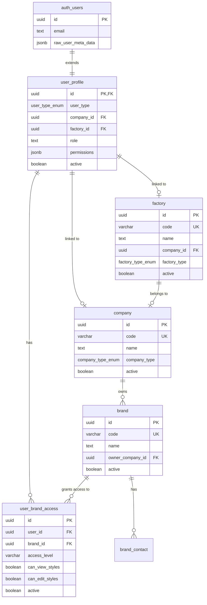
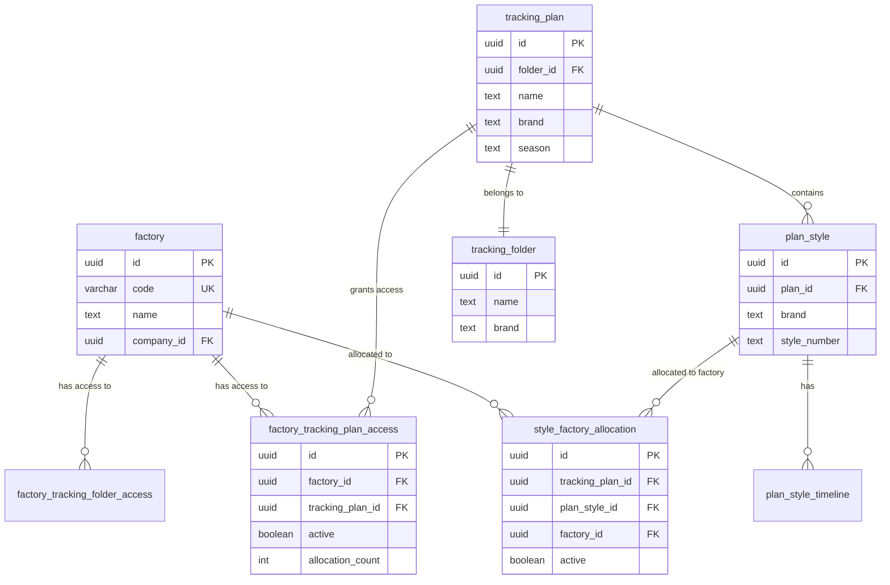
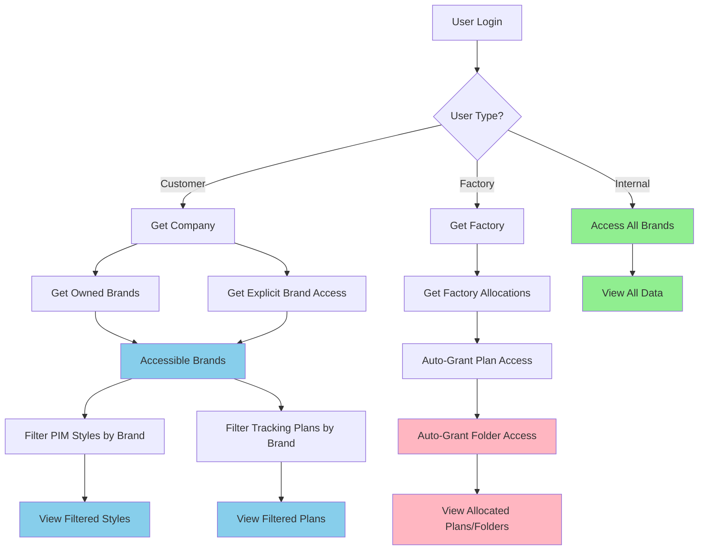

# Row-Level Security (RLS) Implementation Guide

## Overview

This document describes the Row-Level Security (RLS) implementation for the Supabase PLM backend. The RLS system provides multi-tenant access control based on:

- **User Types**: Internal staff, customer users, factory/supplier users
- **Brand Ownership**: Customers own brands and access data by brand
- **Factory Allocations**: Factories access tracking data based on style allocations

## Table of Contents

1. [Architecture Overview](#architecture-overview)
2. [Entity Relationship Diagrams](#entity-relationship-diagrams)
3. [Access Control Patterns](#access-control-patterns)
4. [Implementation Details](#implementation-details)
5. [Usage Examples](#usage-examples)
6. [Testing Guide](#testing-guide)

---

## Architecture Overview

### Schemas

The RLS implementation spans multiple schemas:

- **`mdm`** (Master Data Management): Companies, factories, brands
- **`public`**: User profiles and access control
- **`pim`**: Product Information Management (styles, colors, materials)
- **`ops`**: Operational data (tracking plans, factory allocations)
- **`tracking`**: Legacy tracking schema (will be merged with ops)

### Key Concepts

1. **User Profile**: Every authenticated user has a profile linking them to a company or factory
2. **Brand Ownership**: Brands are owned by customer companies
3. **Access Grants**: Users can have explicit access to brands beyond company ownership
4. **Factory Allocations**: When a factory is allocated to a style, they automatically get access to the plan and folder

---

## Entity Relationship Diagrams

### 1. User and Company Relationships



### 2. PIM Schema with Brand Access

```mermaid
erDiagram
    brand ||--o{ style : "filters by brand code"
    style ||--o{ style_colorway : "has"
    style ||--o{ style_size_class : "has"
    color_palette ||--o{ color_palette_color : "contains"
    color_folder ||--o{ color_palette : "contains"
    
    brand {
        uuid id PK
        varchar code UK
        text name
        uuid owner_company_id FK
    }
    
    style {
        uuid id PK
        varchar brand
        text header_name
        text supplier_name
        boolean deleted
    }
    
    style_colorway {
        uuid id PK
        uuid style_id FK
        varchar color_name
    }
    
    color_palette {
        uuid id PK
        uuid folder_id FK
        varchar brand
        varchar season
    }
```

### 3. Factory Access to Tracking Data



### 4. Complete Access Control Flow



---

## Access Control Patterns

### 1. Customer Access Pattern

**Rule**: Customers access data for brands they own or have explicit access to.

```sql
-- Customer users see styles for their brands
SELECT * FROM pim.style
WHERE brand = ANY(public.get_accessible_brand_codes(auth.uid()));

-- Customer users see tracking plans for their brands
SELECT * FROM tracking.plans
WHERE brand = ANY(public.get_accessible_brand_codes(auth.uid()));
```

**How it works**:
1. User logs in → JWT contains user_id
2. Query `user_profile` → find `company_id`
3. Query `brand` → find brands owned by company
4. Query `user_brand_access` → find explicit grants
5. Filter data by brand codes

### 2. Factory Access Pattern

**Rule**: Factories access tracking data for plans/folders where they have active allocations.

```sql
-- Factory users see plans they're allocated to
SELECT * FROM tracking.plans
WHERE id IN (
    SELECT plan_id FROM public.get_factory_accessible_plans(auth.uid())
);

-- Factory users see styles they're allocated to
SELECT * FROM tracking.plan_styles
WHERE id IN (
    SELECT plan_style_id 
    FROM ops.style_factory_allocation sfa
    JOIN public.user_profile up ON up.factory_id = sfa.factory_id
    WHERE up.id = auth.uid() AND sfa.active = true
);
```

**How it works**:
1. Admin allocates factory to style → creates `style_factory_allocation`
2. Trigger fires → auto-creates `factory_tracking_plan_access`
3. Trigger fires → auto-creates `factory_tracking_folder_access`
4. Factory user queries → sees allocated plans/folders
5. When allocation removed → access revoked if no other allocations remain

### 3. Internal User Access Pattern

**Rule**: Internal users (our staff) can access all data.

```sql
-- Internal users bypass brand filters
SELECT * FROM pim.style; -- All styles visible

-- Internal users see all tracking plans
SELECT * FROM tracking.plans; -- All plans visible
```

**How it works**:
1. User profile has `user_type = 'internal'`
2. RLS policies check: `user_type = 'internal'` → return `true`
3. All data visible

---

## Implementation Details

### Migration Files

1. **`014_create_mdm_schema.sql`**: Creates MDM schema with company, factory, brand tables
2. **`015_create_user_management_tables.sql`**: Creates user_profile and access control tables
3. **`016_create_factory_tracking_access.sql`**: Creates factory allocation and access tables with triggers
4. **`017_apply_rls_policies.sql`**: Applies RLS policies to all existing tables

### Helper Functions

#### `public.get_accessible_brands(p_user_id UUID)`
Returns brands accessible by user with details.

**Returns**:
```
TABLE(brand_id UUID, brand_code VARCHAR, brand_name TEXT, access_level VARCHAR)
```

#### `public.get_accessible_brand_codes(p_user_id UUID)`
Returns array of brand codes accessible by user.

**Returns**:
```
TEXT[] -- e.g., ['AAG_CORE', 'AAG_PREMIUM', 'NIKE']
```

#### `public.can_access_brand(p_brand_code VARCHAR, p_user_id UUID)`
Check if user has access to a specific brand.

**Returns**:
```
BOOLEAN
```

#### `public.get_factory_accessible_plans(p_user_id UUID)`
Returns tracking plans accessible by factory user.

**Returns**:
```
TABLE(plan_id UUID, plan_name TEXT, brand TEXT, season TEXT)
```

#### `public.get_factory_accessible_folders(p_user_id UUID)`
Returns tracking folders accessible by factory user.

**Returns**:
```
TABLE(folder_id UUID, folder_name TEXT, brand TEXT)
```

### Automatic Access Grant Trigger

When a factory is allocated to a style:

```sql
-- Trigger: ops.grant_factory_access_on_allocation()
-- Fires on: INSERT/UPDATE of ops.style_factory_allocation

-- What it does:
1. Get plan and folder details
2. Insert/update factory_tracking_plan_access (increment allocation_count)
3. Insert/update factory_tracking_folder_access
4. Set active = true
```

### Automatic Access Revocation Trigger

When a factory allocation is deactivated:

```sql
-- Trigger: ops.revoke_factory_access_if_no_allocations()
-- Fires on: UPDATE of ops.style_factory_allocation.active

-- What it does:
1. Count remaining active allocations for factory in plan
2. Decrement allocation_count in factory_tracking_plan_access
3. If count = 0, set active = false and record revoked_at
```

---

## Usage Examples

### For Frontend Applications

#### 1. Filter Styles by User's Brands

```typescript
// In your React/Next.js app
const { data: styles } = await supabase
  .from('style')
  .select('*')
  // RLS automatically filters by accessible brands!
  .order('created_at', { ascending: false });
```

RLS handles the filtering automatically based on the authenticated user's JWT.

#### 2. Get User's Accessible Brands

```typescript
const { data: brands } = await supabase
  .rpc('get_accessible_brands');

// Returns: [{ brand_id, brand_code, brand_name, access_level }]
```

#### 3. Filter Tracking Plans

```typescript
const { data: plans } = await supabase
  .from('plans')
  .select(`
    *,
    folder:folders(*)
  `)
  // RLS filters by brand or factory access
  .eq('active', true);
```

#### 4. Check Brand Access Before Showing UI

```typescript
const { data: hasAccess } = await supabase
  .rpc('can_access_brand', { p_brand_code: 'AAG_CORE' });

if (hasAccess) {
  // Show brand-specific UI
}
```

#### 5. Factory User - View Allocated Styles

```typescript
const { data: allocatedStyles } = await supabase
  .from('plan_styles')
  .select(`
    *,
    plan:plans(*),
    timelines:plan_style_timelines(*)
  `);
  // RLS automatically filters to allocated styles only
```

### For Edge Functions / Backend

#### 1. Allocate Factory to Style (Auto-Grant Access)

```typescript
// In beproduct-tracking-webhook or admin function
const { data, error } = await supabase
  .from('style_factory_allocation')
  .insert({
    tracking_plan_id: planId,
    plan_style_id: styleId,
    factory_id: factoryId,
    allocated_quantity: 1000,
    brand: 'AAG_CORE',
    active: true
  });

// Trigger automatically creates:
// - factory_tracking_plan_access entry
// - factory_tracking_folder_access entry
```

#### 2. Service Role - Bypass RLS

```typescript
// Using service_role key (backend only!)
const supabaseAdmin = createClient(
  process.env.SUPABASE_URL,
  process.env.SUPABASE_SERVICE_ROLE_KEY
);

// Service role sees ALL data, RLS bypassed
const { data: allStyles } = await supabaseAdmin
  .from('style')
  .select('*');
```

### SQL Queries

#### 1. Get All Styles for Current User

```sql
-- Automatically filtered by RLS
SELECT * FROM pim.style
WHERE deleted = false
ORDER BY created_at DESC;
```

#### 2. Get Brands Accessible to User

```sql
-- Using helper function
SELECT * FROM public.get_accessible_brands(auth.uid());
```

#### 3. Get Tracking Plans for Factory User

```sql
-- Using helper function
SELECT * FROM public.get_factory_accessible_plans(auth.uid());
```

#### 4. Manual Brand Filter (if needed)

```sql
-- Explicit brand check
SELECT * FROM pim.style
WHERE brand = ANY(public.get_accessible_brand_codes(auth.uid()))
AND deleted = false;
```

---

## Testing Guide

### 1. Create Test Users

```sql
-- Create internal user
INSERT INTO public.user_profile (id, user_type, full_name, role, active)
VALUES (
  '11111111-1111-1111-1111-111111111111',
  'internal',
  'Admin User',
  'admin',
  true
);

-- Create customer user
INSERT INTO public.user_profile (id, user_type, company_id, full_name, role, active)
VALUES (
  '22222222-2222-2222-2222-222222222222',
  'customer',
  (SELECT id FROM mdm.company WHERE code = 'NIKE'),
  'Nike User',
  'manager',
  true
);

-- Create factory user
INSERT INTO public.user_profile (id, user_type, factory_id, full_name, role, active)
VALUES (
  '33333333-3333-3333-3333-333333333333',
  'factory',
  (SELECT id FROM mdm.factory WHERE code = 'FACTORY_001'),
  'Factory Manager',
  'viewer',
  true
);
```

### 2. Create Test Data

```sql
-- Create test company
INSERT INTO mdm.company (code, name, company_type, active)
VALUES ('NIKE', 'Nike Inc', 'customer', true);

-- Create test brands
INSERT INTO mdm.brand (code, name, owner_company_id, active)
VALUES 
  ('NIKE_SPORT', 'Nike Sport', (SELECT id FROM mdm.company WHERE code = 'NIKE'), true),
  ('NIKE_CASUAL', 'Nike Casual', (SELECT id FROM mdm.company WHERE code = 'NIKE'), true);

-- Create test factory
INSERT INTO mdm.factory (code, name, factory_type, active)
VALUES ('FACTORY_001', 'China Textile Factory', 'manufacturing', true);

-- Create test styles
INSERT INTO pim.style (header_name, brand, season, year)
VALUES 
  ('Nike Air Max', 'NIKE_SPORT', 'SPRING', '2025'),
  ('Nike Cortez', 'NIKE_CASUAL', 'FALL', '2025');
```

### 3. Test Access Control

```sql
-- Test as internal user (sees all)
SET LOCAL role = authenticated;
SET LOCAL request.jwt.claim.sub = '11111111-1111-1111-1111-111111111111';

SELECT COUNT(*) FROM pim.style; -- Should see all styles

-- Test as customer user (sees only Nike brands)
SET LOCAL request.jwt.claim.sub = '22222222-2222-2222-2222-222222222222';

SELECT COUNT(*) FROM pim.style; -- Should see only Nike styles
SELECT * FROM public.get_accessible_brand_codes(); -- Should return ['NIKE_SPORT', 'NIKE_CASUAL']

-- Test as factory user (sees only allocated styles)
SET LOCAL request.jwt.claim.sub = '33333333-3333-3333-3333-333333333333';

SELECT COUNT(*) FROM tracking.plan_styles; -- Should see only allocated styles
```

### 4. Test Factory Allocation

```sql
-- Allocate factory to a style
INSERT INTO ops.style_factory_allocation (
  tracking_plan_id,
  plan_style_id,
  factory_id,
  brand,
  active
)
VALUES (
  (SELECT id FROM tracking.plans LIMIT 1),
  (SELECT id FROM tracking.plan_styles LIMIT 1),
  (SELECT id FROM mdm.factory WHERE code = 'FACTORY_001'),
  'NIKE_SPORT',
  true
);

-- Verify access was granted
SELECT * FROM ops.factory_tracking_plan_access
WHERE factory_id = (SELECT id FROM mdm.factory WHERE code = 'FACTORY_001');

-- Should show active = true, allocation_count = 1
```

---

## Performance Considerations

### 1. Indexes

All foreign keys and frequently filtered columns are indexed:

```sql
-- User profile indexes
CREATE INDEX idx_user_profile_type ON public.user_profile(user_type);
CREATE INDEX idx_user_profile_company ON public.user_profile(company_id);
CREATE INDEX idx_user_profile_factory ON public.user_profile(factory_id);

-- Brand indexes
CREATE INDEX idx_brand_code ON mdm.brand(code);
CREATE INDEX idx_brand_owner_company ON mdm.brand(owner_company_id);

-- Style indexes  
-- Add index on brand column for faster filtering
CREATE INDEX IF NOT EXISTS idx_style_brand ON pim.style(brand) WHERE deleted = false;
```

### 2. Function Performance

Helper functions use `SECURITY DEFINER` to run with elevated privileges and cache plan reuse.

### 3. RLS Policy Optimization

Policies are structured to use indexes effectively:

```sql
-- Good: Uses index on brand column
WHERE brand = ANY(public.get_accessible_brand_codes(auth.uid()))

-- Avoid: Full table scan on jsonb
WHERE metadata->>'brand' = ANY(...)
```

---

## Security Considerations

### 1. Service Role Key

- **Never expose service role key to frontend**
- Use only in Edge Functions or backend services
- Service role bypasses all RLS policies

### 2. JWT Claims

- User metadata stored in `auth.users.raw_user_meta_data`
- Synced to `user_profile` via triggers
- Use `auth.uid()` to get current user ID in policies

### 3. Explicit Access Grants

- `user_brand_access` table allows fine-grained control
- Can grant temporary access with `expires_at`
- Audit trail with `granted_by` and `granted_at`

### 4. Factory Access Revocation

- Access automatically revoked when last allocation removed
- Manual revocation possible by setting `active = false`
- Audit trail with `revoked_at` and `revoked_by`

---

## Troubleshooting

### User Can't See Expected Data

1. Check user profile: `SELECT * FROM public.user_profile WHERE id = auth.uid();`
2. Check accessible brands: `SELECT * FROM public.get_accessible_brands();`
3. Check brand on data: `SELECT brand FROM pim.style WHERE id = '...';`
4. Check RLS policies: `SELECT * FROM pg_policies WHERE tablename = 'style';`

### Factory Can't See Allocated Styles

1. Check allocation: `SELECT * FROM ops.style_factory_allocation WHERE factory_id = '...';`
2. Check plan access: `SELECT * FROM ops.factory_tracking_plan_access WHERE factory_id = '...';`
3. Check trigger fired: Look for `access_reason = 'style_allocation'`

### Performance Issues

1. Check for missing indexes: `EXPLAIN ANALYZE SELECT ...`
2. Review policy complexity
3. Consider materialized views for common queries

---

## Future Enhancements

1. **Time-based Access**: Automatic expiration of access grants
2. **Audit Logging**: Detailed logging of all access denials
3. **Role-based Access**: More granular permissions beyond user_type
4. **Data Masking**: Hide sensitive fields based on user role
5. **Materialized Views**: Pre-computed accessible data for performance

---

## Additional Resources

- [Supabase RLS Documentation](https://supabase.com/docs/guides/auth/row-level-security)
- [PostgreSQL RLS Documentation](https://www.postgresql.org/docs/current/ddl-rowsecurity.html)
- [Project Schema Documentation](../schema/)

---

*Last Updated: 2025-11-15*
*Version: 1.0*
