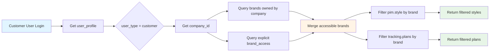
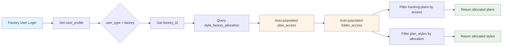
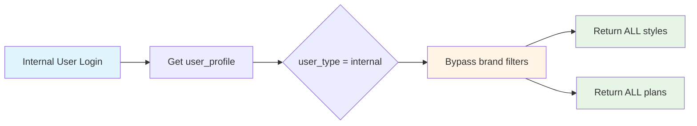
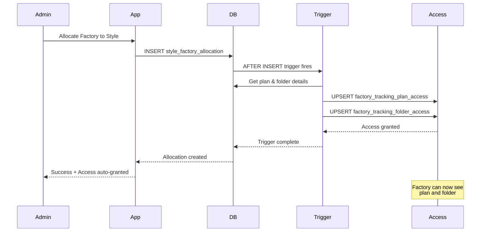

# RLS Schema Visual Overview

This document provides visual diagrams and quick reference for the RLS implementation.

## Table Relationships at a Glance

### Core Tables

```
┌─────────────────────────────────────────────────────────────────┐
│                        MDM SCHEMA                               │
├─────────────────────────────────────────────────────────────────┤
│                                                                 │
│  ┌──────────────┐        ┌──────────────┐                      │
│  │   company    │◄───────┤    brand     │                      │
│  │              │        │              │                      │
│  │ - code       │        │ - code       │                      │
│  │ - name       │        │ - name       │                      │
│  │ - type       │        │ - owner_id ──┘                      │
│  └──────┬───────┘        └──────────────┘                      │
│         │                                                       │
│         │                                                       │
│  ┌──────▼───────┐                                               │
│  │   factory    │                                               │
│  │              │                                               │
│  │ - code       │                                               │
│  │ - name       │                                               │
│  │ - company_id │                                               │
│  └──────────────┘                                               │
└─────────────────────────────────────────────────────────────────┘

┌─────────────────────────────────────────────────────────────────┐
│                       PUBLIC SCHEMA                             │
├─────────────────────────────────────────────────────────────────┤
│                                                                 │
│  ┌──────────────┐        ┌───────────────────┐                 │
│  │ auth.users   │◄───────┤  user_profile     │                 │
│  │              │        │                   │                 │
│  │ - id         │        │ - user_type       │                 │
│  │ - email      │        │ - company_id    ──┼──► mdm.company  │
│  └──────────────┘        │ - factory_id    ──┼──► mdm.factory  │
│                          │ - role            │                 │
│                          └───────┬───────────┘                 │
│                                  │                             │
│                          ┌───────▼────────────┐                │
│                          │ user_brand_access  │                │
│                          │                    │                │
│                          │ - user_id          │                │
│                          │ - brand_id       ──┼──► mdm.brand   │
│                          │ - access_level     │                │
│                          └────────────────────┘                │
└─────────────────────────────────────────────────────────────────┘

┌─────────────────────────────────────────────────────────────────┐
│                        OPS SCHEMA                               │
├─────────────────────────────────────────────────────────────────┤
│                                                                 │
│  ┌──────────────────────┐      ┌────────────────────────┐      │
│  │ style_factory_       │      │ factory_tracking_      │      │
│  │ allocation           │      │ plan_access            │      │
│  │                      │      │                        │      │
│  │ - plan_id            │      │ - factory_id         ──┼──►   │
│  │ - plan_style_id      │      │ - tracking_plan_id     │      │
│  │ - factory_id       ──┼──►   │ - allocation_count     │      │
│  │ - allocated_qty      │      │ - active               │      │
│  └──────────────────────┘      └────────────────────────┘      │
│                                                                 │
│  ┌────────────────────────┐                                     │
│  │ factory_tracking_      │                                     │
│  │ folder_access          │                                     │
│  │                        │                                     │
│  │ - factory_id         ──┼──► mdm.factory                      │
│  │ - tracking_folder_id   │                                     │
│  │ - brand                │                                     │
│  └────────────────────────┘                                     │
└─────────────────────────────────────────────────────────────────┘
```

## User Access Flow

### Customer User Journey



### Factory User Journey



### Internal User Journey



## Trigger Flow for Factory Allocation



## Data Visibility Matrix

| User Type | Sees Styles | Sees Plans | Sees Folders | Filter Logic |
|-----------|-------------|------------|--------------|--------------|
| **Internal** | All | All | All | No filter (full access) |
| **Customer** | By Brand | By Brand | By Brand | brand IN accessible_brands |
| **Factory** | By Allocation | By Allocation | By Access | JOIN factory_*_access |
| **External** | None | None | None | No access granted |

## Helper Functions Quick Map

```
┌─────────────────────────────────────────────────────────┐
│              HELPER FUNCTIONS                           │
├─────────────────────────────────────────────────────────┤
│                                                         │
│  Customer Access:                                       │
│  ┌─────────────────────────────────────────────┐       │
│  │ get_accessible_brands(user_id)              │       │
│  │ → Returns: brand_id, code, name, level      │       │
│  └─────────────────────────────────────────────┘       │
│                                                         │
│  ┌─────────────────────────────────────────────┐       │
│  │ get_accessible_brand_codes(user_id)         │       │
│  │ → Returns: ['NIKE_SPORT', 'NIKE_CASUAL']    │       │
│  └─────────────────────────────────────────────┘       │
│                                                         │
│  ┌─────────────────────────────────────────────┐       │
│  │ can_access_brand(brand_code, user_id)       │       │
│  │ → Returns: true/false                        │       │
│  └─────────────────────────────────────────────┘       │
│                                                         │
│  Factory Access:                                        │
│  ┌─────────────────────────────────────────────┐       │
│  │ get_factory_accessible_plans(user_id)       │       │
│  │ → Returns: plan_id, name, brand, season     │       │
│  └─────────────────────────────────────────────┘       │
│                                                         │
│  ┌─────────────────────────────────────────────┐       │
│  │ get_factory_accessible_folders(user_id)     │       │
│  │ → Returns: folder_id, name, brand           │       │
│  └─────────────────────────────────────────────┘       │
│                                                         │
└─────────────────────────────────────────────────────────┘
```

## RLS Policy Summary

### PIM Schema Policies

```
pim.style:
├── "Internal users can view all styles" (SELECT)
│   → WHERE user_type = 'internal'
│
├── "Customer users can view styles for their brands" (SELECT)
│   → WHERE brand IN accessible_brand_codes()
│
├── "Users with brand access can view styles" (SELECT)
│   → WHERE brand IN user_brand_access
│
├── "Internal users can manage styles" (ALL)
│   → WHERE user_type = 'internal'
│
└── "Users with write access can update styles" (UPDATE)
    → WHERE brand IN brands with edit permission

pim.style_colorway:
├── Inherits from parent style
└── Internal users can manage

pim.style_size_class:
├── Inherits from parent style
└── Internal users can manage
```

### Tracking Schema Policies

```
tracking.folders:
├── "Internal users can view all folders" (SELECT)
│   → WHERE user_type = 'internal'
│
├── "Customer users can view folders for their brands" (SELECT)
│   → WHERE brand IN accessible_brand_codes()
│
└── "Factory users can view accessible folders" (SELECT)
    → WHERE id IN factory_accessible_folders()

tracking.plans:
├── "Internal users can view all plans" (SELECT)
│   → WHERE user_type = 'internal'
│
├── "Customer users can view plans for their brands" (SELECT)
│   → WHERE brand IN accessible_brand_codes()
│
└── "Factory users can view accessible plans" (SELECT)
    → WHERE id IN factory_accessible_plans()

tracking.plan_styles:
├── "Internal users can view all plan styles" (SELECT)
│   → WHERE user_type = 'internal'
│
├── "Customer users can view plan styles for brands" (SELECT)
│   → WHERE brand IN accessible_brand_codes()
│
└── "Factory users can view allocated plan styles" (SELECT)
    → WHERE plan_style_id IN allocations
    → OR plan_id IN accessible_plans
```

## Migration Sequence

```
Migration 014: Create MDM Schema
     ↓
  Creates:
  - mdm.company
  - mdm.factory
  - mdm.brand
  - mdm.brand_contact
     ↓
Migration 015: User Management
     ↓
  Creates:
  - public.user_profile
  - public.user_brand_access
  - Helper functions for brand access
  - Auto-create triggers
     ↓
Migration 016: Factory Access
     ↓
  Creates:
  - ops.factory_tracking_plan_access
  - ops.factory_tracking_folder_access
  - ops.style_factory_allocation
  - Auto-grant/revoke triggers
  - Helper functions for factory access
     ↓
Migration 017: Apply RLS Policies
     ↓
  Applies:
  - RLS on pim.style and children
  - RLS on tracking tables
  - Brand-based policies
  - Factory-based policies
  - Service role full access
```

## Testing Flow

```
1. Load Seed Data
   ├── Test Companies (Nike, Adidas, Puma, AAG)
   ├── Test Factories (China, Vietnam, India)
   ├── Test Brands (8 brands across companies)
   ├── Test Users (internal, customer, factory)
   └── Test Styles & Allocations

2. Test Customer Access
   ├── Login as Nike user
   ├── Query pim.style
   ├── Verify: Only Nike brands visible
   └── Verify: Can't see Adidas/Puma

3. Test Factory Access
   ├── Login as China Factory user
   ├── Query tracking.plan_styles
   ├── Verify: Only allocated styles visible
   └── Verify: Can't see unallocated styles

4. Test Internal Access
   ├── Login as AAG internal user
   ├── Query all tables
   └── Verify: All data visible

5. Test Access Grants
   ├── Allocate factory to style
   ├── Verify: plan_access created
   ├── Verify: folder_access created
   ├── De-allocate factory
   └── Verify: access revoked if no allocations remain
```

## Key Security Points

```
┌─────────────────────────────────────────────────┐
│           SECURITY CONSIDERATIONS               │
├─────────────────────────────────────────────────┤
│                                                 │
│  ✓ Service Role Key                             │
│    - Never expose to frontend                   │
│    - Use only in Edge Functions                 │
│    - Bypasses all RLS policies                  │
│                                                 │
│  ✓ JWT Claims                                   │
│    - auth.uid() gets user from JWT              │
│    - Synced to user_profile via triggers        │
│    - Cannot be tampered by client               │
│                                                 │
│  ✓ Factory Access                               │
│    - Auto-granted via triggers                  │
│    - Auto-revoked when no allocations           │
│    - Audit trail maintained                     │
│                                                 │
│  ✓ Brand Access                                 │
│    - Based on company ownership                 │
│    - Explicit grants override                   │
│    - Time-based expiration supported            │
│                                                 │
│  ✓ Policy Layering                              │
│    - Internal users: full access                │
│    - Customer users: brand-filtered             │
│    - Factory users: allocation-filtered         │
│    - Service role: bypass all                   │
│                                                 │
└─────────────────────────────────────────────────┘
```

## Performance Optimization

```
Indexes Created:
================

MDM Schema:
- idx_company_code
- idx_company_type
- idx_company_active
- idx_factory_code
- idx_factory_company_id
- idx_factory_active
- idx_brand_code
- idx_brand_owner_company
- idx_brand_active

Public Schema:
- idx_user_profile_type
- idx_user_profile_company
- idx_user_profile_factory
- idx_user_profile_role
- idx_user_brand_access_user
- idx_user_brand_access_brand

OPS Schema:
- idx_factory_folder_access_factory
- idx_factory_folder_access_folder
- idx_factory_plan_access_factory
- idx_factory_plan_access_plan
- idx_style_allocation_plan
- idx_style_allocation_factory

Recommended:
- Add idx_style_brand on pim.style(brand)
- Consider materialized views for complex joins
```

---

*For detailed implementation, see [RLS-IMPLEMENTATION-GUIDE.md](./RLS-IMPLEMENTATION-GUIDE.md)*

*For code examples, see [RLS-QUICK-REFERENCE.md](./RLS-QUICK-REFERENCE.md)*
