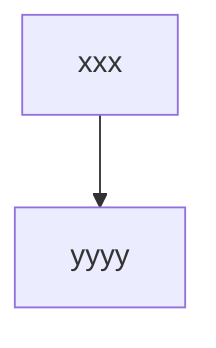

# Timeline / Time & Action Plan

This document provides an overview of the Timeline / Time & Action Plan stage in the end-to-end workflow.

## Purpose
This stage manages the overall timeline and critical path for the season, integrating with upstream and downstream workflow stages.

## Key Artifacts
- Timeline templates
- Milestone definitions
- Gantt charts
- Dependency maps

## Integration Points
- Receives data from production, logistics, and quality stages
- Sends updates to reporting and analytics

## Folder Structure
- `docs/`: Documentation and diagrams
- All SQL migrations and Edge Function code/scripts are now centralized in the canonical `supabase/` folders. See [Migration and Function Index](../../../../supabase/MIGRATION_FUNCTION_INDEX.md) for the single source of truth.

## Mermaid Diagram

---

*Expand this document as the stage is implemented.*
