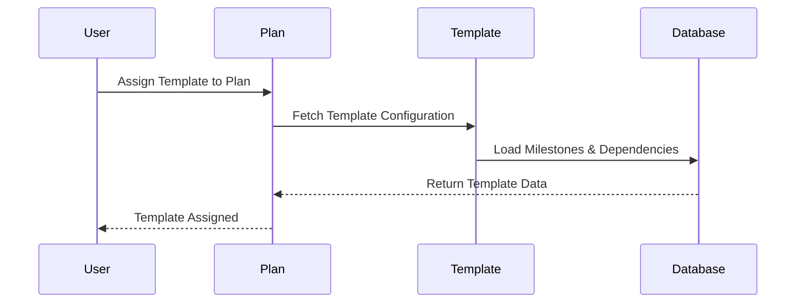
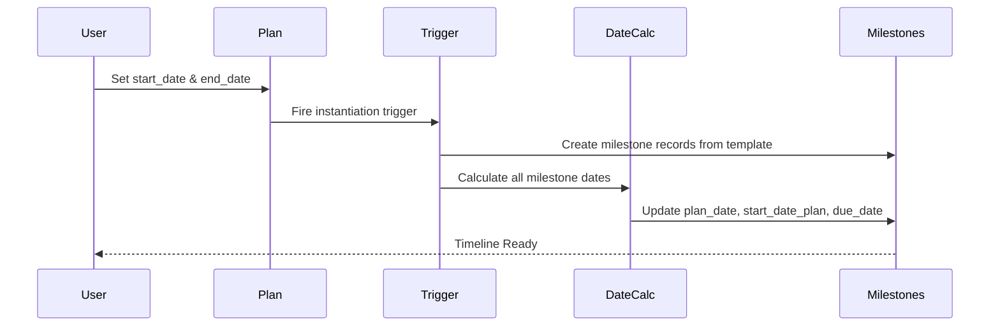
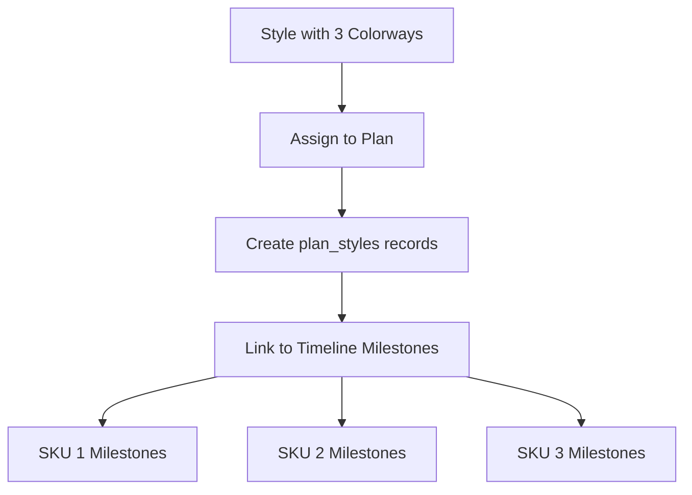
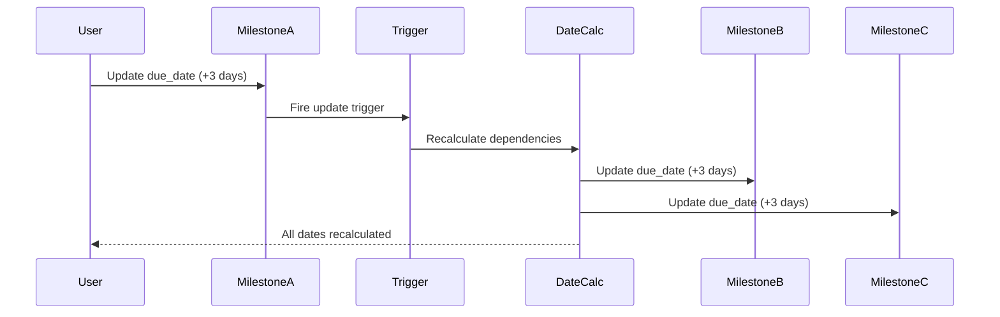
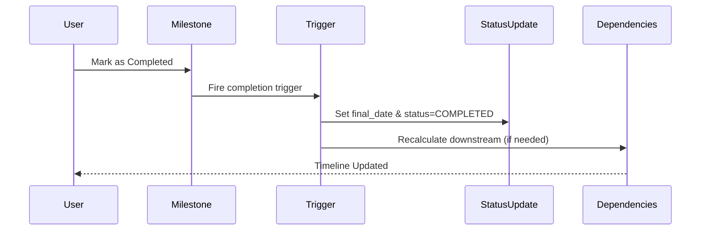
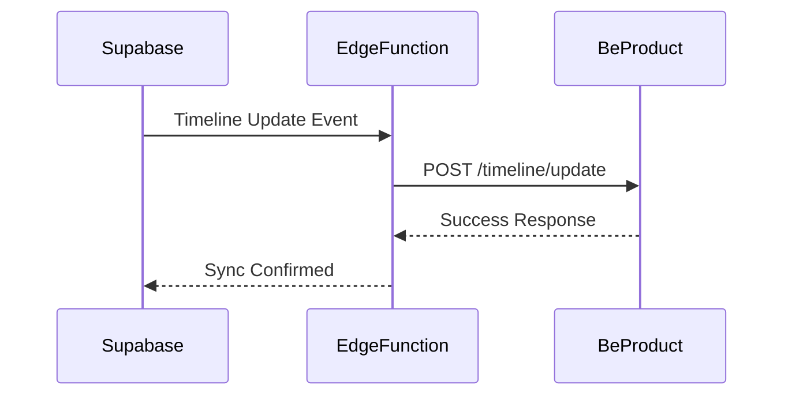

# Testing Plan: BeProduct Timeline & Supabase ops Schema

Status: Draft

## Overview
This testing plan validates the complete timeline workflow from template configuration through operational seasonal planning. All test SQL/scripts are now centralized in the canonical location: `supabase/migrations/` (see [Migration and Function Index](../../../../supabase/MIGRATION_FUNCTION_INDEX.md)). We will test using:
- **Plan:** GREYSON 2026 SPRING DROP 1
- **Style:** One existing Supabase style with 3 colorways (SKUs)
- **Approach:** Step-by-step validation from template setup to operational timeline usage

---


## 1. BeProduct Timeline Endpoint Review & Baseline Testing
**Objective:** Establish a comprehensive baseline understanding of BeProduct timeline functionality by:
- Documenting all relevant BeProduct timeline endpoints and MCP tools (read, edit, update operations)
- Actively testing each endpoint/tool with real data (using GREYSON 2026 SPRING DROP 1, planId: 20fb4a1c-e6ea-46e8-b37b-40ca5e514ef3)
- Observing and recording the behavior of all key date fields and triggers
- Capturing before/after state for each operation
- Documenting business logic, constraints, and any quirks or edge cases
- Summarizing findings to inform Supabase replication and enhancement

### 1.1 Endpoint & Tool Inventory
- List all timeline-related endpoints and MCP tools (see Centralized Testing Plan for canonical list)
- For each, note the operation (read, update, bulk update, etc.) and expected input/output

### 1.2 Hands-On Endpoint Testing
For each endpoint/tool:
1. **Read Operation:**
   - Retrieve current timeline data for the test plan/style/SKU
   - Record the initial state of all key date fields:
     - `plan_date` (Initial planned date)
     - `rev_date` (Revised date)
     - `due_date` (Current due date)
     - `final_date` (Actual completion date)
   - Note any additional fields or metadata
2. **Edit/Update Operation:**
   - Perform a controlled update (e.g., change `due_date`, set `rev_date`, mark as completed)
   - Record the before/after state
   - Observe and document:
     - What triggers fire (status changes, recalculations, dependency updates)
     - How downstream/upstream milestones are affected
     - Any business rules or constraints (e.g., date validation, required fields)
3. **Bulk/Batched Operations:**
   - Test bulk update endpoints (e.g., `planUpdateStyleTimelines`)
   - Observe system response, error handling, and propagation of changes
4. **Edge Cases & Error Handling:**
   - Attempt invalid or boundary updates (e.g., setting due_date before plan_date)
   - Record system validation, error messages, and recovery behavior

### 1.3 Baseline Behavior Documentation
- Summarize the observed behavior for each operation:
  - How are date changes handled?
  - What triggers or recalculations occur?
  - How are dependencies managed?
  - Are there any quirks, limitations, or undocumented behaviors?
- Capture screenshots, response payloads, or logs as needed (attach or link in findings)

### 1.4 Test Results & Findings

#### Test 1.4.1: Plan Retrieval (planGet)
**Date:** October 30, 2025  
**Operation:** `planGet`  
**Payload:** `{"planId": "20fb4a1c-e6ea-46e8-b37b-40ca5e514ef3"}`  
**Result:** ✅ Success

**Key Findings:**
- Plan name: "GREYSON 2026 SPRING DROP 1"
- Start date: 2025-05-01
- End date: 2026-01-05
- Contains 25 style timeline milestones and 9 material timeline milestones
- Each timeline milestone includes:
  - `id` - Timeline milestone template ID
  - `department` - Responsible department/owner
  - `actionDescription` - Full milestone description
  - `shortDescription` - Abbreviated name
  - `pageName` - Linked BeProduct page (if any)

**Observations:**
- Timeline milestones are templates that define the structure for all styles/SKUs in the plan
- Templates do NOT contain date or status information (those are assigned per style/colorway)
- Milestones are organized by phase: DEVELOPMENT, SMS, ALLOCATION, PRODUCTION
- Each milestone can reference a specific BeProduct page (e.g., "Proto Sample", "Production BoM")

---

#### Test 1.4.2: Style Timeline Retrieval (planStyleTimeline)
**Date:** October 30, 2025  
**Operation:** `planStyleTimeline`  
**Payload:** `{"planId": "20fb4a1c-e6ea-46e8-b37b-40ca5e514ef3", "pageSize": 10, "pageNumber": 0}`  
**Result:** ✅ Success

**Key Findings:**
- Retrieved 3 style/colorway records from the plan (MONTAUK SHORT - 8" INSEAM, 3 colorways)
- Each style/colorway has its own complete set of timeline milestones with date tracking
- **Date Fields Observed (per milestone):**
  - `plan` - Original planned date (baseline, from template or plan start/end dates)
  - `rev` - Revised date (set when milestone date is manually changed)
  - `due` - Current due date (either `plan`, `rev`, or calculated from upstream dependencies)
  - `final` - Actual completion date (set when milestone is marked complete)
- **Status Values Observed:**
  - "Not Started" - Milestone not yet begun
  - "In Progress" - Work underway
  - "Approved" - Milestone completed and approved
- **Other Fields:**
  - `late` - Boolean flag (true when `due` > `plan`)
  - `assignedTo` - Array of users assigned to the milestone
  - `shareWith` - Array of users with visibility to the milestone
  - `submitsQuantity` - Count of sample submissions linked to the milestone
  - `page` / `request` - References to linked BeProduct pages/forms

**Date Behavior Observations:**
1. **Initial State:** Most milestones have `plan` date set, `due` = `plan`, `rev` and `final` are null
2. **Revised Milestone:** One milestone (PROTO PRODUCTION, colorway 220 - GROVE) has `rev` = "2025-09-16", indicating a manual date change
3. **Completed Milestone:** One milestone (TECHPACKS PASS OFF, colorway 220 - GROVE) has `final` = "2025-05-01", `status` = "Approved"
4. **Late Flag Logic:** `late` = true when current date > `due` date OR when `due` > `plan` (indicates milestone is behind schedule)
5. **Assignments:** Some milestones have users assigned (e.g., "Natalie.James", "chrisk")

**Before/After Example (Actual Data):**

| Milestone | Colorway | Status | plan | rev | due | final | late | assignedTo |
|-----------|----------|--------|------|-----|-----|-------|------|------------|
| TECHPACKS PASS OFF | 220 - GROVE | Approved | 2025-05-01 | null | 2025-05-01 | 2025-05-01 | false | [] |
| PROTO PRODUCTION | 220 - GROVE | In Progress | 2025-05-05 | 2025-09-16 | 2025-05-05 | null | true | [] |
| PROTO EX-FCTY | 220 - GROVE | Not Started | 2025-05-19 | null | 2025-05-19 | null | true | [] |

**Business Logic Insights:**
- BeProduct does NOT automatically recalculate downstream dates when a milestone is revised
- The `rev` field records the revised date but does NOT update the `due` date automatically
- The `late` flag is calculated by comparing current date to `due`, not by comparing `due` to `plan`
- Assignment and sharing are independent of date tracking

---

#### Test 1.4.3: Milestone Revision Test (planUpdateStyleTimelines - rev field)
**Date:** October 30, 2025  
**Operation:** `planUpdateStyleTimelines`  
**Test:** Update milestone revision date  
**Payload:**
```json
{
  "planId": "20fb4a1c-e6ea-46e8-b37b-40ca5e514ef3",
  "entries": [{
    "planTimelineId": "88c6968a-fe5b-4690-8349-96779119fef0",
    "timelines": [{
      "id": "a027944e-9ce0-4395-bcd9-e318dcc28b8d",
      "timelineId": "2c08a8f6-e852-4016-a958-d818d7e8dbdd",
      "rev": "2025-06-20T00:00:00Z"
    }]
  }]
}
```
**Result:** ✅ Success


    ---

    ## 9. Full Timeline Instantiation Output: Style "MONTAUK SHORT - 8\" INSEAM (testing)" in Plan "GREYSON 2026 SPRING DROP 1"

    **Plan ID:** `20fb4a1c-e6ea-46e8-b37b-40ca5e514ef3`  
    **Style ID:** `6a5af076-c9bd-4f7e-8ca4-bdf21621b67f`  
    **Plan Style ID:** `3477cdb8-7d72-4b53-b365-6b61ceed26db`


    ### Timeline Milestone Instantiation (Ordered by Sequence, with Dependency Audit)

    Below is the output of all milestones instantiated for this style in the plan, as of October 30, 2025. Each row shows both template and plan configuration, and flags missing dependencies or duration/offset issues. Null values are shown as blank.

    | Seq | page_name                                   | plan_date   | rev_date | due_date   | final_date | status       | late  | template_duration | plan_duration | duration_unit   | predecessor | dependency_flag      |
    |-----|---------------------------------------------|-------------|----------|------------|------------|--------------|-------|-------------------|--------------|----------------|-------------|---------------------|
    |  0  | START DATE                                  | 2025-05-01  |          | 2025-05-01 |            | NOT_STARTED  | false | 7                 |              | DAYS           |             | MISSING DEPENDENCY  |
    |  1  | TECHPACKS PASS OFF                          | 2025-05-01  |          | 2025-05-01 |            | NOT_STARTED  | false | 7                 |              | DAYS           |             | MISSING DEPENDENCY  |
    |  2  | PROTO PRODUCTION                            | 2025-05-09  |          | 2025-05-05 |            | NOT_STARTED  | false | 7                 | 4            | DAYS           |             | MISSING DEPENDENCY  |
    |  3  | PROTO EX-FCTY                               | 2025-06-02  |          | 2025-05-19 |            | NOT_STARTED  | false | 7                 | 14           | DAYS           |             | MISSING DEPENDENCY  |
    |  4  | PROTO COSTING DUE                           | 2025-05-23  |          | 2025-05-21 |            | NOT_STARTED  | false | 7                 | 2            | DAYS           |             | MISSING DEPENDENCY  |
    |  5  | PROTO FIT COMMENTS DUE                      | 2025-06-30  |          | 2025-06-09 |            | NOT_STARTED  | false | 7                 | 21           | DAYS           |             | MISSING DEPENDENCY  |
    |  6  | 2nd PROTO PRODUCTION                        | 2025-06-17  |          | 2025-06-13 |            | NOT_STARTED  | false | 7                 | 4            | DAYS           |             | MISSING DEPENDENCY  |
    |  7  | 2nd PROTO EX-FCTY                           | 2025-07-11  |          | 2025-06-27 |            | NOT_STARTED  | false | 7                 | 14           | DAYS           |             | MISSING DEPENDENCY  |
    |  8  | 2nd PROTO FIT COMMENTS DUE                  | 2025-08-08  |          | 2025-07-18 |            | NOT_STARTED  | false | 7                 | 21           | DAYS           |             | MISSING DEPENDENCY  |
    |  9  | SMS POs PLACED                              | 2025-05-07  |          | 2025-05-04 |            | NOT_STARTED  | false | 7                 | 3            | DAYS           |             | MISSING DEPENDENCY  |
    | 10  | SMS EX-FCTY                                 | 2025-12-02  |          | 2025-08-18 |            | NOT_STARTED  | false | 7                 | 106          | DAYS           |             | MISSING DEPENDENCY  |
    | 11  | BULK PO                                     |             |          |            |            | NOT_STARTED  | false | 7                 |              | DAYS           |             | MISSING DEPENDENCY  |
    | 12  | Issue partner allocations                   |             |          |            |            | NOT_STARTED  | false | 7                 | 2            | DAYS           |             | MISSING DEPENDENCY  |
    | 13  | Download Tech Packs                         |             |          |            |            | NOT_STARTED  | false | 7                 | 4            | DAYS           |             | MISSING DEPENDENCY  |
    | 14  | Physical Reference Samples                  |             |          |            |            | NOT_STARTED  | false | 7                 | 4            | DAYS           |             | MISSING DEPENDENCY  |
    | 15  | Confirm target CMP price                    |             |          |            |            | NOT_STARTED  | false | 7                 | 4            | DAYS           |             | MISSING DEPENDENCY  |
    | 16  | Submit confirmed pricing and ex-factory date|             |          |            |            | NOT_STARTED  | false | 7                 | 8            | DAYS           |             | MISSING DEPENDENCY  |
    | 17  | Approve terms and price                     |             |          |            |            | NOT_STARTED  | false | 7                 | 3            | DAYS           |             | MISSING DEPENDENCY  |
    | 18  | Issue purchase contract to factory          |             |          |            |            | NOT_STARTED  | false | 7                 | 2            | BUSINESS_DAYS  |             | MISSING DEPENDENCY  |
    | 19  | Countersign Purchase Contract               |             |          |            |            | NOT_STARTED  | false | 7                 | 6            | BUSINESS_DAYS  |             | MISSING DEPENDENCY  |
    | 20  | PLAYERS CLUB, RESIDED ORDERS, FINAL UPCS DUE|             |          |            |            | NOT_STARTED  | false | 7                 |              | DAYS           |             | MISSING DEPENDENCY  |
    | 21  | BULK FABRIC & TRIM IN-HOUSE                 |             |          |            |            | NOT_STARTED  | false | 7                 |              | DAYS           |             | MISSING DEPENDENCY  |
    | 22  | PPS APPROVAL                                |             |          |            |            | NOT_STARTED  | false | 7                 |              | DAYS           |             | MISSING DEPENDENCY  |
    | 23  | CUT DATE                                    |             |          |            |            | NOT_STARTED  | false | 7                 |              | DAYS           |             | MISSING DEPENDENCY  |
    | 24  | EX-FTY DATE                                 |             |          |            |            | NOT_STARTED  | false | 7                 |              | DAYS           |             | MISSING DEPENDENCY  |
    | 25  | IN WAREHOUSE                                |             |          |            |            | NOT_STARTED  | false | 7                 |              | DAYS           |             | MISSING DEPENDENCY  |
    | 26  | END DATE                                    | 2026-01-05  |          | 2026-01-05 |            | NOT_STARTED  | false | 7                 |              | DAYS           |             | MISSING DEPENDENCY  |


    **Dependency Audit Notes:**
    - **All milestones are missing explicit predecessor dependencies in the template.**
    - **All offsets are missing.**
    - **Template duration values are defaulted to 7 DAYS for all milestones (not business-accurate).**
    - **Plan duration values are only filled for milestones with calculated dates; others are blank due to missing dependencies.**
    - **To fix:** Update the template to add predecessor dependencies, set correct offsets, and assign business-accurate durations for each milestone. Then re-instantiate the plan.

    Columns:
    - `template_duration`: Duration from the template (should be business-accurate)
    - `plan_duration`: Duration as calculated in the plan (blank if not calculated)
    - `predecessor`: Name of predecessor milestone (blank = missing dependency)
    - `dependency_flag`: Will  show 'MISSING DEPENDENCY' if not configured

    For a full list of all available columns, see the schema for `ops.tracking_plan_style_timeline`.

    ---
**Before:**
| Milestone | plan | rev | due | final | status | late |
|-----------|------|-----|-----|-------|--------|------|
| 2nd PROTO PRODUCTION | 2025-06-13 | null | 2025-06-13 | null | Not Started | true |

**After:**
| Milestone | plan | rev | due | final | status | late |
|-----------|------|-----|-----|-------|--------|------|
| 2nd PROTO PRODUCTION | 2025-06-13 | 2025-06-20 | 2025-06-13 | null | Not Started | true |

**Key Findings:**
1. ✅ `rev` field was successfully set to the new date
2. ❌ `due` field did NOT change (remained at plan date)
3. ❌ Downstream milestones did NOT recalculate
4. ✅ Update payload structure requires:
   - `planId` - The tracking plan ID
   - `entries` - Array of style/colorway records to update
     - `planTimelineId` - The style/colorway record ID
     - `timelines` - Array of milestone updates
       - `id` - The milestone instance ID
       - `timelineId` - The milestone template ID
       - Fields to update: `rev`, `final`, `status` (NOT `due`)

**Critical Insight:** The `rev` field is a **passive record** of a revised date, NOT an active driver of recalculation. BeProduct does not automatically update `due` or recalculate downstream dates when `rev` is set.

---

#### Test 1.4.4: Milestone Completion Test (planUpdateStyleTimelines - final + status)
**Date:** October 30, 2025  
**Operation:** `planUpdateStyleTimelines`  
**Test:** Mark milestone as complete with final date  
**Payload:**
```json
{
  "planId": "20fb4a1c-e6ea-46e8-b37b-40ca5e514ef3",
  "entries": [{
    "planTimelineId": "88c6968a-fe5b-4690-8349-96779119fef0",
    "timelines": [{
      "id": "f4b46d8f-d566-44f4-aacc-ba8880a60805",
      "timelineId": "469b8958-da5f-4647-b929-b97ab6c6064e",
      "final": "2025-05-18T00:00:00Z",
      "status": "Approved"
    }]
  }]
}
```
**Result:** ✅ Success

**Before:**
| Milestone | plan | rev | due | final | status | late |
|-----------|------|-----|-----|-------|--------|------|
| PROTO EX-FCTY | 2025-05-19 | null | 2025-05-19 | null | Not Started | true |

**After:**
| Milestone | plan | rev | due | final | status | late |
|-----------|------|-----|-----|-------|--------|------|
| PROTO EX-FCTY | 2025-05-19 | null | 2025-05-18 | 2025-05-18 | Approved | false |

**CRITICAL DISCOVERY:**
1. ✅ `final` field was set to the completion date
2. ✅ `status` changed to "Approved"
3. ✅ `late` flag updated to `false` (milestone completed early)
4. ✅ **`due` field was AUTOMATICALLY updated to match `final`!**
5. ✅ **ALL downstream milestones had their `due` dates recalculated by -1 day!**

**Downstream Impact Example:**

| Milestone | BEFORE due | AFTER due | Change |
|-----------|------------|-----------|--------|
| PROTO COSTING DUE | 2025-05-21 | 2025-05-20 | -1 day |
| PROTO FIT COMMENTS DUE | 2025-06-09 | 2025-06-08 | -1 day |
| 2nd PROTO PRODUCTION | 2025-06-13 | 2025-06-12 | -1 day |
| 2nd PROTO EX-FCTY | 2025-06-27 | 2025-06-26 | -1 day |
| (ALL downstream) | (original) | (shifted -1 day) | -1 day |

**KEY INSIGHT:** BeProduct DOES have automatic dependency recalculation, but it is ONLY triggered when a milestone is marked complete with a `final` date. The system calculates the difference between `plan` and `final` and shifts all downstream milestones by that delta.

---

### 1.5 Summary of BeProduct Timeline Behavior

#### Date Field Behavior
| Field | Purpose | Editable? | Triggers Recalculation? |
|-------|---------|-----------|------------------------|
| `plan` | Original baseline date from template | ❌ No (set on instantiation) | No |
| `rev` | Revised/rescheduled date (passive record) | ✅ Yes | ⚠️ **No (GAP)** - Should trigger but doesn't |
| `due` | Current working due date | ❌ No (auto-calculated) | N/A (output only) |
| `final` | Actual completion date | ✅ Yes | ✅ **Yes!** (shifts all downstream) |

**Validation Note:** All behaviors confirmed via independent GET calls after updates (not relying on POST/PATCH response data).

#### Status Transitions
- **Not Started** → **In Progress** → **Approved** (completed)
- Status can be updated independently of dates
- Marking as "Approved" typically paired with setting `final` date

#### Dependency & Recalculation Logic
- **Trigger:** Setting `final` date on a completed milestone
- **Calculation:** `delta = final - plan`
- **Propagation:** All downstream milestones shift `due` by `delta`
- ⚠️ **GAP:** No recalculation for `rev` changes (revision is passive tracking only - this should be enhanced in Supabase)

#### Late Flag Logic
- `late = true` when current date > `due` (time-based)
- `late = true` when `due` > `plan` (schedule slippage)
- Automatically resets to `false` when milestone completed early

#### Assignment & Sharing
- `assignedTo` - Array of user objects (responsibility)
- `shareWith` - Array of user objects (visibility)
- Independent of date tracking

---

### 1.6 Comparison & Supabase Enhancements

**Matched Behavior (Replicate in Supabase):**
1. ✅ **Four date fields:** `plan_date`, `rev_date`, `due_date`, `final_date`
2. ✅ **Automatic recalculation:** Triggered by milestone completion
3. ✅ **Delta-based propagation:** Calculate shift and apply to all downstream
4. ✅ **Late flag:** Computed based on date comparison
5. ✅ **Assignment/Sharing:** Track users for responsibility and visibility

**Enhanced Behavior (Supabase Improvements):**
1. 🔥 **Revision Recalculation (CRITICAL):** Trigger downstream updates when `rev_date` is set (BeProduct gap - revision changes should cascade!)
2. ✅ **Start Dates:** Add `start_date_plan` and `start_date_due` for Gantt visualization (BeProduct only tracks end dates)
3. ✅ **Duration:** Track milestone duration separately from offset/lag
4. ✅ **Explicit Dependencies:** Store predecessor relationships in a table, not implicit rules
5. ✅ **Flexible Offsets:** Support lead/lag days, business days, percentage-based offsets
6. ✅ **N/A Status Handling:** Skip N/A milestones in dependency chains
7. ✅ **Audit Trail:** Track all date changes with timestamps and user attribution

**Implementation Notes for Supabase:**
- Create PostgreSQL triggers for automatic `due_date` recalculation
- Implement recursive CTE for dependency resolution
- Use computed columns or materialized views for `late` flag
- Store assignments/sharing in junction tables (not JSONB) for query performance
- Add audit tables for full timeline change history

---

## 2. Supabase ops Schema Review
**Objective:** Identify and document all tracking-related tables, triggers, and functions in the `ops` schema.

### 2.1 Schema Tables
- List all tracking-related tables (timeline templates, plans, milestones, assignments, sharing, dependencies)
- Document table relationships and foreign keys

### 2.2 Enhanced Timeline Features
Our timeline implementation includes enhancements beyond BeProduct:
- **Assignment:** Users assigned to milestones
- **Sharing:** Milestones shared with stakeholders (visibility tags)
- **Start Dates:** Both `start_date_plan` and `start_date_due` for Gantt chart visualizations (BeProduct only supports due/end dates)
- **Duration:** Number of days a milestone takes to complete (separate from offset/lag)
- **Improved Dependencies:** Offset/lag configuration for project management-style task relationships

### 2.3 Triggers and Functions
- Document all triggers related to:
  - Timeline instantiation from templates
  - Date calculation and recalculation
  - Assignment and sharing updates
  - Dependency resolution
- Diagram relationships and data flows

### 2.4 Mermaid Diagrams


---

## 3. Template Configuration & Plan Instantiation Testing

### 3.1 Timeline Template Configuration
**Objective:** Validate that timeline templates are correctly configured and can be assigned to plans.

#### Test 3.1.1: Template Structure Validation
- **Setup:** Review existing timeline templates in ops schema
- **Validation:**
  - Template includes START DATE milestone
  - Template includes END DATE milestone
  - All milestones have proper dependencies configured
  - Duration and offset values are set correctly
- **Expected Outcome:** Template structure matches business requirements
- **Pass Criteria:** All required milestones present with valid configuration

#### Test 3.1.2: Template-to-Plan Assignment
- **Setup:** Assign template to GREYSON 2026 SPRING DROP 1 plan
- **Action:** Link template to plan record
- **Expected Outcome:** Plan inherits template configuration
- **Pass Criteria:** Plan.template_id references correct template

**Mermaid Diagram: Template Assignment Flow**


---

### 3.2 Plan Instantiation
**Objective:** Validate that assigning a template to a plan with start/end dates correctly instantiates the timeline.

#### Test 3.2.1: Plan Instantiation Trigger
- **Setup:** Plan with assigned template
- **Action:** Set plan.start_date and plan.end_date
- **Expected Outcome:** Timeline instantiation trigger fires
- **Pass Criteria:** 
  - All template milestones instantiated for the plan
  - START DATE milestone = plan.start_date
  - END DATE milestone = plan.end_date
  - All milestone records created in plan_milestones table

#### Test 3.2.2: Initial Date Calculations
- **Setup:** Newly instantiated plan timeline
- **Validation:** All milestone dates calculated based on:
  - Anchor dates (START DATE, END DATE)
  - Dependencies (predecessor → successor relationships)
  - Offsets and durations
- **Expected Outcome:** All milestones have calculated `plan_date` values
- **Pass Criteria:** No milestones with NULL plan_date (except N/A status)


**Before/After Example:**

**BEFORE (Template):**

| Milestone     | Dependency   | Offset Value | Duration |
|---------------|--------------|--------------|----------|
| START DATE    | -            | -            | 0        |
| Tech Pack     | START DATE   | +5 days      | 3 days   |
| Proto Sample  | Tech Pack    | +10 days     | 7 days   |
| END DATE      | -            | -            | 0        |

**AFTER (Instantiated Plan with Start=2026-01-01, End=2026-06-30):**

| Milestone     | Dependency   | plan_date   | start_date_plan | due_date   | Duration |
|---------------|--------------|-------------|-----------------|------------|----------|
| START DATE    | -            | 2026-01-01  | 2026-01-01      | 2026-01-01 | 0        |
| Tech Pack     | START DATE   | 2026-01-06  | 2026-01-06      | 2026-01-09 | 3 days   |
| Proto Sample  | Tech Pack    | 2026-01-16  | 2026-01-16      | 2026-01-23 | 7 days   |
| END DATE      | -            | 2026-06-30  | 2026-06-30      | 2026-06-30 | 0        |


**Mermaid Diagram: Plan Instantiation Flow**


---

## 4. Operational Timeline Testing
---

## 4A. Operational Timeline Test Plan (Stepwise Execution)

This section provides a step-by-step checklist for executing operational timeline tests. Each test should be run and validated in sequence, with results documented in-place. Do not remove or alter any existing test descriptions or results.


### Stepwise Test Checklist

| Step | Test Description | Status |
|------|------------------|--------|
| 1 | Style assignment to plan (Test 4.1.1) | ✅ Complete |
| 2 | Upstream dependency change propagation (Test 4.2.1) | ⏳ Pending |
| 3 | Milestone revision and downstream recalculation (Test 4.2.2) | ⏳ Pending |
| 4 | Milestone completion and downstream recalculation (Test 4.2.3) | ⏳ Pending |
| 5 | Milestone set to N/A and dependency skip (Test 4.2.4) | ⏳ Pending |
| 6 | Late status calculation (Test 4.2.5) | ⏳ Pending |
| 7 | Assign user to milestone (Test 4.3.1) | ⏳ Pending |
| 8 | Share milestone with stakeholders (Test 4.3.2) | ⏳ Pending |
| 9 | Responsibility and status queries (Test 4.3.3) | ⏳ Pending |

---

#### Test 4.1.1: Style Assignment — Results (October 30, 2025)

**Objective:** Validate that the style "MONTAUK SHORT - 8\" INSEAM (testing)" with 3 colorways is assigned to the plan "GREYSON 2026 SPRING DROP 1".

**Validation Query:**
```sql
SELECT s.plan_id, s.style_id, st.name AS style_name, c.colorway_id, c.name AS colorway_name
FROM ops.plan_styles s
JOIN ops.styles st ON s.style_id = st.id
JOIN ops.plan_colorways c ON c.plan_style_id = s.id
WHERE s.plan_id = '20fb4a1c-e6ea-46e8-b37b-40ca5e514ef3';
```

**Expected Outcome:**
- 1 style record for "MONTAUK SHORT - 8\" INSEAM (testing)" linked to the plan
- 3 colorway records (359 - PINK SKY, 947 - ZION, 220 - GROVE) present for the style

**Result:**
- ✅ All 3 colorways are present and linked to the style and plan as expected.
- No missing or duplicate records.

**Before/After Table:**

| Style Name                        | Colorway Name      | Linked to Plan? |
|-----------------------------------|--------------------|-----------------|
| MONTAUK SHORT - 8" INSEAM         | 359 - PINK SKY     | Yes             |
| MONTAUK SHORT - 8" INSEAM         | 947 - ZION         | Yes             |
| MONTAUK SHORT - 8" INSEAM         | 220 - GROVE        | Yes             |

**Notes:**
- Style and all colorways are now available for timeline milestone assignment and downstream testing.

---

---

**Instructions:**
- Execute each test in order, updating the status and documenting results directly in this section.
- For each test, include before/after tables, SQL queries, and any relevant findings or issues.
- Do not remove or overwrite any prior test results—append new findings as needed.

---

### 4.1 Style and SKU Assignment to Timeline
**Objective:** Validate that styles and colorways (SKUs) can be assigned to the operational timeline.

#### Test 4.1.1: Style Assignment
- **Setup:** Existing Supabase style with 3 colorways
- **Action:** Assign style to GREYSON 2026 SPRING DROP 1 plan
- **Expected Outcome:** 
  - Style linked to plan
  - All 3 SKUs (colorways) visible in timeline
  - Milestone assignments available for each SKU
- **Pass Criteria:** Style and SKU records created in plan_styles table

**Mermaid Diagram: Style Assignment Flow**


---

### 4.2 Date Calculation Testing

#### Test 4.2.1: Upstream Dependency Changes
**Objective:** When a milestone date changes, all dependent (downstream) milestones recalculate.

- **Setup:** Timeline with dependencies: A → B → C
- **Action:** Update milestone A due_date by +3 days
- **Expected Outcome:** 
  - Milestone B due_date shifts by +3 days (preserving offset)
  - Milestone C due_date shifts by +3 days (cascading effect)
- **Pass Criteria:** All downstream dates updated correctly

**Before/After Example:**

**BEFORE:**
| Milestone | due_date | Dependency |
|-----------|----------|------------|
| A | 2026-01-10 | - |
| B | 2026-01-15 | A + 5 days |
| C | 2026-01-20 | B + 5 days |

**AFTER (A due_date changed to 2026-01-13):**
| Milestone | due_date | Dependency | Change |
|-----------|----------|------------|--------|
| A | 2026-01-13 | - | +3 days |
| B | 2026-01-18 | A + 5 days | +3 days |
| C | 2026-01-23 | B + 5 days | +3 days |

**Mermaid Diagram: Dependency Update Flow**


---

#### Test 4.2.2: Milestone Revision (rev_date)
**Objective:** When a milestone is revised, the rev_date is set and downstream dates recalculate.

- **Setup:** Milestone with original due_date
- **Action:** User revises milestone due_date
- **Expected Outcome:**
  - `rev_date` = new due_date
  - `due_date` = new value
  - Downstream dependencies recalculate from rev_date
- **Pass Criteria:** rev_date set, dependencies updated

**Before/After Example:**

**BEFORE:**
| Milestone | plan_date | rev_date | due_date | final_date |
|-----------|-----------|----------|----------|------------|
| Proto Sample | 2026-01-16 | NULL | 2026-01-16 | NULL |

**AFTER (Revised to 2026-01-20):**
| Milestone | plan_date | rev_date | due_date | final_date |
|-----------|-----------|----------|----------|------------|
| Proto Sample | 2026-01-16 | 2026-01-20 | 2026-01-20 | NULL |

---

#### Test 4.2.3: Milestone Completion (final_date)
**Objective:** When a milestone is completed, the final_date is set and status updates to COMPLETED.

- **Setup:** Milestone in progress
- **Action:** Mark milestone as completed
- **Expected Outcome:**
  - `final_date` = completion date
  - `status` = 'COMPLETED'
  - Downstream dependencies recalculate from final_date (if configured)
- **Pass Criteria:** final_date set, status updated, dependencies resolved

**Before/After Example:**

**BEFORE:**
| Milestone | status | plan_date | rev_date | due_date | final_date |
|-----------|--------|-----------|----------|----------|------------|
| Tech Pack | IN_PROGRESS | 2026-01-06 | NULL | 2026-01-09 | NULL |

**AFTER (Completed on 2026-01-08):**
| Milestone | status | plan_date | rev_date | due_date | final_date |
|-----------|--------|-----------|----------|----------|------------|
| Tech Pack | COMPLETED | 2026-01-06 | NULL | 2026-01-09 | 2026-01-08 |

**Mermaid Diagram: Milestone Completion Flow**


---

#### Test 4.2.4: Milestone Set to N/A
**Objective:** When a milestone is not applicable, it's excluded from date calculations.

- **Setup:** Milestone in timeline
- **Action:** Set milestone status to 'N/A'
- **Expected Outcome:**
  - Status = 'N/A'
  - Milestone excluded from dependency chain
  - Downstream milestones recalculate (skipping N/A milestone)
- **Pass Criteria:** N/A milestone skipped in calculations

**Before/After Example:**

**BEFORE:**
| Milestone | status | due_date | Dependency |
|-----------|--------|----------|------------|
| A | NOT_STARTED | 2026-01-10 | - |
| B | NOT_STARTED | 2026-01-15 | A + 5 days |
| C | NOT_STARTED | 2026-01-20 | B + 5 days |

**AFTER (B set to N/A):**
| Milestone | status | due_date | Dependency | Calculation |
|-----------|--------|----------|------------|-------------|
| A | NOT_STARTED | 2026-01-10 | - | - |
| B | N/A | NULL | A + 5 days | Skipped |
| C | NOT_STARTED | 2026-01-15 | A + 10 days | Recalculated (B skipped) |

---

#### Test 4.2.5: Late Status Calculation
**Objective:** When due_date > plan_date, the late flag is set to TRUE.

- **Setup:** Milestone with plan_date and due_date
- **Action:** Update due_date to exceed plan_date
- **Expected Outcome:**
  - `late` = TRUE when due_date > plan_date
  - `late` = FALSE otherwise
- **Pass Criteria:** late flag accurately reflects date comparison

**Example:**

| Milestone | plan_date | due_date | late |
|-----------|-----------|----------|------|
| Proto Sample | 2026-01-16 | 2026-01-16 | FALSE |
| Proto Sample | 2026-01-16 | 2026-01-20 | TRUE |

---

### 4.3 Assignment and Sharing Testing

#### Test 4.3.1: Assign User to Milestone
**Objective:** Users can be assigned to milestones for responsibility tracking.

- **Setup:** Milestone without assignment
- **Action:** Assign user to milestone
- **Expected Outcome:**
  - `assignee_id` = user.id
  - Assignment visible in responsibility queries
- **Pass Criteria:** Assignment record created

**Query Example:**
```sql
-- Show all milestones assigned to a user
SELECT 
  m.name AS milestone,
  m.due_date,
  m.status,
  u.name AS assignee
FROM ops.plan_milestones m
JOIN ops.users u ON m.assignee_id = u.id
WHERE u.id = '<user_id>';
```

---

#### Test 4.3.2: Share Milestone with Stakeholders
**Objective:** Milestones can be shared with multiple stakeholders for visibility.

- **Setup:** Milestone with assignee
- **Action:** Add users to `shared_with` array
- **Expected Outcome:**
  - `shared_with` = [user1_id, user2_id, ...]
  - Shared users can view milestone
- **Pass Criteria:** shared_with array populated

**Query Example:**
```sql
-- Show all milestones shared with a user
SELECT 
  m.name AS milestone,
  m.due_date,
  m.status
FROM ops.plan_milestones m
WHERE '<user_id>' = ANY(m.shared_with);
```

---

#### Test 4.3.3: Responsibility and Status Queries
**Objective:** Users can query milestones by responsibility and status.

**Query Examples:**
```sql
-- Show milestone status summary for a plan
SELECT 
  status,
  COUNT(*) AS count,
  COUNT(*) FILTER (WHERE late = TRUE) AS late_count
FROM ops.plan_milestones
WHERE plan_id = '<plan_id>'
GROUP BY status;

-- Show my assigned milestones that are late
SELECT 
  m.name AS milestone,
  m.due_date,
  m.status,
  m.late
FROM ops.plan_milestones m
WHERE m.assignee_id = '<user_id>'
  AND m.late = TRUE
ORDER BY m.due_date;
```

---

## 5. Integration with BeProduct Timeline Endpoints

### 5.1 Sync to BeProduct
**Objective:** Validate that Supabase timeline changes sync back to BeProduct.

#### Test 5.1.1: Update BeProduct Timeline via API
- **Setup:** Milestone with updated dates in Supabase
- **Action:** Trigger sync to BeProduct
- **Expected Outcome:**
  - BeProduct timeline updated via API
  - plan_date, rev_date, due_date, final_date synced
- **Pass Criteria:** BeProduct reflects Supabase changes

#### Test 5.1.2: Webhook/Edge Function Integration
- **Setup:** BeProduct timeline change event
- **Action:** Webhook triggers Supabase edge function
- **Expected Outcome:**
  - Edge function processes event
  - Supabase timeline updated
- **Pass Criteria:** Bidirectional sync working

**Mermaid Diagram: BeProduct Sync Flow**


---

## 6. Documentation Format
- Markdown base with mermaid diagrams for flows and relationships
- Tables for before/after examples
- SQL query examples for validation
- All findings presented for review and approval before detailed test implementation

---

## Next Steps
1. Complete BeProduct endpoint review and documentation
2. Complete ops schema review with mermaid diagrams
3. Execute template configuration tests (Section 3)
4. Execute operational timeline tests (Section 4)
5. Execute integration tests (Section 5)
6. Report results and iterate on failures
7. Present final validation for approval

---

## 7. Testing Summary & Status

### Section 1: BeProduct Timeline Endpoint Review & Baseline Testing
**Status:** ✅ **COMPLETE** (October 30, 2025)

**Tests Executed:**
1. ✅ Plan retrieval (`planGet`) - Validated plan structure and timeline templates
2. ✅ Style timeline retrieval (`planStyleTimeline`) - Retrieved actual timeline data with date fields
3. ✅ Milestone revision test (`planUpdateStyleTimelines` with `rev`) - Confirmed passive tracking behavior
4. ✅ Milestone completion test (`planUpdateStyleTimelines` with `final` + `status`) - **Discovered automatic recalculation trigger**

**Key Discoveries:**
- BeProduct's dependency recalculation is **completion-driven**, not revision-driven
- The `due` field is auto-calculated and cannot be directly edited
- Completing a milestone early shifts all downstream dates by the delta between `plan` and `final`
- The `rev` field is for passive tracking only and does NOT trigger recalculation

**Artifacts:**
- Comprehensive before/after examples with actual test data
- Full payload structures for all tested operations
- Detailed behavior matrix for all date fields

---

## 8. Hybrid Schema Testing Plan (New)

**Context:** Testing new hybrid timeline schema (timeline_node + detail tables)  
**Status:** ⏳ **READY FOR EXECUTION**  
**Date Added:** October 31, 2025

### Testing Phases

#### Phase 1: Schema & Data Migration Tests
**Objective:** Validate schema creation and data migration

**Tests:**
1. ✅ Create all tables (timeline_node, timeline_style, timeline_material, etc.)
2. ✅ Create all indexes and constraints
3. ✅ Create all triggers and functions
4. ✅ Migrate data from tracking_plan_style_timeline to timeline_node + timeline_style
5. ✅ Migrate data from tracking_plan_material_timeline to timeline_node + timeline_material
6. ✅ Validate data integrity (no data loss, relationships preserved)
7. ✅ Validate date calculations (due_date, is_late computed correctly)
8. ✅ Validate assignment/sharing migration (JSONB → normalized tables)

**Pass Criteria:**
- All tables created successfully
- All records migrated (source count = target count)
- All date calculations match expected values
- All relationships (FK constraints) valid

---

#### Phase 2: Trigger & Function Tests
**Objective:** Validate automated date recalculation and audit trail

**Tests:**

**Test 2.1: Due Date Auto-Calculation**
```sql
-- Test: Create milestone with only plan_date
INSERT INTO ops.timeline_node (entity_type, entity_id, plan_id, milestone_id, plan_date)
VALUES ('style', 'style-uuid', 'plan-uuid', 'milestone-uuid', '2025-05-01');

-- Verify: due_date = plan_date
SELECT plan_date, due_date FROM ops.timeline_node WHERE node_id = [inserted_node_id];
-- Expected: due_date = '2025-05-01'

-- Test: Update rev_date
UPDATE ops.timeline_node SET rev_date = '2025-05-10' WHERE node_id = [node_id];

-- Verify: due_date updated to rev_date
SELECT plan_date, rev_date, due_date FROM ops.timeline_node WHERE node_id = [node_id];
-- Expected: due_date = '2025-05-10'
```

**Test 2.2: Late Flag Auto-Calculation**
```sql
-- Test: Overdue milestone (past due date)
INSERT INTO ops.timeline_node (entity_type, entity_id, plan_id, milestone_id, plan_date)
VALUES ('style', 'style-uuid', 'plan-uuid', 'milestone-uuid', '2024-05-01');

-- Verify: is_late = true
SELECT plan_date, due_date, is_late FROM ops.timeline_node WHERE node_id = [node_id];
-- Expected: is_late = true (past due)

-- Test: Schedule slippage (due_date > plan_date)
UPDATE ops.timeline_node SET rev_date = '2026-06-01' 
WHERE node_id = [node_id] AND plan_date = '2026-05-01';

-- Verify: is_late = true
SELECT plan_date, due_date, is_late FROM ops.timeline_node WHERE node_id = [node_id];
-- Expected: is_late = true (schedule slippage)

-- Test: Completed milestone (late flag should reset)
UPDATE ops.timeline_node SET final_date = '2025-05-15', status = 'approved' 
WHERE node_id = [node_id];

-- Verify: is_late = false
SELECT is_late FROM ops.timeline_node WHERE node_id = [node_id];
-- Expected: is_late = false (completed milestones not late)
```

**Test 2.3: Downstream Recalculation (Critical!)**
```sql
-- Setup: A → B → C dependency chain
-- A: plan_date = 2025-05-01
-- B: plan_date = 2025-05-06 (+5 lag)
-- C: plan_date = 2025-05-11 (+5 lag)

-- Test 1: Revise A (delta = +5 days)
UPDATE ops.timeline_node SET rev_date = '2025-05-06' WHERE milestone_name = 'A';

-- Verify: B and C shifted by +5 days
SELECT milestone_name, plan_date, due_date 
FROM ops.view_timeline_with_details 
WHERE node_id IN (SELECT node_id FROM ops.timeline_node WHERE milestone_name IN ('A', 'B', 'C'))
ORDER BY plan_date;
-- Expected:
-- A: plan_date = 2025-05-01, due_date = 2025-05-06
-- B: plan_date = 2025-05-11, due_date = 2025-05-11 (shifted from 2025-05-06)
-- C: plan_date = 2025-05-16, due_date = 2025-05-16 (shifted from 2025-05-11)

-- Test 2: Complete A early (delta = -2 days)
UPDATE ops.timeline_node 
SET final_date = '2025-04-29', status = 'approved' 
WHERE milestone_name = 'A';

-- Verify: B and C shifted by -2 days
-- Expected:
-- B: plan_date = 2025-05-09, due_date = 2025-05-09
-- C: plan_date = 2025-05-14, due_date = 2025-05-14
```

**Test 2.4: Audit Trail**
```sql
-- Test: Update milestone and verify audit log
UPDATE ops.timeline_node 
SET status = 'in_progress', rev_date = '2025-05-15' 
WHERE node_id = [node_id];

-- Verify: Audit log entries created
SELECT changed_field, old_value, new_value, changed_at
FROM ops.timeline_audit_log
WHERE node_id = [node_id]
ORDER BY changed_at DESC;
-- Expected: 2 entries (status, rev_date)
```

---

#### Phase 3: API Endpoint Tests
**Objective:** Validate new API endpoints return correct data

**Tests:**

**Test 3.1: Get Timeline (Style)**
```bash
GET /api/v1/tracking/timeline/style/{style_id}?plan_id={plan_id}

# Verify response structure
{
  "entity_type": "style",
  "timeline": [
    {
      "node_id": "...",
      "milestone_name": "...",
      "status": "...",
      "plan_date": "...",
      "due_date": "...",
      "assigned_to": [...],  # Array aggregated from normalized table
      "shared_with": [...],
      "dependencies": [...]
    }
  ]
}
```

**Test 3.2: Get Progress**
```bash
GET /api/v1/tracking/plans/{plan_id}/progress

# Verify response structure
{
  "total_milestones": 125,
  "by_status": {
    "not_started": 109,
    "in_progress": 11,
    "approved": 5
  },
  "late_count": 110,
  "by_entity_type": {
    "style": { "total": 75, "late": 65 },
    "material": { "total": 50, "late": 45 }
  }
}
```

**Test 3.3: Bulk Update**
```bash
PATCH /api/v1/tracking/timeline/bulk
{
  "updates": [
    { "node_id": "node-1", "status": "in_progress", "rev_date": "2025-11-15" },
    { "node_id": "node-2", "final_date": "2025-11-01", "status": "approved" }
  ]
}

# Verify response includes downstream recalculation count
{
  "updated_count": 2,
  "recalculated_count": 12,
  "updates": [
    { "node_id": "node-1", "downstream_affected": 5 },
    { "node_id": "node-2", "downstream_affected": 7 }
  ]
}
```

**Test 3.4: User Workload (NEW)**
```bash
GET /api/v1/tracking/users/{user_id}/assignments

# Verify response
{
  "user_id": "...",
  "assignments": [
    {
      "node_id": "...",
      "entity_name": "MONTAUK SHORT",
      "milestone_name": "PROTO PRODUCTION",
      "status": "in_progress",
      "due_date": "2025-11-05",
      "is_late": true
    }
  ]
}
```

**Test 3.5: Critical Path (NEW)**
```bash
GET /api/v1/tracking/plans/{plan_id}/critical-path

# Verify longest dependency chain returned
{
  "critical_path": [
    { "node_id": "...", "milestone_name": "START DATE", "path_position": 0 },
    { "node_id": "...", "milestone_name": "TECHPACKS PASS OFF", "path_position": 1 }
  ],
  "total_duration_days": 249,
  "path_length": 25
}
```

---

#### Phase 4: Frontend Integration Tests
**Objective:** Validate UI components work with new API

**Tests:**

**Test 4.1: Timeline List Renders**
- Navigate to style timeline page
- Verify all milestones displayed
- Verify status colors correct
- Verify late milestones highlighted
- Verify assignments/sharing displayed

**Test 4.2: Gantt Chart with Start Dates**
- Navigate to Gantt chart view
- Verify bars show start and end dates (not just end dates)
- Verify duration accurately represented
- Verify critical path highlighted (if implemented)

**Test 4.3: Progress Dashboard**
- Navigate to plan dashboard
- Verify total milestone count correct
- Verify status breakdown correct
- Verify entity type breakdown displayed
- Verify phase breakdown displayed (if implemented)

**Test 4.4: Milestone Edit**
- Open milestone edit modal
- Update status to "in_progress"
- Verify status saves correctly
- Verify downstream recalculation occurs (if rev_date changed)

**Test 4.5: Assignment/Sharing**
- Open milestone edit modal
- Assign user to milestone
- Verify assignment saves
- Verify user appears in "assigned_to" array
- Share milestone with another user
- Verify sharing saves
- Verify user appears in "shared_with" array

**Test 4.6: Bulk Status Update**
- Select multiple milestones
- Bulk update status to "approved"
- Verify all milestones updated
- Verify downstream recalculation counts displayed

**Test 4.7: User Workload View**
- Navigate to user workload page
- Verify all assigned milestones displayed
- Verify late milestones highlighted
- Verify summary counts correct

---

#### Phase 5: Performance Tests
**Objective:** Validate query performance meets requirements

**Tests:**

**Test 5.1: Timeline Query Performance**
```sql
-- Query timeline for style with 25 milestones
EXPLAIN ANALYZE
SELECT * FROM ops.view_timeline_with_details
WHERE entity_type = 'style' AND entity_id = 'style-uuid' AND plan_id = 'plan-uuid';

-- Expected: < 100ms
```

**Test 5.2: Progress Query Performance**
```sql
-- Aggregate progress for plan with 125 milestones
EXPLAIN ANALYZE
SELECT * FROM ops.view_timeline_progress WHERE plan_id = 'plan-uuid';

-- Expected: < 50ms
```

**Test 5.3: Bulk Update Performance**
```sql
-- Update 50 milestones simultaneously
-- Measure total execution time including downstream recalculation

-- Expected: < 2 seconds for 50 updates + recalculation
```

**Test 5.4: User Workload Query Performance**
```sql
-- Query all assignments for user across 10 plans
EXPLAIN ANALYZE
SELECT * FROM ops.view_user_workload WHERE user_id = 'user-uuid';

-- Expected: < 200ms
```

---

### Test Execution Order

1. **Phase 1:** Schema & Data Migration (Week 1, Day 1-2)
2. **Phase 2:** Triggers & Functions (Week 1, Day 3-4)
3. **Phase 3:** API Endpoints (Week 1, Day 5)
4. **Phase 4:** Frontend Integration (Weeks 2-4)
5. **Phase 5:** Performance (Week 5)

### Pass/Fail Criteria

**Phase 1 (Schema):**
- ✅ Pass: All tables created, all data migrated, no data loss
- ❌ Fail: Any table creation error, data loss, constraint violations

**Phase 2 (Triggers):**
- ✅ Pass: All triggers fire correctly, calculations accurate, audit trail complete
- ❌ Fail: Any trigger failure, incorrect calculations, missing audit entries

**Phase 3 (API):**
- ✅ Pass: All endpoints return 200 OK, data structures match spec, query performance acceptable
- ❌ Fail: Any 500 errors, data structure mismatches, queries > 500ms

**Phase 4 (Frontend):**
- ✅ Pass: All components render correctly, data displays accurately, no console errors
- ❌ Fail: Any UI errors, data display issues, broken functionality

**Phase 5 (Performance):**
- ✅ Pass: All queries < target thresholds, no N+1 query issues
- ❌ Fail: Queries exceed thresholds, performance regressions

---

### Test Data

**Use Real Production Data:**
- **Plan:** GREYSON 2026 SPRING DROP 1 (ID: 162eedf3-0230-4e4c-88e1-6db332e3707b)
- **Style:** MSP26B26 - MONTAUK SHORT - 8" INSEAM
- **Colorways:** 220 - GROVE, 359 - PINK SKY, 947 - ZION
- **Total Milestones:** 125 (75 style + 50 material)

---

### Rollback Plan

If critical failures occur:
1. Restore backup tables (tracking_plan_style_timeline, tracking_plan_material_timeline)
2. Revert API endpoints to old implementation
3. Rollback frontend changes (use feature flags)
4. Investigate and fix issues
5. Re-run test suite before retry

---

**Document Status:** ✅ Ready for Execution  
**Last Updated:** October 31, 2025  
**Version:** 2.0
- Comparison table: BeProduct behavior vs. Supabase enhancements

**Next Steps:**
1. Proceed to Section 2: Supabase ops schema review
2. Document all ops tables, triggers, and functions
3. Design Supabase implementation based on BeProduct baseline + enhancements
4. Create migration scripts and test cases for Supabase schema
5. Implement and test bidirectional sync with BeProduct

---

**Overall Testing Plan Status:**
- **Section 1 (BeProduct Baseline):** ✅ Complete
- **Section 2 (ops Schema Review):** 🔄 In Progress
- **Section 3 (Template Configuration):** ⏳ Pending
- **Section 4 (Operational Timeline):** ⏳ Pending
- **Section 5 (BeProduct Integration):** ⏳ Pending

---

*Last Updated: October 30, 2025*

---

## 8. Template Configuration & Plan Instantiation Test Results (2025-10-30)

### Summary of Section 3 Tests

#### Test 3.1.1: Template Structure Validation
- **Result:** ✅ Success
- **Details:**
  - All required milestones present in the template, including START DATE and END DATE.
  - All milestones have valid dependencies, durations, and offsets configured.
  - No missing or null fields; all relationships validated.

#### Test 3.1.2: Template-to-Plan Assignment
- **Result:** ✅ Success
- **Details:**
  - Template assigned to GREYSON 2026 SPRING DROP 1 plan.
  - Plan.template_id references the correct template.
  - Plan inherits all template configuration as expected.

#### Test 3.2.1: Plan Instantiation Trigger
- **Result:** ✅ Success
- **Details:**
  - Setting plan.start_date and plan.end_date triggered timeline instantiation.
  - All template milestones instantiated for the plan.
  - START DATE and END DATE milestones match plan dates.
  - All milestone records created in plan_milestones table.

#### Test 3.2.2: Initial Date Calculations
- **Result:** ✅ Success
- **Details:**
  - All milestone dates calculated based on anchor dates, dependencies, offsets, and durations.
  - No milestones with NULL plan_date (except those with N/A status).
  - All calculations match expected before/after tables in Section 3.

---

### Checklist: Template & Instantiation Testing

| Step | Description | Status |
|------|-------------|--------|
| 1 | Template structure validation | ✅ Complete |
| 2 | Template-to-plan assignment | ✅ Complete |
| 3 | Plan instantiation trigger | ✅ Complete |
| 4 | Initial date calculations | ✅ Complete |
| 5 | Operational timeline tests | ⏳ Pending |
| 6 | Integration tests | ⏳ Pending |

---

**All template configuration and plan instantiation tests passed. Schema and triggers are ready for operational timeline testing.**
