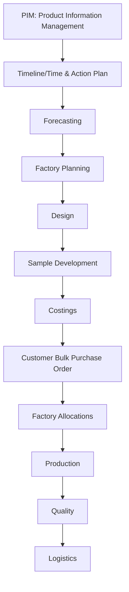

**Navigation:**
- Use the Milestones section above to jump to detailed documentation for each phase.
- Each milestone doc contains links back to this overview and to related SOPs, technical references, and diagrams.

> **Tip:** For best results, always start here for a high-level understanding, then use milestone links for deep dives. Each milestone doc should include:
> - SOPs for that phase
> - Technical details (schema, triggers, functions)
> - Backlinks to this overview and related phases
# Workflow Overview

This document provides a high-level overview of the end-to-end fashion season workflow, schema, and integration points between Supabase and BeProduct.

## Workflow Stages

Each stage is implemented in its own folder with:
- Documentation (including mermaid diagrams and backlinks)
- All SQL migrations and Edge Function code/scripts are now centralized in the canonical `supabase/` folders. See [Migration and Function Index](../../../supabase/MIGRATION_FUNCTION_INDEX.md) for the single source of truth.

### Workflow Stage Order

1. PIM: Product Information Management
2. Timeline/Time & Action Plan
3. Forecasting
4. Factory Planning
5. Design
6. Sample Development
7. Costings
8. Customer Bulk Purchase Order
9. Factory Allocations
10. Production
11. Quality
12. Logistics

## Milestones

- [PIM: Product Information Management](../../supabase/01-pim/docs/stage-overview.md)
- [Timeline/Time & Action Plan](../../supabase/02-timeline/docs/stage-overview.md)
- [Forecasting](../../supabase/03-forecasting/docs/stage-overview.md)

*...additional milestones and links to be added as implemented...*

---

## Integration
- BeProduct integration is handled via webhooks and Supabase edge functions at each relevant stage.
- All triggers and functions are versioned and documented in this repo.

## Guide Structure & Navigation

This document serves as the high-level summary and entry point for the Supabase x BeProduct workflow. It provides:
- A visual and textual overview of the end-to-end workflow
- Links to milestone/phase documentation for each major stage
- A reference for naming conventions and integration points

**Definitive Guide Structure:**
- This overview is complemented by detailed milestone/phase documentation (see Milestones above), which together form the functional and technical guide for the platform.
- Standard Operating Procedures (SOPs) and technical details are included in each milestone document, ensuring both summary and in-depth reference are available.

**Navigation:**
- Use the Milestones section above to jump to detailed documentation for each phase.
- Each milestone doc contains links back to this overview and to related SOPs, technical references, and diagrams.

---

*This document will be updated as the workflow and schema evolve.*
