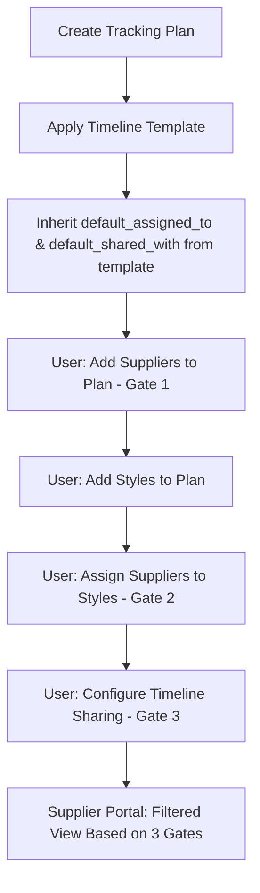
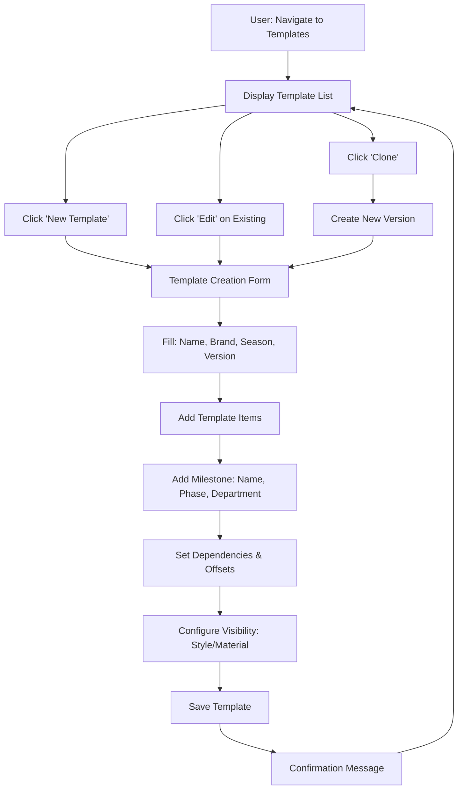
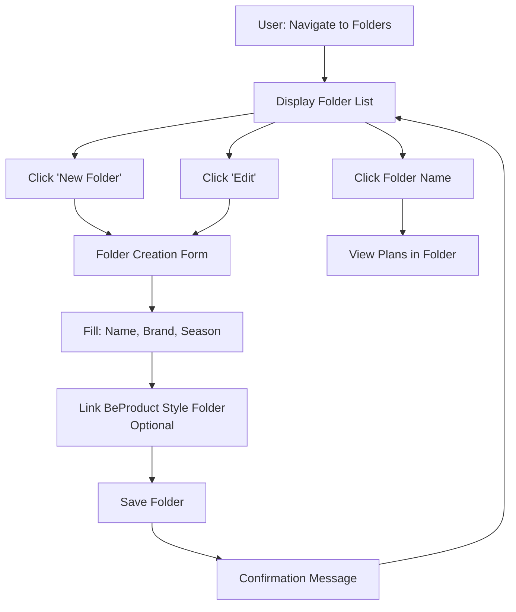
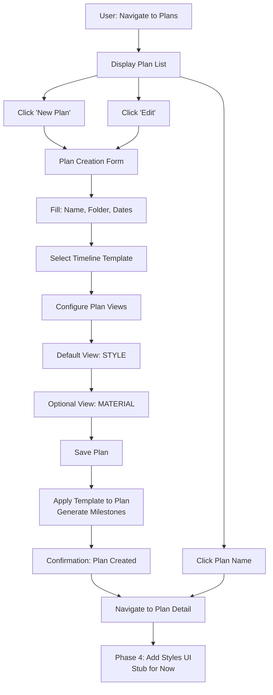
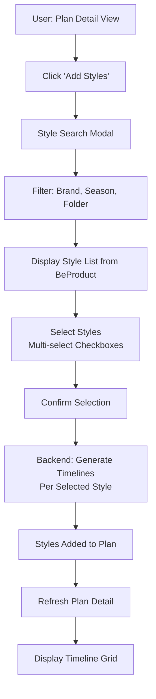

# Seasonal Tracking Plan App – Frontend Implementation Plan

**Document version:** 2.0 • **Last updated:** 2025-10-24 • **Owner:** GitHub Copilot

This plan consolidates the Phase 1 hand-off notes, data requirements, and UI specifications that were previously scattered across `plans/phase-1-*`, `handoff/*`, and `api-endpoints/*`. Those documents are now deprecated—treat this file as the single source of truth for frontend delivery.

---

## 1. Executive summary

- Supabase migrations **0007 → 0015** are applied in production. Nine read-only REST endpoints are live at `https://wjpbryjgtmmaqjbhjgap.supabase.co/rest/v1/*` with anonymous-key access.
- GREYSON seed data is loaded: 1 folder, 3 plans, 1 template, 4 styles, and 108 style milestones. Material tables are provisioned but empty (UI must show empty states gracefully).
- Phase 1 delivers browse-only experiences across folders, plans, templates, and style timelines. CRUD, supplier actions, and analytics deltas will arrive in Phase 2+ once Edge Functions are wired.
- Frontend can start immediately on Tasks 1–7. No backend work is required before coding begins.

---

## 2. Backend readiness snapshot

| Entity | View / Endpoint | Count | Status |
| --- | --- | --- | --- |
| Folders | `/rest/v1/v_folder` | 1 | ✅ `GREYSON MENS` with three active plans. |
| Plans | `/rest/v1/v_folder_plan` | 3 | ✅ Spring Drop 1–3 show template linkage and counts (style/material counts = 4/0). |
| Plan column config | `/rest/v1/v_folder_plan_columns` | 0 rows | ⚠️ No column presets yet—UI should call endpoint and render “No saved columns”. |
| Templates | `/rest/v1/v_timeline_template` | 1 | ✅ “Garment Tracking Timeline” (27 milestones, 5 phases). |
| Template items | `/rest/v1/v_timeline_template_item` | 27 | ✅ Anchor + task nodes with dependency offsets. |
| Styles | `/rest/v1/v_plan_styles` | 4 | ✅ MSP26B26 colorways + 1 test style. |
| Style timelines | `/rest/v1/v_plan_style_timelines_enriched` | 108 | ✅ 27 milestones × 4 styles with plan/rev/final dates and supplier visibility flags. |
| Materials | `/rest/v1/v_plan_materials` | 0 | ⏳ Awaiting trims import; treat as empty states. |
| Material timelines | `/rest/v1/v_plan_material_timelines_enriched` | 0 | ⏳ Empty until trims import. |

**Authentication headers (PowerShell / fetch):**

```javascript
const headers = {
  apikey: SUPABASE_ANON_KEY,
  Authorization: `Bearer ${SUPABASE_ANON_KEY}`
};
```


---

## 3. Feature backlog overview

The table below merges the original “Phase 1 plan”, “Handoff report”, and “Endpoint status” docs.

| Task | Scope | Endpoint(s) | Status | Notes |
| --- | --- | --- | --- | --- |
| **1. Folder list** | List folders with plan counts, filter/sort | `/v_folder` | ✅ Ready now | Use GREYSON folder seed. |
| **2. Plan overview** | Show plans inside selected folder | `/v_folder_plan` | ✅ Ready now | Counts show 0 materials by design; handle null template fields gracefully. |
| **3. Plan detail drawer** | Expanded metadata, CTA placeholders | `/v_folder_plan` | ✅ Ready now | Include badges for template linkage and counts. |
| **4. Template list** | Catalog of timeline templates | `/v_timeline_template` | ✅ Ready now | Currently 1 template; anticipate more after import pipeline runs. |
| **5. Template detail** | Ordered milestone list + dependency info | `/v_timeline_template_item` | ✅ Ready now | 27 nodes; anchors at display orders 0 and 99. |
| **6. Plan styles** | Styles within a plan + milestone aggregates | `/v_plan_styles` | ✅ Ready now | 4 styles with non-zero milestone counts. |
| **7. Style timeline** | Detailed milestone view per style | `/v_plan_style_timelines_enriched` | ✅ Ready now | 27 milestone rows per style; include dependency/visibility info. |
| **8. Materials** | Material roster & timelines | `/v_plan_materials`, `/v_plan_material_timelines_enriched` | ⏳ Design ready, data empty | Build UI with empty state fallback; real data arrives once trims importer runs. |
| **9. Supplier portal surface** | Read-only supplier snapshot | Edge function (future) | 🛠 Planned | Covered in Section 8 for future planning. |

---

## 4. API quick reference (Phase 1)

| Endpoint | Select fields to request | Example query |
| --- | --- | --- |
| `/rest/v1/v_folder` | `folder_id, folder_name, brand, active_plan_count, total_plan_count, latest_plan_date, active_seasons` | `/rest/v1/v_folder?order=folder_name.asc` |
| `/rest/v1/v_folder_plan` | `plan_id, plan_name, plan_season, start_date, end_date, template_name, style_count, material_count` | `/rest/v1/v_folder_plan?folder_id=eq.82a698e1-9103-4bab-98af-a0ec423332a2` |
| `/rest/v1/v_folder_plan_columns` | `plan_id, view_id, view_name, view_type, column_config` | `/rest/v1/v_folder_plan_columns?plan_id=eq.{uuid}` |
| `/rest/v1/v_timeline_template` | `template_id, template_name, brand, season, total_item_count, style_item_count, milestone_count, phase_count, active_plan_count` | `/rest/v1/v_timeline_template?is_active=eq.true` |
| `/rest/v1/v_timeline_template_item` | `item_id, node_type, item_name, phase, department, display_order, depends_on_template_item_id, depends_on_item_name, offset_relation, offset_value, offset_unit, applies_to_style, applies_to_material, supplier_visible` | `/rest/v1/v_timeline_template_item?template_id=eq.{uuid}&order=display_order.asc` |
| `/rest/v1/v_plan_styles` | `plan_style_id, plan_id, plan_name, style_number, style_name, color_name, supplier_name, milestones_total, milestones_completed, milestones_in_progress, milestones_not_started, milestones_late, status_breakdown` | `/rest/v1/v_plan_styles?plan_id=eq.1305c5e9-39d5-4686-926c-c88c620d4f8a` |
| `/rest/v1/v_plan_style_timelines_enriched` | `timeline_id, plan_style_id, style_number, milestone_name, node_type, phase, department, display_order, status, plan_date, rev_date, final_date, due_date, supplier_visible, shared_with, assignments, predecessors` | `/rest/v1/v_plan_style_timelines_enriched?style_number=eq.MSP26B26&order=display_order.asc` |

All endpoints support standard PostgREST filters, ordering, limiting, and column renaming.

---

## 5. Detailed task specifications

### 5.1 Task 1 – Folder list

- **Goal:** Provide a landing page showing all tracking folders with quick health indicators.
- **Data contract:** `/v_folder` rows (see Section 4) sorted by `folder_name`.
- **UI expectations:**
  - Grid/list view with columns: Folder name, Brand, Active plan count, Total plan count, Active seasons (badge), Latest plan date.
  - Provide filters for Brand (multi-select) and Active status (active/inactive/all).
  - Empty state messaging when no folders match filters.
  - Clicking a row routes to the plan overview screen with `folder_id` query param.
- **Acceptance criteria:**
  1. GREYSON folder renders with “3 plans” badge and `2026 Spring` season tag.
  2. Sorting by plan count and alphabetical order works.
  3. Mobile breakpoint collapses to card layout.

### 5.2 Task 2 – Plan overview within a folder

- **Goal:** Present all plans inside the selected folder with key metadata and quick stats.
- **Data contract:** `/v_folder_plan?folder_id=eq.{folder_id}`.
- **UI expectations:**
  - Card-based grid (recommended) or table listing plan name, season, date range, template name (if any), style/material counts, milestone totals.
  - Handle `template_name = null` or counts = 0 by showing badges such as “No template assigned” or `0 styles`.
  - Provide filters for season and active status.
  - Clicking a card opens the plan detail drawer (Task 3) or navigates to `/plans/:planId` detail page.
- **Acceptance criteria:**
  1. All three GREYSON plans appear with accurate start/end dates and blank template names replaced by “Template pending”.
  2. Style/material counts show `4` / `0` (not hidden).
  3. Null default view names produce “No default view configured” message.

### 5.3 Task 3 – Plan detail drawer / overview page

- **Goal:** Display full plan metadata, call-to-action placeholders, and navigation to subordinate features.
- **Data contract:** Same payload as Task 2.
- **UI expectations:**
  - Drawer or detail header summarizing plan name, folder, brand, season, template, dates, counts.
  - CTA placeholders for “View styles”, “View materials”, “Assign suppliers”, “Open timeline”. These can link to tabbed sections within the plan page.
  - Section for “Data readiness” showing whether template/view assignments exist (e.g., check icon when `template_name` set).
  - For empty material counts, display informational banner referencing future imports.
- **Acceptance criteria:**
  1. Drawer opens from plan card click and closes via ESC/backdrop.
  2. Styles CTA navigates to Task 6 view.
  3. Content is responsive and accessible (ARIA roles, focus trap).

### 5.4 Task 4 – Timeline template list

- **Goal:** Provide a catalog of active timeline templates.
- **Data contract:** `/v_timeline_template?is_active=eq.true&order=brand.asc,season.asc`.
- **UI expectations:**
  - Table or cards with columns: Template name, Brand, Season, Version, Total milestones, Style milestones, Material milestones, Active plan count.
  - Filters for brand, season, and activity.
  - Row click opens template detail (Task 5).
  - Show empty-state guidance if list is empty (e.g., “Import templates via migration 0012 or the template importer”).
- **Acceptance criteria:**
  1. “Garment Tracking Timeline” displays with 27 total items and 5 phases.
  2. The “Used by N plans” badge displays `3` when counts fill in after linking.

### 5.5 Task 5 – Timeline template detail view

- **Goal:** Render ordered milestone rows including dependencies, visibility, and supplier flags.
- **Data contract:** `/v_timeline_template_item?template_id=eq.{template_id}&order=display_order.asc`.
- **UI expectations:**
  - Sort by `display_order`; group by `phase` with collapsible sections (PLAN, DEVELOPMENT, SMS, ALLOCATION, PRODUCTION).
  - For each item show: milestone name, node type badge (ANCHOR vs TASK), department, offset description (“AFTER START DATE + 14 days”), supplier visibility icon, required badge.
  - Use dependency info to display chips such as “Depends on: START DATE”.
  - Provide quick filter for `applies_to_style` vs `applies_to_material`.
- **Acceptance criteria:**
  1. 27 rows render in correct order with anchors at positions 0 and 99.
  2. “Supplier visible” shows `false` for internal milestones per seed data.
  3. UI degrades gracefully if future templates omit dependency fields.

### 5.6 Task 6 – Plan styles view

- **Goal:** Give merchandisers a status snapshot per style.
- **Data contract:** `/v_plan_styles?plan_id=eq.{plan_id}`.
- **UI expectations:**
  - Table with style number, color name, supplier, milestone totals, status breakdown (progress bar), earliest/latest due dates, last updated timestamp.
  - Filters for status (Not started, In progress, Complete, Late) derived from `status_breakdown` JSON.
  - Click row to open style timeline (Task 7).
- **Acceptance criteria:**
  1. MSP26B26 colorways display with milestone totals = 27.
  2. Late counts show `0`; progress bars compute using totals.
  3. Last milestone updated timestamp surfaces from `last_milestone_updated_at`.

### 5.7 Task 7 – Style timeline detail

- **Goal:** Show the 27 milestone cards per style with key metadata.
- **Data contract:** `/v_plan_style_timelines_enriched?plan_style_id=eq.{uuid}` or filtered by `style_number`.
- **UI expectations:**
  - Vertical timeline or table grouped by phase, ordered by `display_order`.
  - Columns: Milestone name, status pill, plan/rev/final/due dates, assignees (`assignments` array), supplier visibility, dependency summary, attachments/requests info if present, audit snippet from `recent_status_history` if provided.
  - Provide sticky header with style summary (style number, color, supplier, plan info).
- **Acceptance criteria:**
  1. 27 rows per style render; anchors show plan start/end, tasks show due dates.
  2. Supplier visibility icon toggles based on `supplier_visible` boolean.
  3. When `shared_with` contains supplier IDs, display a chip count (e.g., “Shared with 2 suppliers”).

### 5.8 Task 8 – Material surfaces (future-ready)

- Build the same UI scaffolding as Tasks 6–7 but backed by `/v_plan_materials` and `/v_plan_material_timelines_enriched`.
- Seed data is currently empty, so render “Awaiting material import” placeholders; no blockers for development.

---

## 6. Supplier access architecture (for future phases)

Supplier experiences use a **three-gate model**. Keep this in mind while designing UI controls—even if the actual supplier portal lands later.

1. **Plan-level access (`plans.suppliers`)** – Determines which partner companies can see a plan at all. Manage this on the plan settings page (“Supplier access” tab). Fields include `companyId`, `companyName`, `accessLevel`, and `canUpdateTimelines`.
2. **Style/material assignments (`plan_styles.suppliers`, `plan_materials.suppliers`)** – Within an accessible plan, identify which suppliers are quoting or producing each style/material. Expose as part of the style/material detail view.
3. **Timeline milestone sharing (`shared_with` arrays)** – Fine-grained visibility per milestone. Control via share modals on the timeline grid.

Template metadata (`supplier_visible`, `default_assigned_to`, `default_shared_with`) seeds gates 2–3 when new timelines are instantiated. UI should respect these defaults when we implement editing.

---

## 7. Testing strategy

- **Component/unit tests (Jest + React Testing Library):** form validation, sorting/filtering helpers, PostgREST query builders.
- **Integration tests:**
  - Mock fetch requests for each endpoint and assert rendering of GREYSON seed data.
  - Validate error states (network failure, empty array, null fields).
- **E2E tests (Playwright/Cypress):**
  - “Folder → Plan → Style” happy path.
  - Template browsing flow.
  - Responsive layout checks.

Use captured responses from `supabase-tracking/tests/logs/*.json` or live calls with the anon key. Remember to strip credentials from recorded fixtures.

---

## 8. Next milestones

| Milestone | Scope | Dependencies |
| --- | --- | --- |
| **Phase 2 – Timeline grids & assignments** | CRUD-less timeline editing UI (status/date updates), assignments display, filter by assignee. | Requires Edge Function `tracking-timeline-action` and assignment views. |
| **Phase 3 – Supplier portal snapshot** | Consume Supabase vendor snapshot views via Edge Function `tracking-vendor-portal` (see `03-import-and-api-plan.md` Section 4). | Depends on snapshot Edge Function + RLS hardening. |
| **Phase 4 – CRUD + analytics** | Enable plan/template editing, supplier assignment, analytics widgets. | Requires write policies, Edge Functions, and analytics RPCs. |

---

## 9. Change log

| Date | Version | Notes |
| --- | --- | --- |
| 2025-10-24 | 2.0 | Consolidated Phase 1 specs, endpoint references, and supplier gating guidance into a single doc. Removed legacy docs (`plans/phase-1-*`, `handoff/*`, `api-endpoints/*`). |
| 2025-10-23 | 1.0 | Initial draft (now superseded). |
# Seasonal Tracking Plan App - Frontend Implementation Plan

**Document version:** 1.0 • **Last updated:** 2025-10-23 • **Author:** GitHub Copilot

**Target audience:** Frontend Developer / AI Coding Agent  
**Deployment:** Embedded within existing portal application  
**Tech stack:** Aligns with existing portal design theme and component library

---

## Executive Summary

Build a **Seasonal Tracking Plan Management App** that allows internal users to:
1. Manage timeline templates (master milestone blueprints)
2. Set up tracking folders (organize by brand/season)
3. Create tracking plans (time and action plans linked to folders)
4. Add styles from BeProduct to plans (future phase—stub UI for now)

The app will use the deployed Supabase `tracking` schema and align with your existing portal's design system. Backend connectivity will be wired in a follow-up phase; initially focus on functional UI/UX with mock data.

---

## Phase Overview

| Phase | Scope | Deliverable | Backend Status |
|-------|-------|-------------|----------------|
| **Phase 1** | Template Manager UI | CRUD screens for timeline templates | Schema ready; Edge Functions pending |
| **Phase 2** | Folder Management | Folder list, create/edit, brand/season filters | Schema ready; Edge Functions pending |
| **Phase 3** | Plan Management | Plan CRUD, link to folders/templates, view configuration | Schema ready; Edge Functions pending |
| **Phase 4** | Style Integration | UI to search/add BeProduct styles to plans | Stub only; backend integration later |

---

## Data Model Reference

### Core Entities (from Supabase `tracking` schema)

#### 1. Timeline Templates

```typescript
interface TimelineTemplate {
  id: string; // uuid
  name: string; // e.g., "GREYSON MASTER 2026"
  brand?: string; // e.g., "GREYSON"
  season?: string; // e.g., "2026 Spring"
  version: number; // Default 1
  is_active: boolean; // Default true
  timezone?: string;
  anchor_strategy?: string;
  conflict_policy?: string;
  business_days_calendar?: Record<string, any>; // JSON
  created_at: string; // timestamptz
  created_by?: string; // uuid
  updated_at: string; // timestamptz
  updated_by?: string; // uuid
}

interface TimelineTemplateItem {
  id: string; // uuid
  template_id: string; // FK to timeline_templates
  node_type: 'ANCHOR' | 'TASK'; // enum
  name: string; // e.g., "Physical Reference Samples"
  short_name?: string;
  phase?: string; // e.g., "DEVELOPMENT", "PRODUCTION"
  department?: string; // e.g., "Design", "Sourcing"
  display_order: number; // Sequence for UI ordering
  depends_on_template_item_id?: string; // Self-reference
  depends_on_action?: string; // Cached name
  offset_relation?: 'AFTER' | 'BEFORE'; // enum
  offset_value?: number; // Days offset
  offset_unit?: 'DAYS' | 'BUSINESS_DAYS'; // enum
  page_type?: 'BOM' | 'SAMPLE_REQUEST_MULTI' | 'SAMPLE_REQUEST' | 'FORM' | 'TECHPACK' | 'NONE'; // enum
  page_label?: string;
  applies_to_style: boolean; // Default true
  applies_to_material: boolean; // Default false
  timeline_type: 'MASTER' | 'STYLE' | 'MATERIAL'; // enum, default MASTER
  required: boolean; // Default true
  notes?: string;
  
  // Assignment & Sharing Defaults (NEW in migration 0005)
  supplier_visible?: boolean; // Whether suppliers can see this milestone type (default false)
  default_assigned_to?: string[]; // Array of user IDs to assign by default when template is applied
  default_shared_with?: string[]; // Array of company IDs to share with by default when template is applied
}

interface TimelineTemplateVisibility {
  template_item_id: string; // FK to timeline_template_items
  view_type: 'STYLE' | 'MATERIAL'; // enum
  is_visible: boolean; // Default true
}
```

#### 2. Folders

```typescript
interface Folder {
  id: string; // uuid
  name: string; // e.g., "GREYSON MENS"
  brand?: string;
  season?: string; // e.g., "2026 Spring"
  style_folder_id?: string; // BeProduct style folder ID
  style_folder_name?: string;
  active: boolean; // Default true
  created_at: string;
  updated_at: string;
  raw_payload?: Record<string, any>; // Optional JSON snapshot
}

interface FolderStyleLink {
  folder_id: string; // FK to folders
  style_folder_id: string; // BeProduct folder ID
  is_primary: boolean; // Default false
  linked_at: string;
}
```

#### 3. Plans

```typescript
interface Plan {
  id: string; // uuid
  folder_id?: string; // FK to folders
  name: string; // e.g., "GREYSON 2026 SPRING DROP 1"
  active: boolean; // Default true
  season?: string;
  brand?: string;
  start_date?: string; // date
  end_date?: string; // date
  description?: string;
  default_view_id?: string; // FK to plan_views
  template_id?: string; // FK to timeline_templates
  timezone?: string;
  color_theme?: string;
  created_at: string;
  created_by?: string;
  updated_at: string;
  updated_by?: string;
  raw_payload?: Record<string, any>;
  
  // Supplier Access Configuration (NEW in migration 0005)
  suppliers?: SupplierAccess[]; // Array of suppliers with access to this plan (first gate for supplier portal)
}

interface SupplierAccess {
  companyId: string; // Supplier/factory company ID
  companyName: string; // Cached name for display
  accessLevel: 'view' | 'edit'; // What they can do
  canUpdateTimelines: boolean; // Can they mark milestones complete?
}

interface PlanView {
  id: string; // uuid
  plan_id: string; // FK to plans
  name: string; // e.g., "STYLE", "MATERIAL"
  view_type: 'STYLE' | 'MATERIAL'; // enum
  active: boolean; // Default true
  sort_order?: number;
  template_id?: string; // FK to timeline_templates
  created_at: string;
}
```

#### 4. Styles & Materials (Future Phase - Reference Only)

```typescript
interface PlanStyle {
  id: string;
  plan_id: string;
  view_id?: string;
  style_id?: string; // BeProduct style ID
  style_header_id?: string;
  color_id?: string;
  style_number?: string;
  style_name?: string;
  color_name?: string;
  season?: string;
  delivery?: string;
  factory?: string;
  supplier_id?: string;
  supplier_name?: string;
  brand?: string;
  status_summary?: Record<string, any>; // JSON
  created_at: string;
  updated_at: string;
  
  // Supplier Assignments (NEW in migration 0005)
  suppliers?: StyleSupplierAssignment[]; // Which suppliers are quoting/manufacturing this style (second gate)
}

interface StyleSupplierAssignment {
  companyId: string; // Supplier/factory company ID
  companyName: string; // Cached for display
  role: 'quote' | 'production'; // What they're doing with this style
}

interface PlanMaterial {
  id: string;
  plan_id: string;
  view_id?: string;
  material_id?: string; // BeProduct material ID
  material_name?: string;
  material_type?: string;
  supplier_id?: string;
  supplier_name?: string;
  status_summary?: Record<string, any>;
  created_at: string;
  updated_at: string;
  
  // Supplier Assignments (NEW in migration 0005)
  suppliers?: StyleSupplierAssignment[]; // Which suppliers are quoting/producing this material
}
```

---

## Assignment & Sharing Architecture

### The Three-Gate Supplier Access Model

Supplier portal access is controlled by a **three-level gating system**:

#### Gate 1: Plan-Level Access
**Location:** `plans.suppliers` (JSONB array)  
**Purpose:** Which suppliers/factories can access this tracking plan at all?  
**Structure:**
```typescript
{
  companyId: "uuid",
  companyName: "ABC Mfg Co",
  accessLevel: "view" | "edit",
  canUpdateTimelines: true | false
}
```

**UI Location:** Plan settings page → "Supplier Access" tab  
**User Action:** Add/remove suppliers from plan, set access levels

#### Gate 2: Style/Material-Level Assignment
**Location:** `plan_styles.suppliers` / `plan_materials.suppliers` (JSONB arrays)  
**Purpose:** Within an accessible plan, which styles/materials can each supplier quote on or manufacture?  
**Structure:**
```typescript
{
  companyId: "uuid",
  companyName: "ABC Mfg Co",
  role: "quote" | "production"
}
```

**UI Location:** Style detail page → "Suppliers" section  
**User Action:** Assign supplier to quote or manufacture this style (must already be in Gate 1)

#### Gate 3: Timeline Milestone Sharing
**Location:** `plan_style_timelines.shared_with` / `plan_material_timelines.shared_with` (JSONB arrays)  
**Purpose:** Per-milestone visibility control—which milestones can suppliers see?  
**Structure:** Simple array of company IDs: `["companyId1", "companyId2"]`

**UI Location:** Timeline milestone row → "Share" icon → Multi-select suppliers  
**User Action:** Share/unshare specific milestones with suppliers (e.g., share "Submit to Factory" but not "Internal Design Review")

### Assignment & Sharing Workflow



### Template Configuration for Defaults

**In Template Item Form:**
1. **Supplier Visible** (checkbox): Whether suppliers can see this milestone type by default
2. **Default Assigned To** (user multi-select): Pre-populate `assignedTo` when template is applied
3. **Default Shared With** (company multi-select): Pre-populate `sharedWith` when template is applied

**Example:**
- Milestone: "Submit to Factory"
  - `supplier_visible = true`
  - `default_assigned_to = []` (empty, assign per-style)
  - `default_shared_with = []` (empty, assign per-style)

- Milestone: "Internal Design Review"
  - `supplier_visible = false`
  - `default_assigned_to = ["designer-user-id"]`
  - `default_shared_with = []`

### Personal Assignment (assignedTo)

**Storage:** Existing `timeline_assignments` table (from migration 0004)  
**Structure:**
```sql
timeline_assignments (
  timeline_id uuid,
  timeline_type enum ('style' | 'material'),
  assignee_id uuid,  -- User ID
  role_name text,
  role_id uuid
)
```

**UI Location:** Timeline milestone row → "Assigned To" avatar group  
**User Action:** Click avatar group → multi-select users → save

**Alternative:** Could store as JSONB array on timeline tables (simpler, matches BeProduct structure)

---

## User Flows

### Flow 1: Create Timeline Template



**Key UI Components:**
- **Template List Table:** Columns: Name, Brand, Season, Version, Active, Created, Actions (Edit/Clone/Deactivate)
- **Template Form:** Multi-step wizard or accordion
  - Step 1: Basic Info (name, brand, season, version)
  - Step 2: Template Items (drag-drop sortable list with inline add/edit)
  - Step 3: Dependencies (visual dependency graph or simple dropdown)
  - Step 4: Visibility Rules (toggle grid: Style/Material columns)

---

### Flow 2: Set Up Tracking Folder



**Key UI Components:**
- **Folder List Table:** Columns: Name, Brand, Season, Style Folder, Active, Plan Count, Actions (Edit/View Plans)
- **Folder Form:** Simple form
  - Name (text input)
  - Brand (dropdown—pre-populate from master data)
  - Season (dropdown or text input)
  - Style Folder ID (autocomplete search—future integration; text input for now)
  - Active (toggle)

---

### Flow 3: Create Tracking Plan



**Key UI Components:**
- **Plan List Table:** Columns: Name, Folder, Brand, Season, Start Date, End Date, Template, Active, Actions (Edit/View)
- **Plan Form:** Multi-step or tabs
  - Step 1: Basic Info (name, folder dropdown, brand, season, dates, description)
  - Step 2: Template Selection (dropdown of active templates filtered by brand/season)
  - Step 3: View Configuration (add STYLE and/or MATERIAL views with custom names)
  - Step 4: Confirmation (summary before save)
- **Plan Detail View:** (Future) Timeline grid showing milestones per style/material

---

### Flow 4: Add Styles to Plan (Stub UI - Phase 4)



**Key UI Components (Stub):**
- **Add Styles Button:** Opens modal
- **Style Search Modal:** 
  - Filter inputs (brand, season, style folder)
  - Search results table (style number, name, color, season)
  - Multi-select checkboxes
  - "Add Selected" button (currently non-functional; show placeholder message)
- **Plan Timeline Grid:** (Placeholder) Show message "Styles will appear here after backend integration"

---

## Screen Mockup Descriptions

### 1. Timeline Template Manager

#### List View
```
┌─────────────────────────────────────────────────────────────────┐
│ Timeline Templates                            [+ New Template]   │
├─────────────────────────────────────────────────────────────────┤
│ Filters: [Brand ▼] [Season ▼] [Status: Active ▼]               │
├──────────┬────────┬────────┬─────────┬────────┬────────┬────────┤
│ Name     │ Brand  │ Season │ Version │ Active │ Items  │ Actions│
├──────────┼────────┼────────┼─────────┼────────┼────────┼────────┤
│ GREYSON  │ GREYSON│ 2026   │ 1       │ ✓      │ 24     │ Edit   │
│ MASTER   │        │ Spring │         │        │        │ Clone  │
│ 2026     │        │        │         │        │        │        │
├──────────┼────────┼────────┼─────────┼────────┼────────┼────────┤
│ VUORI    │ VUORI  │ 2025   │ 2       │ ✓      │ 18     │ Edit   │
│ STANDARD │        │ Fall   │         │        │        │ Clone  │
├──────────┼────────┼────────┼─────────┼────────┼────────┼────────┤
│ ...      │        │        │         │        │        │        │
└──────────┴────────┴────────┴─────────┴────────┴────────┴────────┘
```

#### Template Editor (Accordion/Tabs)
```
┌─────────────────────────────────────────────────────────────────┐
│ Create Timeline Template                                [Cancel] [Save]│
├─────────────────────────────────────────────────────────────────┤
│ ▼ 1. Basic Information                                          │
│   Name:        [GREYSON MASTER 2026                          ]  │
│   Brand:       [GREYSON          ▼]                             │
│   Season:      [2026 Spring      ▼]                             │
│   Version:     [1                ]                              │
│   Active:      [✓] Active                                       │
│   Timezone:    [America/Los_Angeles ▼]                          │
│                                                                  │
│ ▼ 2. Template Items (24 items)                  [+ Add Item]    │
│   ┌─────────────────────────────────────────────────────────┐  │
│   │ ☰ 1. START DATE (ANCHOR)                    [Edit] [Del]│  │
│   │   Phase: N/A | Department: N/A | Offset: 0 days         │  │
│   ├─────────────────────────────────────────────────────────┤  │
│   │ ☰ 2. Physical Reference Samples (TASK)      [Edit] [Del]│  │
│   │   Phase: DEVELOPMENT | Department: Design               │  │
│   │   Depends on: START DATE | Offset: 14 days AFTER        │  │
│   │   Page Type: SAMPLE_REQUEST | Applies: Style ✓ Material │  │
│   ├─────────────────────────────────────────────────────────┤  │
│   │ ☰ 3. Tech Pack Approval (TASK)              [Edit] [Del]│  │
│   │   ...                                                    │  │
│   └─────────────────────────────────────────────────────────┘  │
│                                                                  │
│ ▼ 3. Visibility Configuration                                   │
│   ┌───────────────────────────┬───────┬──────────┐             │
│   │ Milestone                 │ Style │ Material │             │
│   ├───────────────────────────┼───────┼──────────┤             │
│   │ START DATE                │  ✓    │    ✓     │             │
│   │ Physical Reference Samples│  ✓    │    ✗     │             │
│   │ Tech Pack Approval        │  ✓    │    ✓     │             │
│   │ ...                       │       │          │             │
│   └───────────────────────────┴───────┴──────────┘             │
└─────────────────────────────────────────────────────────────────┘
```

---

### 2. Folder Manager

#### List View
```
┌─────────────────────────────────────────────────────────────────┐
│ Tracking Folders                                [+ New Folder]   │
├─────────────────────────────────────────────────────────────────┤
│ Filters: [Brand ▼] [Season ▼] [Status: Active ▼]               │
├────────────────┬────────┬────────┬──────────────┬───────┬───────┤
│ Name           │ Brand  │ Season │ Style Folder │ Plans │Actions│
├────────────────┼────────┼────────┼──────────────┼───────┼───────┤
│ GREYSON MENS   │ GREYSON│ 2026   │ GRY-M-26     │ 3     │ Edit  │
│                │        │ Spring │              │       │ Plans │
├────────────────┼────────┼────────┼──────────────┼───────┼───────┤
│ VUORI WOMENS   │ VUORI  │ 2025   │ VRI-W-25F    │ 5     │ Edit  │
│                │        │ Fall   │              │       │ Plans │
├────────────────┼────────┼────────┼──────────────┼───────┼───────┤
│ ...            │        │        │              │       │       │
└────────────────┴────────┴────────┴──────────────┴───────┴───────┘
```

#### Folder Form
```
┌─────────────────────────────────────────────────────────────────┐
│ Create Tracking Folder                          [Cancel] [Save] │
├─────────────────────────────────────────────────────────────────┤
│ Name *:                                                          │
│ [GREYSON MENS                                                 ]  │
│                                                                  │
│ Brand:                                                           │
│ [GREYSON          ▼]                                             │
│                                                                  │
│ Season:                                                          │
│ [2026 Spring      ▼]                                             │
│                                                                  │
│ BeProduct Style Folder (Optional):                              │
│ [Search style folders...                  🔍]                    │
│ Selected: GRY-M-26                                               │
│                                                                  │
│ Status:                                                          │
│ [✓] Active                                                       │
│                                                                  │
└─────────────────────────────────────────────────────────────────┘
```

---

### 3. Plan Manager

#### List View
```
┌─────────────────────────────────────────────────────────────────┐
│ Tracking Plans                                    [+ New Plan]   │
├─────────────────────────────────────────────────────────────────┤
│ Filters: [Folder ▼] [Brand ▼] [Season ▼] [Status: Active ▼]    │
├──────────────┬──────────┬────────┬──────────┬──────────┬────────┤
│ Name         │ Folder   │ Brand  │ Dates    │ Template │ Actions│
├──────────────┼──────────┼────────┼──────────┼──────────┼────────┤
│ GREYSON 2026 │ GREYSON  │ GREYSON│ 01/15/26 │ GREYSON  │ Edit   │
│ SPRING DROP 1│ MENS     │        │ 06/30/26 │ MASTER   │ View   │
│              │          │        │          │ 2026     │        │
├──────────────┼──────────┼────────┼──────────┼──────────┼────────┤
│ VUORI FALL   │ VUORI    │ VUORI  │ 07/01/25 │ VUORI    │ Edit   │
│ 2025         │ WOMENS   │        │ 12/31/25 │ STANDARD │ View   │
├──────────────┼──────────┼────────┼──────────┼──────────┼────────┤
│ ...          │          │        │          │          │        │
└──────────────┴──────────┴────────┴──────────┴──────────┴────────┘
```

#### Plan Creation Form
```
┌─────────────────────────────────────────────────────────────────┐
│ Create Tracking Plan                   [Cancel] [Save & Continue]│
├─────────────────────────────────────────────────────────────────┤
│ Tab: [● Basic Info] [ Views ] [ Summary ]                        │
│                                                                  │
│ Plan Name *:                                                     │
│ [GREYSON 2026 SPRING DROP 1                                   ]  │
│                                                                  │
│ Folder *:                                                        │
│ [GREYSON MENS     ▼]                                             │
│                                                                  │
│ Brand:              Season:                                      │
│ [GREYSON       ▼]  [2026 Spring ▼]                               │
│                                                                  │
│ Start Date:         End Date:                                    │
│ [01/15/2026 📅]    [06/30/2026 📅]                               │
│                                                                  │
│ Timeline Template *:                                             │
│ [GREYSON MASTER 2026 ▼]                                          │
│ (24 milestones • Version 1)                                      │
│                                                                  │
│ Description:                                                     │
│ [                                                             ]  │
│ [                                                             ]  │
│                                                                  │
│ Status:                                                          │
│ [✓] Active                                                       │
└─────────────────────────────────────────────────────────────────┘
```

#### Plan Views Configuration
```
┌─────────────────────────────────────────────────────────────────┐
│ Create Tracking Plan                   [← Back] [Save & Continue]│
├─────────────────────────────────────────────────────────────────┤
│ Tab: [ Basic Info ] [● Views] [ Summary ]                        │
│                                                                  │
│ Configure Plan Views (how data will be organized)               │
│                                                                  │
│ ┌─────────────────────────────────────────────────────────────┐ │
│ │ View 1: STYLE VIEW                         [✓] Default  [×] │ │
│ │ Type: [Style ▼]                                             │ │
│ │ Template: [Use Plan Template ▼]                             │ │
│ │ Sort Order: [1]                                             │ │
│ └─────────────────────────────────────────────────────────────┘ │
│                                                                  │
│ ┌─────────────────────────────────────────────────────────────┐ │
│ │ View 2: MATERIAL VIEW                                   [×] │ │
│ │ Type: [Material ▼]                                          │ │
│ │ Template: [Use Plan Template ▼]                             │ │
│ │ Sort Order: [2]                                             │ │
│ └─────────────────────────────────────────────────────────────┘ │
│                                                                  │
│ [+ Add Another View]                                             │
└─────────────────────────────────────────────────────────────────┘
```

---

### 4. Plan Detail View (With Add Styles Stub)

```
┌─────────────────────────────────────────────────────────────────┐
│ ← Back to Plans  GREYSON 2026 SPRING DROP 1          [Edit Plan]│
├─────────────────────────────────────────────────────────────────┤
│ Folder: GREYSON MENS | Brand: GREYSON | Season: 2026 Spring     │
│ Dates: 01/15/2026 - 06/30/2026 | Template: GREYSON MASTER 2026 │
├─────────────────────────────────────────────────────────────────┤
│ Views: [● Style View] [ Material View ]              [+ Add View]│
├─────────────────────────────────────────────────────────────────┤
│                                                                  │
│ [+ Add Styles to Plan]  (Phase 4 - Currently Stub)              │
│                                                                  │
│ ┌─────────────────────────────────────────────────────────────┐ │
│ │ 📋 No styles added yet                                      │ │
│ │                                                             │ │
│ │ Click "Add Styles to Plan" to search and import styles     │ │
│ │ from BeProduct. Timelines will be generated automatically  │ │
│ │ based on the plan's timeline template.                     │ │
│ │                                                             │ │
│ │ (Backend integration coming in future phase)               │ │
│ └─────────────────────────────────────────────────────────────┘ │
│                                                                  │
│ Future: Timeline Grid Here                                       │
│ ┌──────────┬─────────┬────────────────────────────┬─────────┐   │
│ │ Style #  │ Color   │ Milestone...               │ Status  │   │
│ ├──────────┼─────────┼────────────────────────────┼─────────┤   │
│ │ MSP26B26 │ 220     │ Ref Samples: 02/01 | ...   │ ...     │   │
│ └──────────┴─────────┴────────────────────────────┴─────────┘   │
└─────────────────────────────────────────────────────────────────┘
```

---

### 5. Supplier Access Management (NEW - Phase 3)

#### Plan Settings → Supplier Access Tab

```
┌─────────────────────────────────────────────────────────────────┐
│ ← Back to Plans  GREYSON 2026 SPRING DROP 1          [Edit Plan]│
├─────────────────────────────────────────────────────────────────┤
│ Tabs: [ Overview ] [ Views ] [● Supplier Access ] [ Settings ]  │
├─────────────────────────────────────────────────────────────────┤
│                                                                  │
│ Supplier Access Management (Gate 1)                             │
│ Control which suppliers/factories can access this tracking plan │
│                                                                  │
│ [+ Add Supplier to Plan]                                         │
│                                                                  │
│ ┌──────────────┬──────────────┬──────────────┬────────────────┐ │
│ │ Company Name │ Access Level │ Can Update   │ Actions        │ │
│ │              │              │ Timelines?   │                │ │
│ ├──────────────┼──────────────┼──────────────┼────────────────┤ │
│ │ ABC Mfg Co   │ View         │ No           │ Edit | Remove  │ │
│ ├──────────────┼──────────────┼──────────────┼────────────────┤ │
│ │ XYZ Factory  │ Edit         │ Yes          │ Edit | Remove  │ │
│ ├──────────────┼──────────────┼──────────────┼────────────────┤ │
│ │ DEF Sourcing │ View         │ No           │ Edit | Remove  │ │
│ └──────────────┴──────────────┴──────────────┴────────────────┘ │
│                                                                  │
│ 💡 Note: Suppliers added here form the first gate. They can     │
│    only see styles/materials you explicitly assign to them.     │
└─────────────────────────────────────────────────────────────────┘
```

#### Add Supplier Modal

```
┌─────────────────────────────────────────────────────────────────┐
│ Add Supplier to Plan                              [×]            │
├─────────────────────────────────────────────────────────────────┤
│                                                                  │
│ Select Supplier/Factory:                                         │
│ [Search companies...                              ▼]             │
│   ABC Mfg Co                                                     │
│   XYZ Factory Ltd                                                │
│   DEF Sourcing Group                                             │
│                                                                  │
│ Access Level:                                                    │
│ ● View only    ○ Edit                                            │
│                                                                  │
│ Permissions:                                                     │
│ [✓] Can update timeline statuses                                 │
│     (Allow supplier to mark milestones as complete)              │
│                                                                  │
│ Notes (optional):                                                │
│ [                                                              ] │
│                                                                  │
│                                         [Cancel]  [Add Supplier] │
└─────────────────────────────────────────────────────────────────┘
```

---

### 6. Style Supplier Assignment (NEW - Phase 4)

#### Style Detail View with Supplier Section

```
┌─────────────────────────────────────────────────────────────────┐
│ ← Back to Plan  Style: MSP26B26-220                              │
├─────────────────────────────────────────────────────────────────┤
│ Style Number: MSP26B26 | Color: 220 - Navy | Season: 2026 Spring│
│ Brand: GREYSON | Delivery: SPRING 1                              │
├─────────────────────────────────────────────────────────────────┤
│ Tabs: [ Overview ] [● Suppliers ] [ Timeline ] [ Documents ]    │
├─────────────────────────────────────────────────────────────────┤
│                                                                  │
│ Assigned Suppliers (Gate 2)                                      │
│ These suppliers can view this style in the supplier portal.      │
│                                                                  │
│ [+ Assign Supplier]                                              │
│                                                                  │
│ ┌──────────────┬──────────────┬────────────────┐                │
│ │ Company Name │ Role         │ Actions        │                │
│ ├──────────────┼──────────────┼────────────────┤                │
│ │ ABC Mfg Co   │ Quote        │ Edit | Remove  │                │
│ ├──────────────┼──────────────┼────────────────┤                │
│ │ XYZ Factory  │ Production   │ Edit | Remove  │                │
│ └──────────────┴──────────────┴────────────────┘                │
│                                                                  │
│ ⚠️  Only suppliers added to the plan (Gate 1) can be assigned   │
│    to styles. Go to Plan → Supplier Access to add more.         │
└─────────────────────────────────────────────────────────────────┘
```

#### Assign Supplier to Style Modal

```
┌─────────────────────────────────────────────────────────────────┐
│ Assign Supplier to Style MSP26B26-220                [×]         │
├─────────────────────────────────────────────────────────────────┤
│                                                                  │
│ Select Supplier:                                                 │
│ [Select from plan suppliers...                    ▼]             │
│   ABC Mfg Co                                                     │
│   XYZ Factory Ltd                                                │
│   DEF Sourcing Group                                             │
│                                                                  │
│ ℹ️  Only showing suppliers with plan access (Gate 1)            │
│                                                                  │
│ Assignment Role:                                                 │
│ ○ Quote     ● Production                                         │
│                                                                  │
│ What this means:                                                 │
│ • Quote: Supplier can view style details and submit quotes       │
│ • Production: Supplier is manufacturing this style and can       │
│   update production milestones                                   │
│                                                                  │
│                                       [Cancel]  [Assign Supplier]│
└─────────────────────────────────────────────────────────────────┘
```

---

### 7. Timeline Milestone Sharing (NEW - Phase 4)

#### Timeline View with Share Controls

```
┌─────────────────────────────────────────────────────────────────┐
│ Plan: GREYSON 2026 SPRING DROP 1 | Style View                   │
├─────────────────────────────────────────────────────────────────┤
│ Filters: [All Phases ▼] [All Departments ▼] [Assigned: Me ▼]   │
├─────────────────────────────────────────────────────────────────┤
│ Style: MSP26B26-220 (Navy Polo)                                 │
│                                                                  │
│ ┌──────────────────────────────────────────────────────────────┐│
│ │ Milestone               Status  Due Date  Assigned  Shared   ││
│ ├──────────────────────────────────────────────────────────────┤│
│ │ START DATE              ✓       01/15     -         🔒       ││
│ │                                                               ││
│ │ Physical Ref Samples    ⏳      01/29     👤 JD     🔒       ││
│ │ (DEVELOPMENT/Design)                               [Share]   ││
│ │                                                               ││
│ │ Tech Pack Approval      -       02/05     👤 TD     🔒       ││
│ │ (DEVELOPMENT/Tech)                                 [Share]   ││
│ │                                                               ││
│ │ Submit to Factory       -       02/12     👤 SM     🌐 2     ││
│ │ (PRODUCTION/Sourcing)                              [Share]   ││
│ │ 📋 Shared with: ABC Mfg Co, XYZ Factory                      ││
│ │                                                               ││
│ │ Pre-Production Sample   -       02/26     👤 SM     🌐 1     ││
│ │ (PRODUCTION/Sourcing)                              [Share]   ││
│ │ 📋 Shared with: XYZ Factory                                  ││
│ └──────────────────────────────────────────────────────────────┘│
│                                                                  │
│ Legend:                                                          │
│ 🔒 = Not shared with suppliers                                  │
│ 🌐 = Shared with N supplier(s)                                  │
│ 👤 = Assigned users                                             │
└─────────────────────────────────────────────────────────────────┘
```

#### Share Milestone Modal

```
┌─────────────────────────────────────────────────────────────────┐
│ Share Milestone: Submit to Factory                    [×]        │
├─────────────────────────────────────────────────────────────────┤
│                                                                  │
│ Control which suppliers can see this milestone (Gate 3)          │
│                                                                  │
│ ┌──────────────────────────────────────────────────────────────┐│
│ │ [✓] ABC Mfg Co          (Assigned to style: Quote)          ││
│ │ [✓] XYZ Factory Ltd     (Assigned to style: Production)     ││
│ │ [ ] DEF Sourcing Group  (Has plan access only)              ││
│ └──────────────────────────────────────────────────────────────┘│
│                                                                  │
│ ℹ️  Only suppliers assigned to this style (Gate 2) can be       │
│    selected. Suppliers with plan access only (Gate 1) are       │
│    shown but not recommended for sharing.                       │
│                                                                  │
│ Quick Actions:                                                   │
│ [Share with all assigned suppliers]  [Clear all]                │
│                                                                  │
│                                              [Cancel]  [Save]    │
└─────────────────────────────────────────────────────────────────┘
```

---

### 8. Template Configuration with Defaults (NEW - Phase 5)

#### Template Item Form with Assignment/Sharing Defaults

```
┌─────────────────────────────────────────────────────────────────┐
│ Edit Template Item: Submit to Factory                 [×]        │
├─────────────────────────────────────────────────────────────────┤
│                                                                  │
│ Tab: [ Basic Info ] [ Dependencies ] [● Defaults ] [ Visibility]│
│                                                                  │
│ Assignment & Sharing Defaults                                    │
│ These values will be copied to timelines when the template is    │
│ applied to a new plan. Users can override them per-style/plan.   │
│                                                                  │
│ ┌──────────────────────────────────────────────────────────────┐│
│ │ Supplier Visibility                                          ││
│ │ [✓] Visible to suppliers in portal                           ││
│ │     (Suppliers can see this milestone type if shared)        ││
│ └──────────────────────────────────────────────────────────────┘│
│                                                                  │
│ ┌──────────────────────────────────────────────────────────────┐│
│ │ Default Assigned To (Optional)                               ││
│ │ [Select users...                                       ▼]    ││
│ │                                                              ││
│ │ Currently assigned: (none)                                   ││
│ │                                                              ││
│ │ Example: Assign "Sourcing Manager" role by default          ││
│ └──────────────────────────────────────────────────────────────┘│
│                                                                  │
│ ┌──────────────────────────────────────────────────────────────┐│
│ │ Default Shared With (Optional)                               ││
│ │ [Select companies...                                   ▼]    ││
│ │                                                              ││
│ │ Currently shared with: (none)                                ││
│ │                                                              ││
│ │ ℹ️  This is rarely used. Usually sharing is configured per   ││
│ │    plan/style, not at template level.                       ││
│ └──────────────────────────────────────────────────────────────┘│
│                                                                  │
│ 💡 Tip: Set "Supplier Visible" for milestones like:             │
│    • Submit to Factory                                           │
│    • Pre-Production Sample                                       │
│    • In Production                                               │
│                                                                  │
│    Leave unchecked for internal milestones like:                 │
│    • Internal Design Review                                      │
│    • Costing Approval                                            │
│                                                                  │
│                                         [Cancel]  [Save Changes] │
└─────────────────────────────────────────────────────────────────┘
```

---

## Technical Implementation Guidance

### Data Access Patterns

**Phase 1-3 (Current):** Use **mock data** in frontend state/context. Structure matches Supabase schema.

**Mock Data Examples:**

```typescript
// Mock Templates
const mockTemplates: TimelineTemplate[] = [
  {
    id: '550e8400-e29b-41d4-a716-446655440000',
    name: 'GREYSON MASTER 2026',
    brand: 'GREYSON',
    season: '2026 Spring',
    version: 1,
    is_active: true,
    created_at: '2025-10-15T10:00:00Z',
    updated_at: '2025-10-15T10:00:00Z',
  },
  // ... more templates
];

const mockTemplateItems: TimelineTemplateItem[] = [
  {
    id: '660e8400-e29b-41d4-a716-446655440001',
    template_id: '550e8400-e29b-41d4-a716-446655440000',
    node_type: 'ANCHOR',
    name: 'START DATE',
    display_order: 0,
    applies_to_style: true,
    applies_to_material: true,
    timeline_type: 'MASTER',
    required: true,
  },
  {
    id: '660e8400-e29b-41d4-a716-446655440002',
    template_id: '550e8400-e29b-41d4-a716-446655440000',
    node_type: 'TASK',
    name: 'Physical Reference Samples',
    short_name: 'Ref Samples',
    phase: 'DEVELOPMENT',
    department: 'Design',
    display_order: 1,
    depends_on_template_item_id: '660e8400-e29b-41d4-a716-446655440001',
    offset_relation: 'AFTER',
    offset_value: 14,
    offset_unit: 'DAYS',
    page_type: 'SAMPLE_REQUEST',
    applies_to_style: true,
    applies_to_material: false,
    timeline_type: 'MASTER',
    required: true,
  },
  // ... more items
];

// Mock Folders
const mockFolders: Folder[] = [
  {
    id: '770e8400-e29b-41d4-a716-446655440000',
    name: 'GREYSON MENS',
    brand: 'GREYSON',
    season: '2026 Spring',
    style_folder_id: 'GRY-M-26',
    style_folder_name: 'GREYSON MENS 2026 SPRING',
    active: true,
    created_at: '2025-10-10T08:00:00Z',
    updated_at: '2025-10-10T08:00:00Z',
  },
  // ... more folders
];

// Mock Plans
const mockPlans: Plan[] = [
  {
    id: '880e8400-e29b-41d4-a716-446655440000',
    folder_id: '770e8400-e29b-41d4-a716-446655440000',
    name: 'GREYSON 2026 SPRING DROP 1',
    active: true,
    season: '2026 Spring',
    brand: 'GREYSON',
    start_date: '2026-01-15',
    end_date: '2026-06-30',
    template_id: '550e8400-e29b-41d4-a716-446655440000',
    created_at: '2025-10-12T09:00:00Z',
    updated_at: '2025-10-12T09:00:00Z',
  },
  // ... more plans
];
```

### State Management

Recommend **Context API** or **Zustand** for shared state:

```typescript
// trackingStore.ts (Zustand example)
import create from 'zustand';

interface TrackingStore {
  templates: TimelineTemplate[];
  folders: Folder[];
  plans: Plan[];
  
  // Actions
  addTemplate: (template: TimelineTemplate) => void;
  updateTemplate: (id: string, updates: Partial<TimelineTemplate>) => void;
  deleteTemplate: (id: string) => void;
  
  addFolder: (folder: Folder) => void;
  updateFolder: (id: string, updates: Partial<Folder>) => void;
  
  addPlan: (plan: Plan) => void;
  updatePlan: (id: string, updates: Partial<Plan>) => void;
  
  // Future: API integration
  fetchTemplates: () => Promise<void>;
  fetchFolders: () => Promise<void>;
  fetchPlans: () => Promise<void>;
}

export const useTrackingStore = create<TrackingStore>((set) => ({
  templates: mockTemplates,
  folders: mockFolders,
  plans: mockPlans,
  
  addTemplate: (template) => set((state) => ({
    templates: [...state.templates, template]
  })),
  
  updateTemplate: (id, updates) => set((state) => ({
    templates: state.templates.map(t => 
      t.id === id ? { ...t, ...updates } : t
    )
  })),
  
  // ... other actions
  
  // Stub for future API calls
  fetchTemplates: async () => {
    // TODO: Replace with Supabase query
    // const { data } = await supabase.from('timeline_templates').select('*');
    // set({ templates: data });
  },
}));
```

### Routing Structure

```
/tracking
  /templates
    /list              (Template List)
    /create            (New Template Form)
    /edit/:id          (Edit Template)
  
  /folders
    /list              (Folder List)
    /create            (New Folder Form)
    /edit/:id          (Edit Folder)
    /view/:id          (Folder Detail with Plans)
  
  /plans
    /list              (Plan List)
    /create            (New Plan Form)
    /edit/:id          (Edit Plan)
    /view/:id          (Plan Detail)
```

### Component Hierarchy Suggestion

```
TrackingApp
├── TrackingNav (sidebar or top nav)
├── TemplateModule
│   ├── TemplateList
│   │   ├── TemplateFilters
│   │   ├── TemplateTable
│   │   └── TemplateRow
│   └── TemplateEditor
│       ├── TemplateBasicInfo
│       ├── TemplateItemList
│       │   ├── TemplateItemRow (drag-drop)
│       │   └── TemplateItemForm (modal/inline)
│       └── TemplateVisibilityGrid
│
├── FolderModule
│   ├── FolderList
│   │   ├── FolderFilters
│   │   ├── FolderTable
│   │   └── FolderRow
│   └── FolderForm
│
├── PlanModule
│   ├── PlanList
│   │   ├── PlanFilters
│   │   ├── PlanTable
│   │   └── PlanRow
│   ├── PlanForm
│   │   ├── PlanBasicInfo
│   │   ├── PlanViewsConfig
│   │   └── PlanSummary
│   └── PlanDetail
│       ├── PlanHeader
│       ├── AddStylesButton (stub)
│       ├── AddStylesModal (stub)
│       └── PlanTimelineGrid (placeholder)
│
└── SharedComponents
    ├── DataTable
    ├── FormField
    ├── Modal
    ├── DropdownSelect
    ├── DatePicker
    └── ConfirmDialog
```

---

## Form Validation Rules

### Timeline Template

| Field | Validation |
|-------|------------|
| name | Required, 3-100 chars |
| brand | Optional, alphanumeric |
| season | Optional, alphanumeric |
| version | Required, integer ≥ 1 |
| template_items | Min 2 items (1 ANCHOR START + 1 TASK) |
| template_items.name | Required, 3-100 chars |
| template_items.display_order | Required, unique within template |
| template_items.offset_value | Integer, -365 to 365 |

### Folder

| Field | Validation |
|-------|------------|
| name | Required, 3-100 chars, unique |
| brand | Optional |
| season | Optional |
| style_folder_id | Optional, format validation if applicable |

### Plan

| Field | Validation |
|-------|------------|
| name | Required, 3-100 chars |
| folder_id | Optional UUID reference |
| template_id | Required UUID reference |
| start_date | Optional, valid date |
| end_date | Optional, valid date, must be ≥ start_date |
| plan_views | Min 1 view, unique view_type per plan |

---

## API Integration Placeholders

When backend is ready, replace mock data with Supabase queries:

### Supabase Client Setup (Future)

```typescript
import { createClient } from '@supabase/supabase-js';

const supabase = createClient(
  process.env.NEXT_PUBLIC_SUPABASE_URL!,
  process.env.NEXT_PUBLIC_SUPABASE_ANON_KEY!
);

// Example: Fetch templates
export async function fetchTemplates() {
  const { data, error } = await supabase
    .from('timeline_templates')
    .select(`
      *,
      timeline_template_items (
        *,
        timeline_template_visibility (*)
      )
    `)
    .eq('is_active', true)
    .order('created_at', { ascending: false });
  
  if (error) throw error;
  return data;
}

// Example: Create plan
export async function createPlan(plan: Omit<Plan, 'id' | 'created_at' | 'updated_at'>) {
  const { data, error } = await supabase
    .from('plans')
    .insert([plan])
    .select()
    .single();
  
  if (error) throw error;
  return data;
}
```

### REST Endpoint Stubs (Future Edge Functions)

When Edge Functions are deployed:

```typescript
// Call tracking-import-beproduct Edge Function
export async function importBeProductData(folderId: string) {
  const response = await fetch('/functions/v1/tracking-import-beproduct', {
    method: 'POST',
    headers: {
      'Content-Type': 'application/json',
      'Authorization': `Bearer ${session.access_token}`,
    },
    body: JSON.stringify({ folderId }),
  });
  
  return response.json();
}

// Call tracking-template-apply Edge Function
export async function applyTemplate(planId: string, templateId: string) {
  const response = await fetch('/functions/v1/tracking-template-apply', {
    method: 'POST',
    headers: {
      'Content-Type': 'application/json',
      'Authorization': `Bearer ${session.access_token}`,
    },
    body: JSON.stringify({ planId, templateId, includeMaterial: true }),
  });
  
  return response.json();
}
```

---

## Design System Alignment

Since this app embeds in your existing portal:

1. **Use Existing Components:** Import buttons, inputs, tables, modals from your component library.
2. **Match Theme:** Apply existing CSS variables, color palette, typography.
3. **Responsive:** Ensure mobile-friendly layouts (collapsible sidebar, responsive tables).
4. **Accessibility:** Follow WCAG 2.1 AA standards (keyboard navigation, ARIA labels, focus management).

**Example Theme Variables (adjust to your portal):**

```css
:root {
  --primary-color: #2563eb;
  --secondary-color: #64748b;
  --success-color: #10b981;
  --danger-color: #ef4444;
  --background: #f8fafc;
  --card-background: #ffffff;
  --text-primary: #0f172a;
  --text-secondary: #64748b;
  --border-color: #e2e8f0;
  --border-radius: 0.5rem;
  --shadow: 0 1px 3px 0 rgb(0 0 0 / 0.1);
}
```

---

## Testing Strategy

### Unit Tests (Jest + React Testing Library)

- Test form validation logic
- Test state management actions
- Test utility functions (date formatting, ID generation)

### Integration Tests

- Test full user flows (create template → create folder → create plan)
- Test navigation between modules
- Test form submission with mock API calls

### E2E Tests (Playwright/Cypress)

- Smoke test: navigate all screens
- Create template end-to-end
- Create plan with views
- Filter and search functionality

---

## Deliverables Checklist

### Phase 1: Template Manager ✅
- [ ] Template list page with filters
- [ ] Template create form (multi-step/accordion)
- [ ] Template edit form
- [ ] Template item drag-drop reordering
- [ ] Dependency configuration UI
- [ ] Visibility grid (Style/Material toggles)
- [ ] Clone template functionality
- [ ] Deactivate template action
- [ ] Mock data for 3-5 templates with full item lists

### Phase 2: Folder Management ✅
- [ ] Folder list page with filters
- [ ] Folder create form
- [ ] Folder edit form
- [ ] Link to BeProduct style folder (text input stub)
- [ ] Display plans count per folder
- [ ] Navigate from folder to plans list (filtered)
- [ ] Mock data for 5-10 folders

### Phase 3: Plan Management ✅
- [ ] Plan list page with filters (by folder, brand, season)
- [ ] Plan create form (multi-step: basic info → views → summary)
- [ ] Plan edit form
- [ ] Plan view configuration (add/remove views)
- [ ] Plan detail page (header info + placeholder for timelines)
- [ ] **NEW:** Supplier access management tab in plan settings
  - [ ] Add/remove suppliers to plan (Gate 1)
  - [ ] Set access levels (view/edit) and permissions (canUpdateTimelines)
  - [ ] Display supplier list with company names and access levels
- [ ] Mock data for 10-15 plans

### Phase 4: Style Integration (Stub) ✅
- [ ] "Add Styles" button on plan detail page
- [ ] Style search modal UI (non-functional search)
- [ ] Display placeholder message: "Backend integration pending"
- [ ] Mock style results table (static data)
- [ ] **NEW:** Supplier assignment section on style detail
  - [ ] Display assigned suppliers (Gate 2)
  - [ ] Add/remove supplier assignments with role (quote/production)
  - [ ] Validation: Can only assign suppliers already in plan (Gate 1)
- [ ] **NEW:** Timeline milestone sharing controls
  - [ ] Share icon on each timeline milestone row
  - [ ] Multi-select supplier modal (Gate 3)
  - [ ] Visual indicator showing which milestones are shared
- [ ] Timeline grid placeholder (empty state)

### Phase 5: Assignment & Collaboration Features ✨ NEW
- [ ] User assignment controls on timeline milestones
  - [ ] Avatar group showing assigned users
  - [ ] Click to add/remove user assignments
  - [ ] Inherit defaults from template on plan creation
- [ ] Template default assignment configuration
  - [ ] Add "Default Assigned To" field in template item form
  - [ ] Add "Default Shared With" field in template item form
  - [ ] Add "Supplier Visible" checkbox
- [ ] Assignment filtering & views
  - [ ] "My Work" view: Show only milestones assigned to current user
  - [ ] Filter timelines by assignee
  - [ ] Filter by shared suppliers

---

## Future Backend Integration Notes

When backend is ready, you'll need to:

1. **Replace Mock Store:** Swap Zustand/Context mock data with Supabase queries.
2. **Wire Edge Functions:** Call `tracking-import-beproduct`, `tracking-template-apply`, `tracking-timeline-action` from UI actions.
3. **Authentication:** Integrate Supabase Auth; pass JWT tokens in API calls.
4. **Real-Time Updates:** Optional—subscribe to Supabase Realtime channels for collaborative editing.
5. **Error Handling:** Add toast notifications, retry logic, error boundaries.

---

## Questions for Frontend Developer

Before starting implementation, clarify:

1. **Component Library:** Are we using Material-UI, Ant Design, custom library, or headless UI (Radix, Headless UI)?
2. **State Management:** Preference for Context API, Zustand, Redux Toolkit, or other?
3. **Routing:** Next.js App Router, Next.js Pages Router, React Router, or other?
4. **Form Library:** React Hook Form, Formik, or native form handling?
5. **Table Library:** TanStack Table (React Table), AG Grid, or custom table component?
6. **Date Picker:** react-datepicker, date-fns + custom, or component library's built-in?
7. **Drag-Drop:** react-beautiful-dnd, dnd-kit, or other?
8. **Testing Tools:** Jest + RTL confirmed? Playwright or Cypress for E2E?

---

## Summary

This plan provides a complete blueprint for building the Seasonal Tracking Plan Management App UI. Focus on:

- **Phase 1-3:** Build fully functional UI with mock data matching Supabase schema.
- **Phase 4:** Stub out style integration UI for future backend connection.
- **Design Consistency:** Match existing portal theme and components.
- **Testability:** Write tests alongside development.
- **Backend Readiness:** Structure code to easily swap mock data for real Supabase queries.

Once the UI is functional and vetted, we'll connect the backend (Edge Functions + Supabase queries) to bring the app to life with real BeProduct data.

---

**Next Steps:**
1. Review and approve this plan.
2. Set up project structure and dependencies.
3. Build Phase 1 (Template Manager) and demo for feedback.
4. Iterate through Phases 2-4.
5. Conduct internal testing and refinement.
6. Backend integration and go-live.

---

**Document Status:** Ready for Implementation  
**Estimated Timeline:** 3-4 weeks (depending on complexity and resource availability)  
**Contact:** [Your Team Contact Info]
