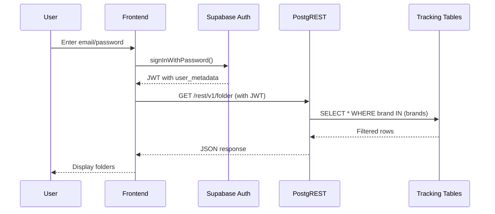

# Phase 2: CRUD Enablement & RLS Implementation Plan

**Document Version:** 1.0  
**Date:** October 24, 2025  
**Status:** 🚧 Planning Phase - Implementation Pending

---

## Executive Summary

This document outlines the complete plan for enabling full CRUD operations on the Supabase tracking schema. Phase 1 delivered read-only REST endpoints; Phase 2 enables authenticated users to create, update, and delete tracking entities with Row Level Security (RLS) enforcing brand-based access control.

**Key Decision**: Direct table access via PostgREST (with RLS) instead of Edge Function gateway pattern.

---

## 1. Architecture Overview

### Current State (Phase 1)
```
Frontend → PostgREST → public.v_* views (read-only) → tracking.* tables
           ↑ Anonymous key
```

### Target State (Phase 2)
```
Frontend → PostgREST → tracking.* tables (RLS-protected)
           ↑ User JWT with brand claims
           
Import Scripts → Supabase (service role) → tracking.* tables (bypasses RLS)
```

**Key Components:**
1. **RLS Policies**: Postgres-native row filtering based on JWT claims
2. **Brand Claims**: `user_metadata.brands` array determines visibility
3. **Service Role Bypass**: Import scripts/Edge Functions bypass RLS
4. **Audit Triggers**: Log all status changes and mutations

---

## 2. RLS Strategy

### 2.1 Policy Hierarchy

```
┌─────────────────────────────────────────────┐
│ Brand-Scoped Entities (Top Level)          │
│ - tracking.folder                           │
│ - tracking.plan                             │
│   Policy: brand IN user_metadata.brands     │
└─────────────────────────────────────────────┘
                    ↓
┌─────────────────────────────────────────────┐
│ Plan-Scoped Entities (Cascading)           │
│ - tracking.plan_views                       │
│ - tracking.plan_styles                      │
│ - tracking.plan_materials                   │
│   Policy: parent plan is accessible         │
└─────────────────────────────────────────────┘
                    ↓
┌─────────────────────────────────────────────┐
│ Timeline Entities (Deep Cascading)         │
│ - tracking.plan_style_timelines            │
│ - tracking.plan_material_timelines         │
│ - tracking.timeline_assignments            │
│   Policy: parent style/material accessible  │
└─────────────────────────────────────────────┘
                    ↓
┌─────────────────────────────────────────────┐
│ Shared Resources (Role-Based)              │
│ - tracking.timeline_templates              │
│ - tracking.timeline_template_items         │
│   Policy: authenticated (read) / admin (write) │
└─────────────────────────────────────────────┘
```

### 2.2 JWT Structure Requirements

**Minimum Required Claims:**
```json
{
  "sub": "user-uuid",
  "email": "user@example.com",
  "role": "authenticated",
  "user_metadata": {
    "brands": ["GREYSON"],
    "role": "manager"
  }
}
```

**Multi-Brand User Example:**
```json
{
  "user_metadata": {
    "brands": ["GREYSON", "MARLEYLILLY", "ACTIVEAPPAREL"],
    "role": "admin"
  }
}
```

**Impact:**
- Users without `brands` array → see ZERO rows
- Empty `brands` array → see ZERO rows
- Multi-brand users → see aggregated data across all brands

---

## 3. Migration Sequence

### Migration 0096: Enable RLS
```sql
-- Enable RLS on all tracking tables
ALTER TABLE tracking.timeline_templates ENABLE ROW LEVEL SECURITY;
ALTER TABLE tracking.timeline_template_items ENABLE ROW LEVEL SECURITY;
ALTER TABLE tracking.folder ENABLE ROW LEVEL SECURITY;
ALTER TABLE tracking.plan ENABLE ROW LEVEL SECURITY;
ALTER TABLE tracking.plan_views ENABLE ROW LEVEL SECURITY;
ALTER TABLE tracking.plan_styles ENABLE ROW LEVEL SECURITY;
ALTER TABLE tracking.plan_style_timelines ENABLE ROW LEVEL SECURITY;
ALTER TABLE tracking.plan_materials ENABLE ROW LEVEL SECURITY;
ALTER TABLE tracking.plan_material_timelines ENABLE ROW LEVEL SECURITY;
ALTER TABLE tracking.timeline_assignments ENABLE ROW LEVEL SECURITY;
ALTER TABLE tracking.timeline_status_history ENABLE ROW LEVEL SECURITY;
```

**Impact:** 🚨 **BREAKING** - All authenticated queries return empty until policies added.

---

### Migration 0097: Brand-Scoped Policies
```sql
-- Folders: Brand-scoped access
CREATE POLICY "brand_access_folders" ON tracking.folder
  FOR ALL
  USING (
    brand = ANY(
      COALESCE(
        (auth.jwt() -> 'user_metadata' ->> 'brands')::text[],
        ARRAY[]::text[]
      )
    )
  );

-- Plans: Brand-scoped access
CREATE POLICY "brand_access_plans" ON tracking.plan
  FOR ALL
  USING (
    brand = ANY(
      COALESCE(
        (auth.jwt() -> 'user_metadata' ->> 'brands')::text[],
        ARRAY[]::text[]
      )
    )
  );
```

**Impact:** Users can now CRUD folders/plans for their assigned brands.

---

### Migration 0098: Cascading Access Policies
```sql
-- Plan Views: Inherit from parent plan
CREATE POLICY "plan_access_views" ON tracking.plan_views
  FOR ALL
  USING (
    EXISTS (
      SELECT 1 FROM tracking.plan p
      WHERE p.id = plan_views.plan_id
        AND p.brand = ANY(
          COALESCE(
            (auth.jwt() -> 'user_metadata' ->> 'brands')::text[],
            ARRAY[]::text[]
          )
        )
    )
  );

-- Styles: Inherit from parent plan
CREATE POLICY "plan_access_styles" ON tracking.plan_styles
  FOR ALL
  USING (
    EXISTS (
      SELECT 1 FROM tracking.plan p
      WHERE p.id = plan_styles.plan_id
        AND p.brand = ANY(
          COALESCE(
            (auth.jwt() -> 'user_metadata' ->> 'brands')::text[],
            ARRAY[]::text[]
          )
        )
    )
  );

-- Style Timelines: Inherit from parent style → plan
CREATE POLICY "plan_access_style_timelines" ON tracking.plan_style_timelines
  FOR ALL
  USING (
    EXISTS (
      SELECT 1 FROM tracking.plan_styles ps
      JOIN tracking.plan p ON p.id = ps.plan_id
      WHERE ps.id = plan_style_timelines.plan_style_id
        AND p.brand = ANY(
          COALESCE(
            (auth.jwt() -> 'user_metadata' ->> 'brands')::text[],
            ARRAY[]::text[]
          )
        )
    )
  );

-- Materials: Inherit from parent plan
CREATE POLICY "plan_access_materials" ON tracking.plan_materials
  FOR ALL
  USING (
    EXISTS (
      SELECT 1 FROM tracking.plan p
      WHERE p.id = plan_materials.plan_id
        AND p.brand = ANY(
          COALESCE(
            (auth.jwt() -> 'user_metadata' ->> 'brands')::text[],
            ARRAY[]::text[]
          )
        )
    )
  );

-- Material Timelines: Inherit from parent material → plan
CREATE POLICY "plan_access_material_timelines" ON tracking.plan_material_timelines
  FOR ALL
  USING (
    EXISTS (
      SELECT 1 FROM tracking.plan_materials pm
      JOIN tracking.plan p ON p.id = pm.plan_id
      WHERE pm.id = plan_material_timelines.plan_material_id
        AND p.brand = ANY(
          COALESCE(
            (auth.jwt() -> 'user_metadata' ->> 'brands')::text[],
            ARRAY[]::text[]
          )
        )
    )
  );

-- Timeline Assignments: Inherit from parent timeline
CREATE POLICY "timeline_access_assignments" ON tracking.timeline_assignments
  FOR ALL
  USING (
    CASE timeline_type
      WHEN 'STYLE' THEN EXISTS (
        SELECT 1 FROM tracking.plan_style_timelines pst
        JOIN tracking.plan_styles ps ON ps.id = pst.plan_style_id
        JOIN tracking.plan p ON p.id = ps.plan_id
        WHERE pst.id = timeline_assignments.timeline_id
          AND p.brand = ANY(
            COALESCE(
              (auth.jwt() -> 'user_metadata' ->> 'brands')::text[],
              ARRAY[]::text[]
            )
          )
      )
      WHEN 'MATERIAL' THEN EXISTS (
        SELECT 1 FROM tracking.plan_material_timelines pmt
        JOIN tracking.plan_materials pm ON pm.id = pmt.plan_material_id
        JOIN tracking.plan p ON p.id = pm.plan_id
        WHERE pmt.id = timeline_assignments.timeline_id
          AND p.brand = ANY(
            COALESCE(
              (auth.jwt() -> 'user_metadata' ->> 'brands')::text[],
              ARRAY[]::text[]
            )
          )
      )
      ELSE FALSE
    END
  );

-- Status History: Inherit from parent timeline
CREATE POLICY "timeline_access_history" ON tracking.timeline_status_history
  FOR ALL
  USING (
    CASE timeline_type
      WHEN 'STYLE' THEN EXISTS (
        SELECT 1 FROM tracking.plan_style_timelines pst
        JOIN tracking.plan_styles ps ON ps.id = pst.plan_style_id
        JOIN tracking.plan p ON p.id = ps.plan_id
        WHERE pst.id = timeline_status_history.timeline_id
          AND p.brand = ANY(
            COALESCE(
              (auth.jwt() -> 'user_metadata' ->> 'brands')::text[],
              ARRAY[]::text[]
            )
          )
      )
      WHEN 'MATERIAL' THEN EXISTS (
        SELECT 1 FROM tracking.plan_material_timelines pmt
        JOIN tracking.plan_materials pm ON pm.id = pmt.plan_material_id
        JOIN tracking.plan p ON p.id = pm.plan_id
        WHERE pmt.id = timeline_status_history.timeline_id
          AND p.brand = ANY(
            COALESCE(
              (auth.jwt() -> 'user_metadata' ->> 'brands')::text[],
              ARRAY[]::text[]
            )
          )
      )
      ELSE FALSE
    END
  );
```

**Impact:** All child entities inherit access from parent plan.

---

### Migration 0099: Template Policies
```sql
-- Templates: All authenticated users can read
CREATE POLICY "templates_read" ON tracking.timeline_templates
  FOR SELECT
  USING (auth.role() = 'authenticated');

-- Templates: Only admins can write
CREATE POLICY "templates_write" ON tracking.timeline_templates
  FOR INSERT
  WITH CHECK (
    (auth.jwt() -> 'user_metadata' ->> 'role') = 'admin'
  );

CREATE POLICY "templates_update" ON tracking.timeline_templates
  FOR UPDATE
  USING (
    (auth.jwt() -> 'user_metadata' ->> 'role') = 'admin'
  )
  WITH CHECK (
    (auth.jwt() -> 'user_metadata' ->> 'role') = 'admin'
  );

CREATE POLICY "templates_delete" ON tracking.timeline_templates
  FOR DELETE
  USING (
    (auth.jwt() -> 'user_metadata' ->> 'role') = 'admin'
  );

-- Template Items: Follow parent template access
CREATE POLICY "template_items_read" ON tracking.timeline_template_items
  FOR SELECT
  USING (
    EXISTS (
      SELECT 1 FROM tracking.timeline_templates t
      WHERE t.id = timeline_template_items.template_id
        AND auth.role() = 'authenticated'
    )
  );

CREATE POLICY "template_items_write" ON tracking.timeline_template_items
  FOR INSERT, UPDATE, DELETE
  USING (
    EXISTS (
      SELECT 1 FROM tracking.timeline_templates t
      WHERE t.id = timeline_template_items.template_id
        AND (auth.jwt() -> 'user_metadata' ->> 'role') = 'admin'
    )
  );
```

**Impact:** Templates are shared resources; only admins can modify.

---

### Migration 0100: Grant CRUD Permissions
```sql
-- Grant full CRUD to authenticated users on base tables
GRANT SELECT, INSERT, UPDATE, DELETE ON tracking.folder TO authenticated;
GRANT SELECT, INSERT, UPDATE, DELETE ON tracking.plan TO authenticated;
GRANT SELECT, INSERT, UPDATE, DELETE ON tracking.plan_views TO authenticated;
GRANT SELECT, INSERT, UPDATE, DELETE ON tracking.plan_styles TO authenticated;
GRANT SELECT, INSERT, UPDATE, DELETE ON tracking.plan_style_timelines TO authenticated;
GRANT SELECT, INSERT, UPDATE, DELETE ON tracking.plan_materials TO authenticated;
GRANT SELECT, INSERT, UPDATE, DELETE ON tracking.plan_material_timelines TO authenticated;
GRANT SELECT, INSERT, UPDATE, DELETE ON tracking.timeline_assignments TO authenticated;
GRANT SELECT, INSERT, UPDATE, DELETE ON tracking.timeline_status_history TO authenticated;

-- Templates: Read for all, write for admins (enforced by policy)
GRANT SELECT, INSERT, UPDATE, DELETE ON tracking.timeline_templates TO authenticated;
GRANT SELECT, INSERT, UPDATE, DELETE ON tracking.timeline_template_items TO authenticated;
GRANT SELECT, INSERT, UPDATE, DELETE ON tracking.timeline_template_visibility TO authenticated;

-- Dependency tables
GRANT SELECT, INSERT, UPDATE, DELETE ON tracking.plan_style_dependencies TO authenticated;
GRANT SELECT, INSERT, UPDATE, DELETE ON tracking.plan_material_dependencies TO authenticated;
GRANT SELECT, INSERT, UPDATE, DELETE ON tracking.folder_style_links TO authenticated;

-- Sequences (for UUID generation and auto-increment)
GRANT USAGE, SELECT ON ALL SEQUENCES IN SCHEMA tracking TO authenticated;

COMMENT ON SCHEMA tracking IS 'Phase 2: Full CRUD enabled with RLS enforcement';
```

**Impact:** PostgREST exposes tracking tables at `/rest/v1/<table_name>` endpoints.

---

## 4. Outstanding Planning Items

### 4.1 Authentication & User Management

**Questions to Answer:**

1. **User Store**: Where are users stored?
   - Supabase Auth (built-in) ✅ Recommended
   - External IDP (Azure AD, Auth0, etc.)
   - Custom auth service

2. **Brand Assignment**: How do users get brand claims?
   - Manual admin assignment via Supabase dashboard
   - Automated during signup (company email domain → brand)
   - Synced from BeProduct directory API
   - Custom admin UI for user/brand management

3. **Role Management**: Who is an "admin"?
   - Super admins (can edit templates)
   - Brand managers (can edit plans for their brand)
   - Merchandisers (can edit timelines but not plans)
   - Suppliers (read-only via supplier portal - Phase 3)

**Recommendation:**
```javascript
// Example user creation flow
const { data: user } = await supabase.auth.admin.createUser({
  email: 'john@greyson.com',
  password: 'temp-password',
  email_confirm: true,
  user_metadata: {
    brands: ['GREYSON'],           // Auto-detected from email domain
    role: 'manager',               // Default role
    company_id: 'uuid-of-company', // Link to directory
    full_name: 'John Doe'
  }
});
```

---

### 4.2 User Metadata Population

**Options:**

**Option 1: Manual Assignment (Quickest)**
```sql
-- Admin updates user via SQL
UPDATE auth.users
SET raw_user_meta_data = jsonb_set(
  COALESCE(raw_user_meta_data, '{}'::jsonb),
  '{brands}',
  '["GREYSON", "MARLEYLILLY"]'::jsonb
)
WHERE email = 'user@example.com';
```

**Option 2: Admin UI (Recommended)**
- Build simple admin page
- List users, assign brands/roles
- Uses `supabase.auth.admin.updateUserById()`

**Option 3: Automated via Edge Function**
```typescript
// During signup, infer brand from email domain
const domain = email.split('@')[1];
const brandMap = {
  'greyson.com': ['GREYSON'],
  'marleylilly.com': ['MARLEYLILLY'],
  'activeapparel.com': ['GREYSON', 'MARLEYLILLY', 'ACTIVEAPPAREL']
};

await supabase.auth.admin.updateUserById(userId, {
  user_metadata: {
    brands: brandMap[domain] || [],
    role: 'viewer' // Default
  }
});
```

**Option 4: Sync from BeProduct Directory**
```typescript
// Nightly sync: fetch BeProduct users, update Supabase claims
const beproductUsers = await fetchBeProductUsers();
for (const user of beproductUsers) {
  await supabase.auth.admin.updateUserById(user.supabaseId, {
    user_metadata: {
      brands: user.brands, // From BeProduct directory
      role: user.role
    }
  });
}
```

---

### 4.3 Login Flow

**Current State:** No login implemented.

**Required for Phase 2:**



**Implementation Options:**

1. **Supabase Auth UI** (Fastest)
   ```javascript
   import { Auth } from '@supabase/auth-ui-react';
   
   <Auth supabaseClient={supabase} appearance={{ theme: ThemeSupa }} />
   ```

2. **Custom Login Form**
   ```javascript
   const handleLogin = async (email, password) => {
     const { data, error } = await supabase.auth.signInWithPassword({
       email,
       password
     });
     
     if (!error) {
       // JWT is automatically stored and used for subsequent requests
       router.push('/dashboard');
     }
   };
   ```

3. **SSO Integration** (Azure AD, Google, etc.)
   ```javascript
   const { data, error } = await supabase.auth.signInWithOAuth({
     provider: 'azure',
     options: {
       scopes: 'email profile',
       redirectTo: 'https://app.example.com/callback'
     }
   });
   ```

---

### 4.4 Database Schema for User Management

**Do we need additional tables?**

**Option A: Use Supabase Auth Only** (Recommended for Phase 2)
- Store brands/roles in `auth.users.raw_user_meta_data`
- No additional tables needed
- Simplest approach

**Option B: Mirror Auth Data** (For complex permissions)
```sql
-- Create app-specific user table
CREATE TABLE public.app_users (
  id UUID PRIMARY KEY REFERENCES auth.users(id),
  brands TEXT[] NOT NULL DEFAULT '{}',
  role TEXT NOT NULL DEFAULT 'viewer',
  company_id UUID REFERENCES public.company(id),
  active BOOLEAN DEFAULT TRUE,
  created_at TIMESTAMPTZ DEFAULT NOW(),
  updated_at TIMESTAMPTZ DEFAULT NOW()
);

-- Sync trigger: auth.users → public.app_users
CREATE FUNCTION sync_user_metadata() RETURNS TRIGGER AS $$
BEGIN
  INSERT INTO public.app_users (id, brands, role)
  VALUES (
    NEW.id,
    COALESCE((NEW.raw_user_meta_data->>'brands')::text[], '{}'),
    COALESCE(NEW.raw_user_meta_data->>'role', 'viewer')
  )
  ON CONFLICT (id) DO UPDATE SET
    brands = EXCLUDED.brands,
    role = EXCLUDED.role,
    updated_at = NOW();
  RETURN NEW;
END;
$$ LANGUAGE plpgsql;
```

**Recommendation:** Start with Option A (auth only), migrate to Option B if needed.

---

## 5. Performance Considerations

### 5.1 RLS Policy Performance

**Concern:** Nested EXISTS queries could slow down large result sets.

**Mitigation:**
```sql
-- Ensure FK indexes exist
CREATE INDEX IF NOT EXISTS idx_plan_styles_plan_id 
  ON tracking.plan_styles(plan_id);
  
CREATE INDEX IF NOT EXISTS idx_plan_style_timelines_plan_style_id 
  ON tracking.plan_style_timelines(plan_style_id);
  
CREATE INDEX IF NOT EXISTS idx_plan_materials_plan_id 
  ON tracking.plan_materials(plan_id);
  
CREATE INDEX IF NOT EXISTS idx_plan_material_timelines_plan_material_id 
  ON tracking.plan_material_timelines(plan_material_id);

-- Brand index on plans (for policy lookup)
CREATE INDEX IF NOT EXISTS idx_plan_brand 
  ON tracking.plan(brand) WHERE active = TRUE;
```

**Monitoring:**
```sql
-- Check policy overhead
EXPLAIN ANALYZE
SELECT * FROM tracking.plan_style_timelines
WHERE plan_style_id = 'some-uuid';
```

**Expected:** <50ms for queries returning <1000 rows.

---

### 5.2 JWT Claim Caching

**Good News:** JWT claims are cached in the token itself (no DB lookup per request).

**Consideration:** Token expiry = 1 hour (default). Brand changes won't take effect until token refresh.

**Workaround:**
```javascript
// Force token refresh after brand assignment change
await supabase.auth.refreshSession();
```

---

## 6. Testing Strategy

### 6.1 Test Users

Create test users for each scenario:

```sql
-- Test User 1: Single-brand manager
INSERT INTO auth.users (email, raw_user_meta_data) VALUES
  ('manager@greyson.com', '{"brands": ["GREYSON"], "role": "manager"}');

-- Test User 2: Multi-brand admin
INSERT INTO auth.users (email, raw_user_meta_data) VALUES
  ('admin@activeapparel.com', '{"brands": ["GREYSON", "MARLEYLILLY"], "role": "admin"}');

-- Test User 3: No brand (should see nothing)
INSERT INTO auth.users (email, raw_user_meta_data) VALUES
  ('viewer@external.com', '{"brands": [], "role": "viewer"}');
```

### 6.2 Test Scenarios

| Test | User | Expected Result |
| --- | --- | --- |
| View GREYSON folder | User 1 | ✅ See 1 folder |
| View MARLEYLILLY folder | User 1 | ❌ See 0 folders |
| View all folders | User 2 | ✅ See 2 folders |
| Create GREYSON plan | User 1 | ✅ Success |
| Create MARLEYLILLY plan | User 1 | ❌ Policy violation |
| Edit template | User 1 | ❌ Policy violation (not admin) |
| Edit template | User 2 | ✅ Success (admin) |

---

## 7. Rollout Checklist

### Pre-Deployment
- [ ] Decide on user management strategy (Option A vs B)
- [ ] Implement login flow (Supabase Auth UI or custom)
- [ ] Create admin UI for brand/role assignment
- [ ] Populate `user_metadata.brands` for existing users
- [ ] Create test users with various brand/role combinations
- [ ] Test RLS policies in development environment

### Deployment
- [ ] Apply Migration 0096 (Enable RLS)
- [ ] Apply Migration 0097 (Brand policies)
- [ ] Apply Migration 0098 (Cascading policies)
- [ ] Apply Migration 0099 (Template policies)
- [ ] Apply Migration 0100 (Grant permissions)
- [ ] Monitor error logs for policy violations
- [ ] Validate query performance

### Post-Deployment
- [ ] Update frontend to use authenticated client
- [ ] Test CRUD operations via UI
- [ ] Monitor performance metrics
- [ ] Document API endpoints for frontend team
- [ ] Train users on new permissions model

---

## 8. Risks & Mitigation

| Risk | Impact | Probability | Mitigation |
| --- | --- | --- | --- |
| Users have no brand claims | ❌ See zero data | HIGH | Pre-populate claims before go-live |
| RLS policy bugs | ❌ Wrong data visibility | MEDIUM | Thorough testing with test users |
| Performance degradation | ⚠️ Slow queries | LOW | Ensure FK indexes, monitor query plans |
| JWT claim staleness | ⚠️ Outdated permissions | LOW | Force token refresh after changes |
| Service role key leak | 🚨 Full DB access | LOW | Rotate keys, use environment vars only |

---

## 9. Future Enhancements (Phase 3+)

**Not included in Phase 2, but on the roadmap:**

1. **Supplier Portal Access**
   - Separate supplier role with limited visibility
   - Filter by `plan.suppliers`, `plan_styles.suppliers`, `timeline.shared_with`
   - See Section 6–8 of `05-frontend-implementation-plan.md`

2. **Audit Dashboard**
   - Query `timeline_status_history` for change logs
   - User activity reports
   - Timeline completion metrics

3. **Complex Business Logic via Edge Functions**
   - Template application (clone template → plan)
   - Bulk timeline updates
   - Date recalculation engine
   - Email notifications on status changes

4. **Analytics RPCs**
   - `get_plan_progress_delta(plan_id, since_date)`
   - `get_overdue_milestones(brand, user_id)`
   - `get_supplier_performance(supplier_id)`

---

## 10. Decision Log

| Date | Decision | Rationale |
| --- | --- | --- |
| 2025-10-24 | Use direct PostgREST access (not Edge Functions) | Simpler, standard patterns, RLS provides security |
| 2025-10-24 | Brand-scoped RLS model | Aligns with BeProduct multi-tenancy |
| TBD | User metadata storage strategy | Options A/B documented, decision pending |
| TBD | Login implementation approach | Options 1/2/3 documented, decision pending |

---

## 11. Next Actions

**Immediate (This Session):**
1. ✅ Apply migrations 0096–0100 to enable CRUD
2. ⏳ Test with service role key (bypasses RLS)
3. ⏳ Document endpoints in `crud-endpoint-status.md`

**Before Production Use:**
1. Implement login flow
2. Populate user metadata (brands/roles)
3. Create test users
4. Validate RLS policies with real JWTs

**Phase 3:**
1. Supplier portal access
2. Edge Functions for complex operations
3. Analytics RPCs

---

**Document Status:** 🚧 Draft - Awaiting decisions on user management strategy.

**Owner:** Backend Team  
**Last Updated:** 2025-10-24
