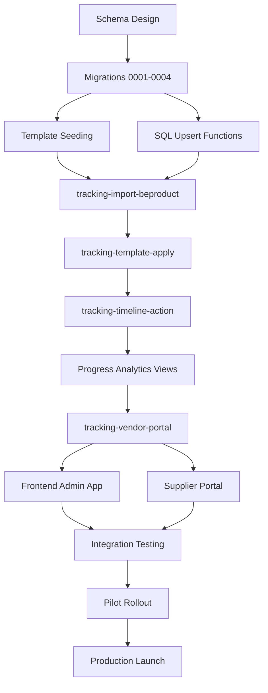

# Supabase Tracking Implementation — Project Plan

**Document version:** 1.0 • **Last updated:** 2025-10-23 • **Author:** GitHub Copilot  
**Project:** GREYSON Tracking Pilot → Multi-Brand Tracking Platform

---

## Current Status: Schema Deployed ✅

### Completed Milestones (October 23, 2025)

#### ✅ Phase 0: Schema Design & Documentation
- [x] Research BeProduct tracking data model
- [x] Design Supabase schema blueprint
- [x] Document import/API strategy
- [x] Extract and normalize garment timeline template
- [x] Create frontend implementation plan
- [x] Draft supplier portal strategy

#### ✅ Phase 1: Database Migrations
- [x] **Migration 0001:** Create `tracking` schema + 7 enumerations
- [x] **Migration 0002:** Create template tables (`timeline_templates`, `timeline_template_items`, `timeline_template_visibility`)
- [x] **Migration 0003:** Create core tables (folders, plans, views, styles, materials, timelines, dependencies)
- [x] **Migration 0004:** Create audit tables (assignments, status_history, import_batches, import_errors, sync_log) + indexes

**Database Status:** All tables, enums, indexes, and foreign key constraints live in Supabase production.

---

## What's Next: Backend Implementation

### 🚧 Phase 2: Edge Functions & Import Pipeline (Current Focus)

#### 2.1 Template Seeding (Week 1)
- [ ] Create seed script to import garment timeline template from `ref/timeline_extract_beproduct.json`
- [ ] Populate `timeline_templates` with GREYSON MASTER 2026 template
- [ ] Populate `timeline_template_items` with 24 milestones (anchors + tasks)
- [ ] Populate `timeline_template_visibility` for style/material views
- [ ] Verify dependency graph and offset calculations

**Deliverable:** Seeded template ready for plan application.

#### 2.2 BeProduct Import Functions (Week 1-2)
- [ ] Build SQL upsert functions:
  - [ ] `tracking.fn_upsert_folder(payload jsonb)`
  - [ ] `tracking.fn_upsert_plan(payload jsonb)`
  - [ ] `tracking.fn_upsert_plan_style(payload jsonb)`
  - [ ] `tracking.fn_upsert_plan_material(payload jsonb)`
  - [ ] `tracking.fn_upsert_timeline(payload jsonb)`
- [ ] Add transaction wrappers and error handling
- [ ] Test with captured BeProduct payloads

**Deliverable:** Tested SQL import functions.

#### 2.3 Edge Function: `tracking-import-beproduct` (Week 2)
- [ ] Scaffold Edge Function with Deno + Supabase client
- [ ] Implement folder list fetch via MCP `beproduct-tracking.folderList`
- [ ] Implement plan timeline fetch via MCP `beproduct-tracking.planStyleTimeline` / `planMaterialTimeline`
- [ ] Call SQL upsert functions from Edge Function
- [ ] Log import batch in `import_batches` + `beproduct_sync_log`
- [ ] Add dry-run mode for validation
- [ ] Test with GREYSON pilot data

**Deliverable:** Functional import Edge Function.

**Input:**
```json
{
  "folderId": "162eedf3-0230-4e4c-88e1-6db332e3707b",
  "planIds": ["optional-array"],
  "includeMaterialTimelines": true,
  "dryRun": false
}
```

**Output:**
```json
{
  "batchId": 12345,
  "counts": {
    "plans": 1,
    "styles": 18,
    "materials": 24,
    "milestones": 432
  },
  "warnings": []
}
```

#### 2.4 Edge Function: `tracking-template-apply` (Week 2)
- [ ] Scaffold function to apply template to plan
- [ ] Read `timeline_template_items` for given template
- [ ] Clone items into `plan_style_timelines` / `plan_material_timelines`
- [ ] Calculate due dates based on dependencies + offsets
- [ ] Handle anchor milestones (START DATE, END DATE)
- [ ] Test with seeded template

**Deliverable:** Template application function.

**Input:**
```json
{
  "planId": "880e8400-e29b-41d4-a716-446655440000",
  "templateId": "550e8400-e29b-41d4-a716-446655440000",
  "includeMaterial": true
}
```

**Output:**
```json
{
  "inserted": 24,
  "skipped": 0,
  "errors": []
}
```

#### 2.5 Edge Function: `tracking-timeline-action` (Week 3)
- [ ] Scaffold function for timeline CRUD operations
- [ ] Implement actions:
  - [ ] `updateStatus` — change milestone status + log history
  - [ ] `updateDates` — modify plan/rev/final/due/completed dates
  - [ ] `assign` — add/remove assignees
  - [ ] `addNote` — append timeline notes
- [ ] Enforce RLS-like permissions (validate user access)
- [ ] Insert into `timeline_status_history` for audit
- [ ] Return updated milestone payload

**Deliverable:** Timeline action function.

**Input:**
```json
{
  "timelineId": "7d88971b-...",
  "timelineType": "STYLE",
  "action": "updateStatus",
  "payload": {
    "status": "IN_PROGRESS"
  }
}
```

**Output:**
```json
{
  "success": true,
  "timeline": { /* updated milestone object */ }
}
```

---

### 🚧 Phase 3: Analytics & Vendor Views (Week 3-4)

#### 3.1 Progress Analytics Views
- [ ] Create SQL views:
  - [ ] `tracking.v_plan_progress_summary` — plan-level rollup
  - [ ] `tracking.v_plan_style_progress` — style-level progress
  - [ ] `tracking.v_plan_style_color_progress` — style+color rollup
  - [ ] `tracking.v_plan_material_progress` — material-level progress
  - [ ] `tracking.v_plan_progress_timeseries` — daily snapshots
- [ ] Index for performance
- [ ] Expose via PostgREST

**Deliverable:** Queryable progress views.

#### 3.2 Vendor Snapshot Views
- [ ] Create `tracking.vendor_memberships` table (links suppliers to plans)
- [ ] Create SQL views:
  - [ ] `tracking.v_vendor_plan_summary` — supplier-scoped plan list
  - [ ] `tracking.v_vendor_milestone_feed` — supplier-scoped timeline cards
  - [ ] `tracking.v_vendor_task_digest` — optional task integration
- [ ] Populate memberships via import pipeline (parse `shareWith` / `supplier` arrays)

**Deliverable:** Vendor-scoped views ready for portal.

#### 3.3 Edge Function: `tracking-vendor-portal`
- [ ] Scaffold vendor gateway function
- [ ] Accept `{ supplierId, planId?, includeTasks?, since? }`
- [ ] Query vendor views in single transaction
- [ ] Return unified payload: `{ supplier, plans[], milestones[], tasks[] }`
- [ ] Support cursor-based pagination (`since` timestamp)

**Deliverable:** Vendor portal API endpoint.

---

### 🚧 Phase 4: Frontend Integration (Week 4-5)

#### 4.1 Internal Admin App (Tracking Plan Manager)
- [ ] Implement Phase 1: Template Manager UI
- [ ] Implement Phase 2: Folder Manager UI
- [ ] Implement Phase 3: Plan Manager UI
- [ ] Implement Phase 4: Add Styles UI (stub)
- [ ] Connect to Supabase (replace mock data with real queries)
- [ ] Wire Edge Function calls
- [ ] Add form validation and error handling

**Reference:** See `05-frontend-implementation-plan.md` for detailed UI specs.

**Deliverable:** Functional admin app for internal users.

#### 4.2 Supplier/Vendor Portal
- [ ] Implement vendor dashboard using `tracking-vendor-portal` Edge Function
- [ ] Display plan list filtered by supplier
- [ ] Display milestone feed with due dates and statuses
- [ ] Add milestone detail modal
- [ ] Support status updates (via `tracking-timeline-action`)
- [ ] Add task integration (if available)

**Reference:** See `supplier-portal-tracking-plan.md` Phase 0-1 sections.

**Deliverable:** Supplier-facing portal.

---

### 🚧 Phase 5: Testing & Validation (Week 5-6)

#### 5.1 Integration Testing
- [ ] Test full import flow: BeProduct → Supabase
- [ ] Validate template application with various scenarios
- [ ] Test timeline action mutations (status changes, assignments)
- [ ] Verify progress analytics accuracy
- [ ] Confirm vendor view filtering and permissions

#### 5.2 Performance Testing
- [ ] Load test import function with 100+ styles
- [ ] Query performance on progress views (explain analyze)
- [ ] Edge Function latency benchmarks
- [ ] Frontend rendering with large datasets

#### 5.3 Security Audit
- [ ] Verify RLS policies on all tables
- [ ] Test unauthorized access scenarios
- [ ] Validate JWT claims handling in Edge Functions
- [ ] Audit logging completeness

**Deliverable:** Test reports + fixes.

---

### 🚧 Phase 6: Pilot Rollout (Week 6-7)

#### 6.1 GREYSON Pilot
- [ ] Import GREYSON 2026 SPRING tracking data
- [ ] Invite 3-5 internal users to admin app
- [ ] Invite 2-3 supplier partners to vendor portal
- [ ] Collect feedback on usability and data accuracy
- [ ] Monitor performance and errors (Supabase logs + Sentry)

#### 6.2 Iteration & Bug Fixes
- [ ] Address feedback from pilot users
- [ ] Refine UI/UX based on usage patterns
- [ ] Optimize slow queries
- [ ] Enhance error messages and validation

**Deliverable:** Production-ready system validated by pilot users.

---

### 🚧 Phase 7: Production Launch (Week 8+)

#### 7.1 Multi-Brand Rollout
- [ ] Expand to additional brands (VUORI, RHONE, etc.)
- [ ] Import historical tracking data (optional)
- [ ] Train users on new system
- [ ] Provide documentation and support materials

#### 7.2 Automation & Webhooks
- [ ] Set up nightly sync cron job (Supabase → BeProduct)
- [ ] Explore webhook integration for real-time updates
- [ ] Automate template versioning and rollover
- [ ] Build reporting dashboards (Metabase, Tableau, or custom)

#### 7.3 Continuous Improvement
- [ ] Collect user feedback and feature requests
- [ ] Iterate on analytics views and visualizations
- [ ] Enhance supplier collaboration features (comments, attachments)
- [ ] Explore mobile app or PWA for field users

**Deliverable:** Fully operational multi-brand tracking platform.

---

## Dependency Map



---

## Team Roles & Responsibilities

| Role | Responsibilities | Current Status |
|------|------------------|----------------|
| **Database Engineer** | Schema design, migrations, SQL functions | ✅ Completed migrations |
| **Backend Developer** | Edge Functions, import pipeline, API endpoints | 🚧 Phase 2 in progress |
| **Frontend Developer** | Admin app UI, supplier portal UI | 🔜 Starting Phase 4 |
| **QA Engineer** | Test plans, integration tests, UAT | 🔜 Phase 5 |
| **Product Owner** | Requirements, user stories, acceptance criteria | ✅ Requirements documented |
| **DevOps** | Deployment, monitoring, CI/CD | 🔜 Phase 6 |

---

## Success Metrics

### Phase 2-3 (Backend)
- ✅ Import function successfully processes 100+ styles/materials
- ✅ Template application generates correct milestone dates
- ✅ Timeline actions update within <500ms
- ✅ Zero data loss or corruption during imports

### Phase 4 (Frontend)
- ✅ Admin app supports template/folder/plan CRUD
- ✅ UI matches existing portal design system
- ✅ Forms validate correctly with clear error messages
- ✅ Page load times <2s for list views

### Phase 6 (Pilot)
- ✅ 90% user satisfaction score
- ✅ <5% error rate on imports
- ✅ All pilot suppliers successfully view their timelines
- ✅ Identified and resolved critical bugs

### Phase 7 (Production)
- ✅ Onboard 10+ brands
- ✅ 95% uptime SLA
- ✅ Daily sync completes within 30 minutes
- ✅ User adoption >80% of target audience

---

## Risk Register

| Risk | Impact | Mitigation |
|------|--------|------------|
| BeProduct API rate limits | High | Cache responses, implement throttling, negotiate higher limits |
| Supabase query performance with large datasets | Medium | Optimize indexes, use materialized views, implement pagination |
| User adoption resistance | Medium | Training sessions, clear documentation, phased rollout |
| Data sync conflicts (stale data) | Low | Implement conflict resolution strategy, timestamp-based merging |
| Security vulnerabilities (RLS bypass) | High | Comprehensive security audit, penetration testing |

---

## Communication Plan

- **Weekly Standups:** Progress updates, blockers, next steps
- **Bi-weekly Demos:** Show working features to stakeholders
- **Slack Channel:** `#tracking-implementation` for async coordination
- **Documentation:** Keep all docs updated in `supabase-tracking/docs/`
- **Issue Tracking:** GitHub Issues or Jira for bugs and feature requests

---

## Budget & Resources

- **Supabase Costs:** Estimate ~$25-50/month (Pro tier for production)
- **Edge Function Compute:** Included in Supabase; monitor usage
- **Development Time:** ~6-8 weeks full-time equivalent
- **Third-Party Tools:** None required (all Supabase + existing portal stack)

---

## Next Immediate Actions (This Week)

1. **Backend Team:**
   - [ ] Create template seed script using `ref/timeline_extract_beproduct.json`
   - [ ] Build and test `tracking.fn_upsert_folder` SQL function
   - [ ] Start scaffolding `tracking-import-beproduct` Edge Function

2. **Frontend Team:**
   - [ ] Review `05-frontend-implementation-plan.md`
   - [ ] Set up project structure and routing
   - [ ] Begin Phase 1: Template Manager UI with mock data

3. **Product/QA:**
   - [ ] Define acceptance criteria for Phase 2 deliverables
   - [ ] Prepare test data sets (sample plans, styles, materials)
   - [ ] Draft user training materials outline

---

## Document References

| Document | Purpose | Status |
|----------|---------|--------|
| `01-beproduct-schema-research.md` | BeProduct data model research | ✅ Complete |
| `02-supabase-schema-blueprint.md` | Supabase schema design | ✅ Complete |
| `03-import-and-api-plan.md` | Import pipeline & API strategy | ✅ Complete |
| `04-garment-timeline-template.md` | Master template definition | ✅ Complete |
| `05-frontend-implementation-plan.md` | Frontend UI/UX specifications | ✅ Complete |
| `supplier-portal-tracking-plan.md` | Vendor portal strategy | ✅ Complete |
| `prd.md` | Product requirements document | ✅ Complete |

---

## Summary

**Current State:** Database schema fully deployed. All tables, relationships, and indexes live in Supabase production.

**Next Milestone:** Complete Phase 2 (Edge Functions & Import Pipeline) within 2 weeks.

**Focus Areas:**
- Backend: Build import functions and Edge Functions
- Frontend: Start admin app UI (Phase 1-3)
- QA: Prepare test scenarios and acceptance criteria

**Timeline:** 6-8 weeks to production launch with pilot validation.

---

**Document Status:** Active Project Plan  
**Review Cadence:** Update weekly during implementation phases  
**Owner:** [Project Lead Name]  
**Last Review:** October 23, 2025
