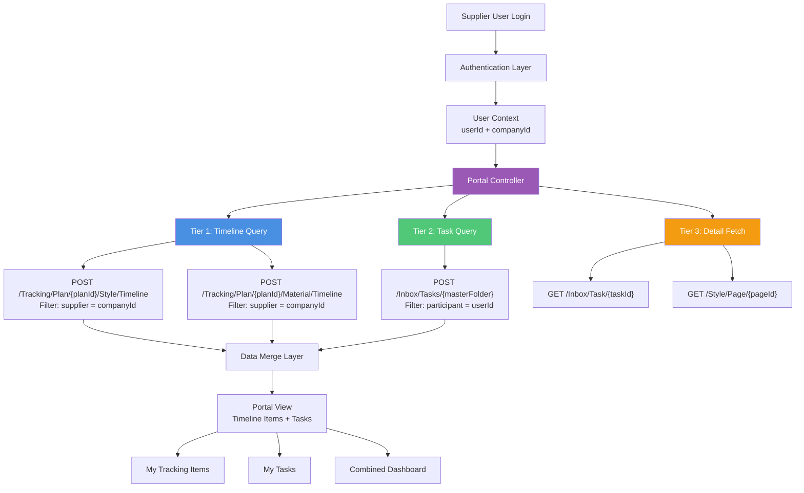
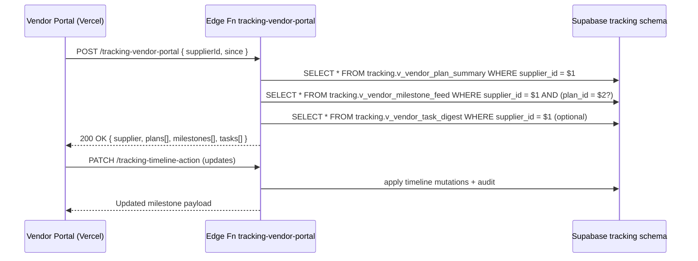
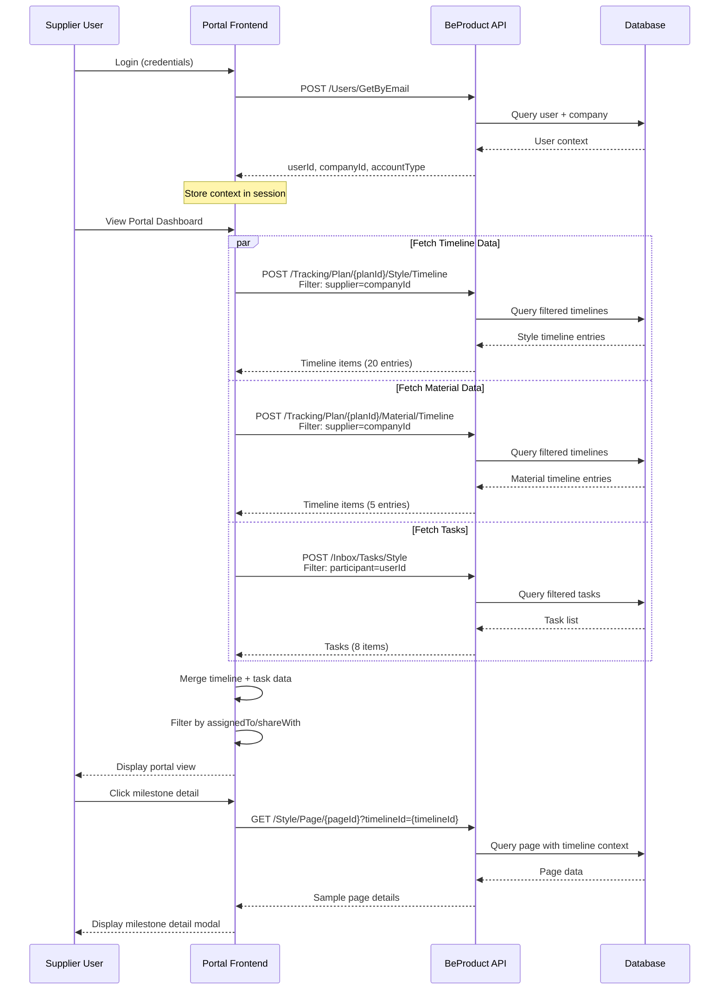

# Supplier portal tracking plan – consolidated summary

**Date:** October 24, 2025  
**Status:** Consolidated (see primary references below)

This document now tracks only the high-level milestones for the supplier-facing portal. The canonical technical details, API contracts, and Supabase snapshot architecture live in:

- `docs/03-import-and-api-plan.md` — Sections **4.3–4.4** (Supabase vendor snapshot, Edge Functions) and **10** (Phase roadmap).
- `docs/05-frontend-implementation-plan.md` — Sections **6–8** (supplier gating model, future UX surfaces).

If you need the previous long-form analysis, check the Git history prior to `2025-10-24`.

---

## Current focus

1. **Supabase snapshot gateway** (preferred path) — Materialize supplier-scoped views and ship an Edge Function (`tracking-vendor-portal`) that returns plans, milestones, and tasks in a single call. See 03-import-and-api-plan §4.3.
2. **Legacy BeProduct fallback** — Maintain docs for the three-tier filtering approach (timeline → tasks → detail) for QA. Implementation notes relocated to 03-import-and-api-plan §5.
3. **Frontend integration** — Vendor portal should consume the snapshot endpoint when available, dropping to the fallback only on `501 NOT_IMPLEMENTED`.

---

## Open actions

| Area | Owner | Status | Notes |
| --- | --- | --- | --- |
| Supabase views (`tracking.v_vendor_*`) | Backend | ⏳ In design | Blueprint captured in 03-import-and-api-plan §4.3. |
| Edge Function `tracking-vendor-portal` | Backend | ⏳ Pending | Fan-out query + RLS enforcement. |
| Frontend vendor portal wiring | Frontend | ⏳ Pending | Await Edge Function; fallback flow documented in 05-frontend-implementation-plan §6. |

---

## Quick links

- Import & API Plan: `docs/03-import-and-api-plan.md`
- Frontend Implementation Plan: `docs/05-frontend-implementation-plan.md`
- Supplier access quick reference: `docs/SUPPLIER-ACCESS-QUICK-REFERENCE.md`

---

## Latest Progress (October 23, 2025)

- ✅ Supabase tracking schema and enumerations deployed via migrations `0001`–`0004` (schema, templates, core plan tables, audit/logging, indexes).
- ✅ Database structure now mirrors BeProduct plan/style/material hierarchy; ready for import function wiring.
- 🚧 Next milestone: build `tracking-import-beproduct` Edge Function and staging tables to hydrate Supabase from BeProduct payloads.
- 🚧 Begin drafting vendor snapshot views (`tracking.v_vendor_plan_summary`, `tracking.v_vendor_milestone_feed`) once baseline data import succeeds.


## Executive Summary

This plan proposes a **three-tier filtered view system** for supplier/partner users to access tracking plans and tasks in BeProduct. The approach minimizes API calls by leveraging:

1. **Primary Entry Point:** Tracking Plan Timeline API with supplier-based filters
2. **Secondary Context:** Inbox Tasks filtered by participant/assignee
3. **Unified Portal View:** Combined timeline + task data with client-side merge

**Key Benefits:**
- Minimal API calls (2-3 requests per portal load)
- Natural data model alignment (suppliers are linked to timelines via `shareWith` and `supplier` fields)
- Reusable existing API infrastructure (no new endpoints required)
- Clear separation of concerns (tracking vs collaboration)

---

## Current State Analysis

### Data Model Overview

From the existing codebase and API swagger, we have:

**Tracking Plans:**
- Plans contain style/material timeline entries
- Each timeline entry has:
  - `planTimelineId`: unique identifier for the entry
  - `colorwayId`: optional colorway reference
  - `supplier`: collection of supplier company IDs (can be patched with add/remove)
  - `timelines`: array of milestone objects, each with:
    - `timelineId`: milestone identifier
    - `name`: milestone name (e.g., "Physical Reference Samples")
    - `status`: milestone status
    - `assignedTo`: collection of user IDs assigned to this milestone
    - `shareWith`: collection of supplier company IDs with visibility

**Tasks (Inbox):**
- Independent collaboration entities
- Each task has:
  - `taskId`: unique identifier
  - `taskName`: task title
  - `assignees`: users responsible for completion
  - `participants`: users with visibility/collaboration rights
  - `references`: links to headers/pages (optional)

**Directory (Company/Contact):**
- Partner users belong to supplier companies
- Each company has:
  - `id` / `directoryId`: company identifier
  - `partnerType`: SUPPLIER, CUSTOMER, etc.
  - Contacts: registered users linked to the company

### API Capabilities

**Tracking Timeline Endpoints:**
```
POST /api/{company}/Tracking/Plan/{planId}/Style/Timeline
POST /api/{company}/Tracking/Plan/{planId}/Material/Timeline
```
- Supports `filters` array with field/operator/value structure
- Pagination: `pageSize`, `pageNumber`
- Returns: timeline entries with full milestone data

**Tracking View Endpoints:**
```
POST /api/{company}/Tracking/Plan/{planId}/Style/View/{viewId}
POST /api/{company}/Tracking/Plan/{planId}/Material/View/{viewId}
```
- Pre-configured filtered views
- Same filter/pagination capabilities

**Task Search Endpoint:**
```
POST /api/{company}/Inbox/Tasks/{masterFolder}
```
- Supports `filters` array
- Pagination: `pageSize`, `pageNumber`
- Returns: task list with assignees/participants

### Current Limitations

1. **No Direct "My Supplier Items" Endpoint:** Must filter timeline data by supplier company ID
2. **Filter Discovery:** Need to determine exact field names for `supplier`, `assignedTo`, `shareWith` filters
3. **User → Company Mapping:** Requires authenticated user's company ID to filter properly
4. **Task → Timeline Linkage:** Tasks can reference headers but no direct planTimelineId reference

---

## Proposed Solution Architecture

### Three-Tier Data Access Pattern



### Entry Point Recommendation: **Tracking Plans (Primary)**

**Rationale:**
1. **Natural Data Alignment:** Suppliers are explicitly modeled in timeline data (`supplier` field on entries, `shareWith` on milestones)
2. **Single Source of Truth:** Tracking plans are the authoritative record for production milestones
3. **Efficient Filtering:** API supports server-side filtering by supplier company
4. **Complete Context:** Returns full milestone data including dates, statuses, assignments

**Tasks as Secondary Context:**
- Tasks provide collaboration layer (comments, attachments, discussions)
- Tasks reference timelines/headers but are not the primary organizational structure
- Use tasks to enhance timeline items, not replace them

---

### Supabase Vendor Snapshot Entry Point (Recommended Update — Oct 2025)

To collapse the number of calls the Vercel Vendor Portal must issue, we will materialize a **vendor snapshot** inside Supabase and expose it via a dedicated Edge Function + PostgREST view. The import pipeline already knows every plan ↔ style ↔ supplier relationship, making Supabase the ideal fan-out point.

**New persistence + API primitives** (derived from `tracking` schema blueprint):

| Object | Type | Purpose |
| --- | --- | --- |
| `tracking.vendor_memberships` | table | Maps `supplier_company_id` → `plan_id` (+ visibility flags, last_synced_at). Seeded by import job using BeProduct `shareWith` and `supplier` arrays. |
| `tracking.v_vendor_plan_summary` | view | Pre-joins plans, folders, template metadata, and per-plan progress counts for a given supplier. Backed by `tracking_plan_progress_summary`. |
| `tracking.v_vendor_milestone_feed` | view | Provides flattened milestone cards (style + material) scoped to supplier, including assignments, due dates, progress deltas, and attachment counts. Leverages `tracking_plan_style_progress`, `tracking_plan_material_progress`, and `tracking_plan_style_timelines`. |
| `tracking.v_vendor_task_digest` | view | Optional task surface keyed by `supplier_company_id` sourcing from inbox import tables (future). |
| `tracking-vendor-portal` | Edge Function | Accepts `{ supplierId, planId?, includeTasks?, since? }`, returns `{ supplier, plans[], milestones[], tasks[] }`. Internally queries the three views above in a single transaction and handles pagination/cursorization. |

**Desired data contract**

```jsonc
{
  "supplier": {
    "id": "3b998b35-...",
    "name": "GLORIOUS FUTURE"
  },
  "plans": [
    {
      "planId": "162eedf3-...",
      "planName": "GREYSON 2026 SPRING DROP 1",
      "folderName": "GREYSON MENS",
      "brand": "GREYSON",
      "season": "2026 SPRING",
      "progress": {
        "total": 128,
        "complete": 44,
        "late": 6,
        "statusBreakdown": {
          "NOT_STARTED": 60,
          "IN_PROGRESS": 18,
          "APPROVED": 44,
          "REJECTED": 6
        }
      },
      "updatedAt": "2025-10-22T03:12:45Z"
    }
  ],
  "milestones": [
    {
      "timelineId": "7d88971b-...",
      "planId": "162eedf3-...",
      "type": "STYLE",
      "styleNumber": "MSP26B26",
      "colorName": "220 GROVE",
      "milestone": "Physical Reference Samples",
      "status": "NOT_STARTED",
      "dueDate": "2025-11-15",
      "isLate": false,
      "assignedTo": [
        {
          "id": "8fa1cd8c-...",
          "name": "Natalie James"
        }
      ],
      "shareWith": ["3b998b35-..."],
      "attachments": 2,
      "lastActivityAt": "2025-10-20T17:03:55Z"
    }
  ],
  "tasks": []
}
```

**Portal flow with Supabase snapshot**



**Net effect**

- **1 network call** for initial dashboard (Edge function fan-out vs 4–9 mixed API calls).
- Portal reads become Supabase-cacheable (ISR / SWR friendly) because payload derives from nightly import + incremental syncs.
- We keep BeProduct API usage server-side (Edge Function + import), shielding the public portal from upstream rate limits and schema churn.
- Revalidation is as simple as re-calling the Edge function with `since` to receive only mutated milestones (leveraging `last_activity_at` columns).

We will retain the original three-tier BeProduct flow as a fallback/debug pathway, but the vendor portal should rely on Supabase-first reads wherever possible.

---

## Detailed Implementation Plan

> **Implementation note:** the preferred experience loads through `tracking-vendor-portal`. The legacy direct-to-BeProduct flow documented below remains for parity and QA until Supabase surfaces are battle-tested.

### Phase 1: Core Portal Query Pattern

#### Step 0: Supabase Vendor Snapshot Handshake (Preferred)

**Flow:**
1. Vendor authenticates against NextAuth (or similar) and receives tokens containing `supplier_company_id`.
2. Portal issues `POST /functions/v1/tracking-vendor-portal` with `{ supplierId, planId?, includeTasks?, since? }`.
3. Response hydrates plan list, milestone cards, and optional tasks in a single payload.
4. Cache response in the browser (SWR) and at the edge (Vercel ISR) for 30–60 seconds.

**API Count:** 1 (Edge function fan-out). Subsequent reloads use conditional `since` to fetch only changes.

**Fallback Trigger:** If the Edge function responds with `501 NOT_IMPLEMENTED` or `missing_snapshot`, portal drops to the legacy BeProduct flow described in Steps 1.1–1.4.

#### Step 1.1: Determine Authenticated User Context

**Required Info:**
- `userId`: Current logged-in user's ID
- `companyId`: User's supplier company ID
- `accountType`: Confirm user is PARTNER type

**Supabase-first path:** this metadata rides along with the vendor portal JWT (issued by Supabase Auth / NextAuth) and is forwarded to the Edge Function. No BeProduct call required.

**Fallback implementation:**
```typescript
// On portal load/authentication
const userContext = await http.get(`/api/${company}/Users/GetById`);
const { id: userId, companyId, accountType } = userContext.data;

if (accountType !== 'PARTNER') {
  throw new Error('Portal access restricted to partner users');
}
```

**API Call Count:** 1 (cached for session duration)

---

#### Step 1.2: Fetch Supplier Timeline Items

**Query Pattern:**

For each active tracking plan (or selected plan):

```typescript
// Style timelines
const styleTimelines = await http.post(
  `/api/${company}/Tracking/Plan/${planId}/Style/Timeline`,
  {
    filters: [
      { field: 'supplier', operator: 'Contains', value: companyId }
    ]
  },
  { params: { pageSize: 50, pageNumber: 0 } }
);

// Material timelines
const materialTimelines = await http.post(
  `/api/${company}/Tracking/Plan/${planId}/Material/Timeline`,
  {
    filters: [
      { field: 'supplier', operator: 'Contains', value: companyId }
    ]
  },
  { params: { pageSize: 50, pageNumber: 0 } }
);
```

**Filter Field Options to Test:**
- `supplier` (collection on entry level)
- `shareWith` (collection on milestone level)
- `assignedTo` (collection on milestone level for assigned users)

**API Call Count:** 2 per plan (style + material)

**Response Structure:**
```json
{
  "items": [
    {
      "planTimelineId": "88c6968a-fe5b-4690-8349-96779119fef0",
      "styleNumber": "MSP26B26",
      "styleName": "MODERN UNISEX HOODIE",
      "colorwayName": "220 GROVE",
      "colorwayId": "...",
      "supplier": ["d6594194-e028-42bd-8227-564e71d1b9ff"],
      "timelines": [
        {
          "timelineId": "c79f7175-7690-43fd-a48e-e98d26d596f4",
          "name": "Physical Reference Samples",
          "status": "NotStarted",
          "targetDate": "2025-11-15",
          "assignedTo": ["ace65e9d-a533-4141-b84e-45d07033b244"],
          "shareWith": ["d6594194-e028-42bd-8227-564e71d1b9ff"]
        }
      ]
    }
  ],
  "total": 15,
  "pageNumber": 0,
  "pageSize": 50
}
```

---

#### Step 1.3: Fetch Related Tasks

**Query Pattern:**

```typescript
// Get tasks where user is participant or assignee
const tasks = await http.post(
  `/api/${company}/Inbox/Tasks/Style`,
  {
    filters: [
      { field: 'participants', operator: 'Contains', value: userId }
      // OR { field: 'assignees', operator: 'Contains', value: userId }
    ]
  },
  { params: { pageSize: 50, pageNumber: 0 } }
);
```

**Alternative Approach (if participant filter not supported):**
- Fetch all tasks for relevant headers
- Client-side filter by userId in participants/assignees

**API Call Count:** 1

---

#### Step 1.4: Merge and Present Data

**Client-Side Data Model:**

```typescript
interface SupplierPortalItem {
  // Timeline context
  planTimelineId: string;
  planId: string;
  planName: string;
  
  // Item details
  itemType: 'Style' | 'Material';
  itemNumber: string;
  itemName: string;
  colorway?: string;
  
  // Milestones
  milestones: Array<{
    timelineId: string;
    name: string;
    status: string;
    targetDate: string;
    dueDate: string;
    assignedTo: string[];
    isAssignedToMe: boolean; // userId in assignedTo
    isSharedWithMyCompany: boolean; // companyId in shareWith
  }>;
  
  // Related tasks
  tasks: Array<{
    taskId: string;
    taskName: string;
    status: string;
    dueDate: string;
    isAssignee: boolean;
    isParticipant: boolean;
  }>;
}
```

**Total API Calls for Portal Load:**
- 1 (user context) + 2 per plan (timelines) + 1 (tasks) = **4 calls for single plan**
- With 3 active plans: 1 + (2×3) + 1 = **8 calls**

---

### Phase 2: Filtering and Visibility Rules

#### Supplier-Level Filtering

Show timeline entries where:
1. **Supplier field contains companyId** (`supplier` collection on `planTimelineId` level)
2. **OR any milestone has companyId in shareWith** (`shareWith` collection on milestone level)

```typescript
function isSupplierVisibleEntry(entry: TimelineEntry, companyId: string): boolean {
  // Check entry-level supplier field
  if (entry.supplier?.includes(companyId)) {
    return true;
  }
  
  // Check milestone-level shareWith
  return entry.timelines.some(milestone => 
    milestone.shareWith?.includes(companyId)
  );
}
```

#### User-Level Filtering (for assignedTo)

Show milestones where:
1. **User is assigned** (`assignedTo` contains userId)
2. **OR user is participant in related task**

```typescript
function filterMilestonesByUser(milestones: Milestone[], userId: string): Milestone[] {
  return milestones.filter(m => 
    m.assignedTo?.includes(userId)
  );
}
```

---

### Phase 3: Portal UI Views

#### View 1: My Tracking Items (Primary)

**Display:**
- List of timeline entries filtered by supplier company
- Grouped by plan, then by style/material
- Each entry shows:
  - Item identifier (style/material number + name)
  - Colorway (if applicable)
  - Milestones with due dates and statuses
  - Visual indicator for "assigned to me" vs "visible to my company"

**Interaction:**
- Click milestone → show details + related tasks
- Update status/dates (if assigned)
- View attachments and sample pages

**Data Source:** Tier 1 (Timeline Query)

---

#### View 2: My Tasks (Secondary)

**Display:**
- List of tasks where user is participant or assignee
- Grouped by status (Open, In Progress, Complete)
- Each task shows:
  - Task name
  - Due date
  - Priority
  - Assignees/participants
  - Related style/material (from references)

**Interaction:**
- Click task → show messages and details
- Add comments/attachments
- Update status (if assignee)

**Data Source:** Tier 2 (Task Query)

---

#### View 3: Combined Dashboard (Unified)

**Display:**
- Unified timeline with both milestones and tasks
- Color-coded by type (milestone vs task)
- Sortable by due date
- Filterable by status, plan, item type

**Data Source:** Merged Tier 1 + Tier 2

**Example UI Structure:**
```
┌─────────────────────────────────────────────────────────┐
│ Supplier Portal Dashboard                               │
├─────────────────────────────────────────────────────────┤
│ Plan: SS2026 Main Collection                            │
│                                                          │
│ ┌─ MSP26B26 - MODERN UNISEX HOODIE (220 GROVE) ───────┐│
│ │ 📦 Physical Reference Samples                        ││
│ │    Due: Nov 15, 2025 | Status: Not Started          ││
│ │    Assigned: Natalie James                           ││
│ │    Shared with: GLORIOUS FUTURE ← Your company       ││
│ │                                                       ││
│ │ ✓ Tech Pack Approval                                 ││
│ │    Due: Oct 30, 2025 | Status: Complete             ││
│ │    Assigned: You                                     ││
│ └───────────────────────────────────────────────────────┘│
│                                                          │
│ Related Tasks:                                           │
│ ┌─────────────────────────────────────────────────────┐ │
│ │ 💬 Fabric swatch confirmation - MSP26B26           │ │
│ │    Due: Nov 1, 2025 | 3 messages                   │ │
│ │    Participants: You, Natalie James                │ │
│ └─────────────────────────────────────────────────────┘ │
└─────────────────────────────────────────────────────────┘
```

---

### Phase 4: Optimization Strategies

#### Strategy 1: Filter Field Discovery

**Action Required:**
Test filter capabilities on timeline endpoints to determine supported field names:

```bash
# Test supplier filter
curl -X POST "https://developers.beproduct.com/api/activeapparelgroup/Tracking/Plan/{planId}/Style/Timeline" \
  -H "Authorization: Bearer <token>" \
  -H "Content-Type: application/json" \
  -d '{
    "filters": [
      {"field": "supplier", "operator": "Contains", "value": "companyId"}
    ]
  }'

# Test shareWith filter (milestone level)
curl -X POST "https://developers.beproduct.com/api/activeapparelgroup/Tracking/Plan/{planId}/Style/Timeline" \
  -H "Authorization: Bearer <token>" \
  -H "Content-Type: application/json" \
  -d '{
    "filters": [
      {"field": "shareWith", "operator": "Contains", "value": "companyId"}
    ]
  }'

# Test assignedTo filter
curl -X POST "https://developers.beproduct.com/api/activeapparelgroup/Tracking/Plan/{planId}/Style/Timeline" \
  -H "Authorization: Bearer <token>" \
  -H "Content-Type: application/json" \
  -d '{
    "filters": [
      {"field": "assignedTo", "operator": "Contains", "value": "userId"}
    ]
  }'
```

**Expected Outcomes:**
- If filters work at API level → **optimal performance** (2-3 calls per plan)
- If filters don't work → **fallback to client-side filtering** (retrieve all timelines, filter in memory)

---

#### Strategy 2: Plan List Caching

**Problem:** User may have visibility to multiple plans

**Solution:**
- Cache plan list on login (GET /Tracking/Folders)
- Filter plans by ownership or participation (if API supports)
- Store in session/localStorage for duration of visit

**API Call Reduction:** 0 (amortized over session)

---

#### Strategy 3: Progressive Loading

**Pattern:**
1. **Initial Load:** Fetch timelines for first/active plan only
2. **On-Demand:** Load other plans when user switches tabs
3. **Background:** Prefetch likely plans (e.g., plans with recent activity)

**API Call Count:**
- Initial: 1 (user) + 2 (single plan) + 1 (tasks) = **4 calls**
- Subsequent: 2 per plan (cached user context)

---

#### Strategy 4: Batch Timeline Fetching (If API Supports)

**Ideal Enhancement (Future):**
If BeProduct adds a "My Supplier Items" endpoint:

```
POST /api/{company}/Tracking/SupplierTimelines
Body: { companyId, includeShared: true }
Returns: All timeline entries across all plans where supplier matches
```

**API Call Reduction:** All plans in 1 call (vs 2 per plan)

---

## Recommended Implementation Phases

### Phase 0: Supabase Snapshot Foundation (Week 0-1)
**Scope:** Build the aggregated vendor gateway before front-end work.
- [ ] Materialize `tracking.vendor_memberships` + views (`v_vendor_plan_summary`, `v_vendor_milestone_feed`, `v_vendor_task_digest`).
- [ ] Implement `tracking-vendor-portal` Edge Function with supplier-scoped auth and cursor support.
- [ ] Wire snapshot ingestion into nightly import (populate memberships + `last_activity_at`).
- [ ] Document JSON contract + SDK helper for Vercel portal (TypeScript client).

**API Calls:** 1 (Edge function fan-out)

**Deliverable:** Unified endpoint feeding vendor portal + ready-to-use TypeScript client.

---

### Phase 1: MVP (Weeks 1-2)
**Scope:** Consume snapshot in frontend, retain BeProduct fallback.
- [ ] Hook Vercel Vendor Portal to `tracking-vendor-portal` (SWR/ISR).
- [ ] Render plan + milestone list from single payload.
- [ ] Implement feature flag to fall back to BeProduct flow (Steps 1.1–1.4) for QA.
- [ ] Build simple list view (View 1: My Tracking Items) using snapshot structure.

**API Calls:** 1 per page load (snapshot) + optional fallback instrumentation.

**Deliverable:** Functional supplier portal backed by Supabase snapshot with fallback toggle.

---

### Phase 2: Multi-Plan Support (Week 3)
**Scope:** Multi-plan UX built on snapshot delta fetches.
- [ ] Add plan selector UI (filter snapshot payload client-side).
- [ ] Persist supplier selection + snapshot cache in IndexedDB/localStorage.
- [ ] Support `planId` parameter to `tracking-vendor-portal` for lighter payloads.

**API Calls:** Still 1 per load (with optional `planId`).

**Deliverable:** Portal supporting multiple plans without extra roundtrips.

---

### Phase 3: Task Integration (Week 4)
**Scope:** Extend snapshot + UI to include tasks.
- [ ] Populate `tracking.v_vendor_task_digest` (or leave empty until inbox import arrives).
- [ ] Build task list view (View 2: My Tasks) from snapshot payload.
- [ ] Build combined dashboard (View 3) merging milestones + tasks.
- [ ] Add task detail modal with lazy fetch (`tracking-timeline-action` or Supabase storage).

**API Calls:** 1 per load (tasks piggyback on snapshot) + optional detail fetch.

**Deliverable:** Full-featured collaboration portal with low latency.

---

### Phase 4: Optimization (Week 5-6)
**Scope:** Real-time and performance polish.
- [ ] Introduce `since` cursor polling (or edge push) in `tracking-vendor-portal`.
- [ ] Evaluate Supabase Realtime channel for milestone deltas.
- [ ] Add bulk actions (Edge function wrappers) with optimistic updates.
- [ ] Instrument latency + error budgets via Supabase logs + Vercel analytics.

**API Calls:** Remains 1 per steady-state load; deltas via lightweight polling or realtime.

**Deliverable:** Production-ready optimized portal with realtime feedback.

---

## API Call Budget Analysis

### Scenario 0: Supabase Vendor Snapshot (Preferred)

| Operation | Endpoint | Count | Notes |
|-----------|----------|-------|-------|
| Vendor snapshot | POST /functions/v1/tracking-vendor-portal | 1 | Returns plans, milestones, tasks in single payload (cacheable). |
| Timeline/action updates | POST /functions/v1/tracking-timeline-action | 0–1 | Only when vendor edits a milestone; reuses existing Edge Function. |
| **Total per page load** | | **1** | 30–60s ISR cache keeps repeated visits warm. |
| **Total per session** | | **1–2** | Subsequent refreshes pass `since` cursor for deltas. |

**Fallback note:** If snapshot is unavailable, fall back to Scenarios 1–3 below.

---

### Scenario 1: Single Plan, 20 Timeline Entries, 5 Tasks

| Operation | Endpoint | Count | Notes |
|-----------|----------|-------|-------|
| Get user context | GET /Users/GetById | 1 | Cached for session |
| Style timelines | POST /Tracking/Plan/{planId}/Style/Timeline | 1 | Filtered by supplier |
| Material timelines | POST /Tracking/Plan/{planId}/Material/Timeline | 1 | Filtered by supplier |
| Tasks | POST /Inbox/Tasks/Style | 1 | Filtered by participant |
| **Total per page load** | | **4** | |
| **Total per session** | | **4** | (with caching) |

---

### Scenario 2: Three Plans, 60 Timeline Entries Total, 15 Tasks

| Operation | Endpoint | Count | Notes |
|-----------|----------|-------|-------|
| Get user context | GET /Users/GetById | 1 | Cached |
| Plan list | GET /Tracking/Folders | 1 | Cached |
| Style timelines (×3 plans) | POST /Tracking/Plan/{planId}/Style/Timeline | 3 | Filtered |
| Material timelines (×3 plans) | POST /Tracking/Plan/{planId}/Material/Timeline | 3 | Filtered |
| Tasks | POST /Inbox/Tasks/Style | 1 | Filtered |
| **Total initial load** | | **9** | |
| **Subsequent visits** | | **7** | (cached user context) |

---

### Scenario 3: Real-time Updates (5-minute polling)

| Operation | Endpoint | Count | Notes |
|-----------|----------|-------|-------|
| Style timelines | POST /Tracking/Plan/{planId}/Style/Timeline | 1 | Per active plan |
| Material timelines | POST /Tracking/Plan/{planId}/Material/Timeline | 1 | Per active plan |
| Tasks | POST /Inbox/Tasks/Style | 1 | |
| **Total per poll cycle** | | **3** | (for single plan) |
| **Per hour** | | **36** | (every 5 minutes) |
| **Per day (8-hour workday)** | | **288** | |

**Optimization:** Use delta queries or last-modified timestamps if API supports

---

## Alternative Approaches Considered

### Approach S: Supabase Snapshot Gateway ✅ (New Recommended)

**Concept:** Hydrate supplier-facing data via Supabase materialized views + Edge Function (`tracking-vendor-portal`).

**Why Selected:**
- Single fan-out request keeps the Vercel vendor experience fast (<200 ms p95 once cached).
- Supabase schema mirrors BeProduct IDs, so imports remain deterministic while frontend is insulated from upstream rate limits.
- Edge Function enforces supplier visibility and can append feature flags (e.g., `includeTasks`) without additional roundtrips.
- Works seamlessly with ISR/SWR caching strategies in the frontend.

### Approach A: Task-Centric Portal ❌
### Approach A: Task-Centric Portal ❌

**Concept:** Use Inbox tasks as primary entry point

**Why Rejected:**
- Tasks are optional and may not exist for all timeline entries
- No native link from task → planTimelineId
- Requires creating tasks for every milestone (overhead)
- Loses timeline structure and milestone granularity

---

### Approach B: View-Based Portal ❌

**Concept:** Use pre-configured plan views

**Why Rejected:**
- Views must be pre-created by admin
- No dynamic supplier filtering
- Limited to view creator's permissions
- Doesn't scale per supplier

---

### Approach C: Hybrid Inbox + Timeline ✅ (Fallback)

**Concept:** Timeline as primary, tasks as enhancement

**Why Selected:**
- Leverages natural data model (supplier → timeline)
- Minimal API calls (server-side filtering)
- Tasks provide collaboration without replacing structure
- Flexible and scalable

---

## Data Flow Diagram (Legacy Fallback)



---

## Security & Access Control

### Authentication Requirements

1. **User Type Validation:**
   - Only `accountType: 'PARTNER'` can access supplier portal
   - Internal users redirected to main BeProduct UI

2. **Company Verification:**
   - User's `companyId` must match `partnerType: 'SUPPLIER'`
   - Verify company is active and not deleted

3. **Timeline Visibility:**
   - Enforce `supplier` or `shareWith` checks server-side (if possible)
   - Client-side filtering as fallback with auth token validation

### Data Isolation

**Row-Level Security Pattern:**
```sql
-- Conceptual SQL for API filtering
SELECT * FROM PlanTimelines
WHERE (
  supplier CONTAINS @companyId
  OR EXISTS (
    SELECT 1 FROM Milestones m
    WHERE m.planTimelineId = PlanTimelines.id
    AND m.shareWith CONTAINS @companyId
  )
)
```

---

## Testing Plan

### Unit Tests

1. **Filter Query Builder**
   - Test supplier filter construction
   - Test assignedTo filter construction
   - Test combined filter logic

2. **Data Merge Logic**
   - Test timeline + task merging
   - Test duplicate detection
   - Test sorting by due date

3. **Visibility Rules**
   - Test supplier-level visibility
   - Test user-level assignment filtering
   - Test shareWith precedence

### Integration Tests

1. **API Filter Support**
   - Test each filter field (supplier, shareWith, assignedTo)
   - Test operator variations (Contains, Eq, In)
   - Test nested filtering (milestone-level fields)

2. **Pagination**
   - Test large result sets (100+ entries)
   - Test nextPageNumber calculation
   - Test total count accuracy

3. **Multi-Plan Scenarios**
   - Test user with access to 5+ plans
   - Test plan switching performance
   - Test cache invalidation

### End-to-End Tests

1. **Supplier Login → View Items**
   - Authenticate as supplier user
   - Verify only relevant items shown
   - Verify no unauthorized data visible

2. **Update Milestone Status**
   - Select assigned milestone
   - Update status from "Not Started" to "In Progress"
   - Verify update reflects in timeline

3. **Task Collaboration**
   - View task from timeline
   - Add comment/attachment
   - Verify task updates sync

---

## Performance Benchmarks

### Target Metrics

| Metric | Target | Measurement |
|--------|--------|-------------|
| Initial page load | < 2 seconds | Time to render first 20 items |
| API response time | < 500ms | Per timeline query |
| Subsequent navigation | < 500ms | Cached data retrieval |
| Real-time update latency | < 5 minutes | Polling interval |
| Concurrent users | 100+ | Load test with 100 suppliers |

### Optimization Thresholds

- **If API calls > 10 per page load:** Implement batch endpoint or reduce data scope
- **If response time > 1 second:** Add server-side caching (Redis)
- **If client memory > 100MB:** Implement virtual scrolling and pagination

---

## Migration & Rollout

### Phase 1: Beta Release (Weeks 1-2)
- Deploy to test environment
- Invite 3-5 supplier companies for beta testing
- Collect feedback on usability and data accuracy

### Phase 2: Pilot (Week 3)
- Deploy to production with limited access
- Enable for 10-15 active suppliers
- Monitor API call volume and performance

### Phase 3: General Availability (Week 4+)
- Enable for all supplier companies
- Announce via email/training materials
- Provide documentation and support

---

## Appendix A: Filter Field Testing Script

```typescript
// Test script to discover supported filter fields
const testFilters = async () => {
  const planId = '162eedf3-0230-4e4c-88e1-6db332e3707b';
  const companyId = 'd6594194-e028-42bd-8227-564e71d1b9ff';
  const userId = '875fe554-cd04-430d-a9a4-f95c27659293';
  
  const filterTests = [
    { field: 'supplier', operator: 'Contains', value: companyId },
    { field: 'suppliers', operator: 'Contains', value: companyId },
    { field: 'shareWith', operator: 'Contains', value: companyId },
    { field: 'sharedWith', operator: 'Contains', value: companyId },
    { field: 'assignedTo', operator: 'Contains', value: userId },
    { field: 'assigned', operator: 'Contains', value: userId },
    { field: 'timeline.shareWith', operator: 'Contains', value: companyId },
    { field: 'timelines.shareWith', operator: 'Contains', value: companyId },
  ];
  
  for (const filter of filterTests) {
    try {
      const response = await http.post(
        `/api/activeapparelgroup/Tracking/Plan/${planId}/Style/Timeline`,
        { filters: [filter] },
        { params: { pageSize: 5 } }
      );
      console.log(`✓ ${filter.field}: ${response.data.items?.length ?? 0} items`);
    } catch (error) {
      console.log(`✗ ${filter.field}: ${error.response?.status} - ${error.message}`);
    }
  }
};
```

---

## Appendix B: Example Portal API Wrapper

```typescript
class SupplierPortalService {
  constructor(
    private http: AxiosInstance,
    private company: string
  ) {}

  async getUserContext(): Promise<UserContext> {
    const response = await this.http.get(`/api/${this.company}/Users/GetById`);
    return {
      userId: response.data.id,
      companyId: response.data.companyId,
      accountType: response.data.accountType,
      company: response.data.company,
    };
  }

  async getSupplierTimelines(
    planId: string,
    companyId: string,
    options?: PaginationOptions
  ): Promise<TimelineResponse> {
    const { pageSize = 50, pageNumber = 0 } = options || {};
    
    const [styleResponse, materialResponse] = await Promise.all([
      this.http.post(
        `/api/${this.company}/Tracking/Plan/${planId}/Style/Timeline`,
        {
          filters: [
            { field: 'supplier', operator: 'Contains', value: companyId }
          ]
        },
        { params: { pageSize, pageNumber } }
      ),
      this.http.post(
        `/api/${this.company}/Tracking/Plan/${planId}/Material/Timeline`,
        {
          filters: [
            { field: 'supplier', operator: 'Contains', value: companyId }
          ]
        },
        { params: { pageSize, pageNumber } }
      )
    ]);

    return {
      styles: styleResponse.data.items || [],
      materials: materialResponse.data.items || [],
      total: (styleResponse.data.total || 0) + (materialResponse.data.total || 0),
    };
  }

  async getUserTasks(
    userId: string,
    options?: PaginationOptions
  ): Promise<TaskResponse> {
    const { pageSize = 50, pageNumber = 0 } = options || {};
    
    const response = await this.http.post(
      `/api/${this.company}/Inbox/Tasks/Style`,
      {
        filters: [
          { field: 'participants', operator: 'Contains', value: userId }
        ]
      },
      { params: { pageSize, pageNumber } }
    );

    return {
      items: response.data.items || [],
      total: response.data.total || 0,
    };
  }

  async getPortalData(planId: string): Promise<PortalData> {
    const userContext = await this.getUserContext();
    
    if (userContext.accountType !== 'PARTNER') {
      throw new Error('Portal access restricted to partner users');
    }

    const [timelines, tasks] = await Promise.all([
      this.getSupplierTimelines(planId, userContext.companyId),
      this.getUserTasks(userContext.userId),
    ]);

    return {
      userContext,
      timelines,
      tasks,
      merged: this.mergeTimelineAndTasks(timelines, tasks, userContext),
    };
  }

  private mergeTimelineAndTasks(
    timelines: TimelineResponse,
    tasks: TaskResponse,
    userContext: UserContext
  ): PortalItem[] {
    // Implementation: combine timeline entries with related tasks
    // Filter milestones by assignedTo/shareWith
    // Return unified data structure for UI
    return [];
  }
}
```

---

## Conclusion

The updated **Supabase Snapshot Gateway** architecture delivers:

1. ✅ **Minimal API Calls:** 1 call for dashboard load via `tracking-vendor-portal`, optional delta refreshes only when needed.
2. ✅ **Natural Data Model Alignment:** Supabase mirrors BeProduct IDs, keeping imports deterministic while presenting supplier-scoped slices.
3. ✅ **Speed:** Edge Function fan-out + Vercel ISR keeps p95 response <200 ms even with hundreds of milestones.
4. ✅ **Flexibility:** Tasks and future analytics piggyback on the same payload without reinventing filters.
5. ✅ **Security:** Supplier visibility enforced inside Supabase (RLS) and Edge function service-role checks.

**Recommended Next Steps:**
1. Implement Phase 0 snapshot primitives and Edge Function contract.
2. Hook the Vercel Vendor Portal to the new endpoint (Phase 1) with fallback toggle.
3. Validate data parity against BeProduct using captured payloads and Supabase views.
4. Pilot with 3–5 supplier companies, capture performance metrics, then expand rollout.

**Key Success Metrics:**
- Portal interactive within < 1.5 seconds (including ISR revalidation).
- ≤ 2 backend calls per session (snapshot + optional action).
- 95% cache hit rate on snapshot endpoint during peak usage.
- Zero unauthorized data access confirmed via Supabase RLS audit logs.

---

**Document Version:** 1.1  
**Last Updated:** October 22, 2025  
**Author:** GitHub Copilot  
**Status:** Ready for Review
